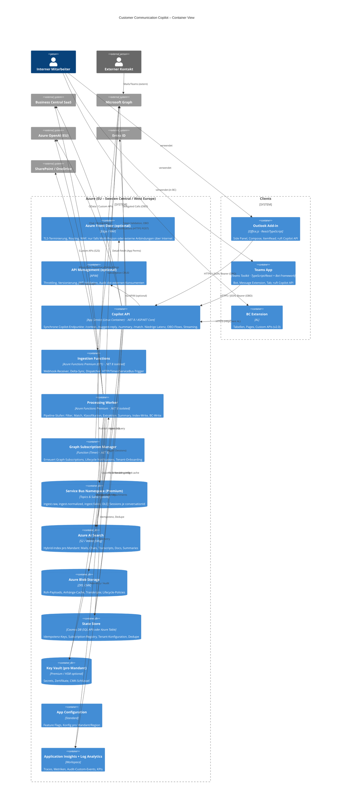
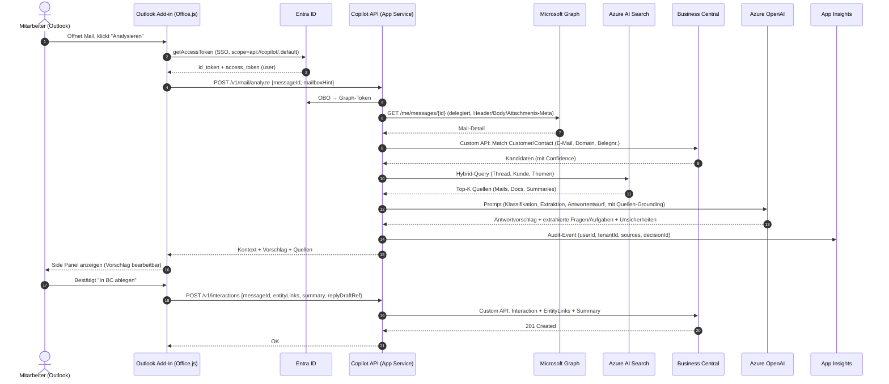
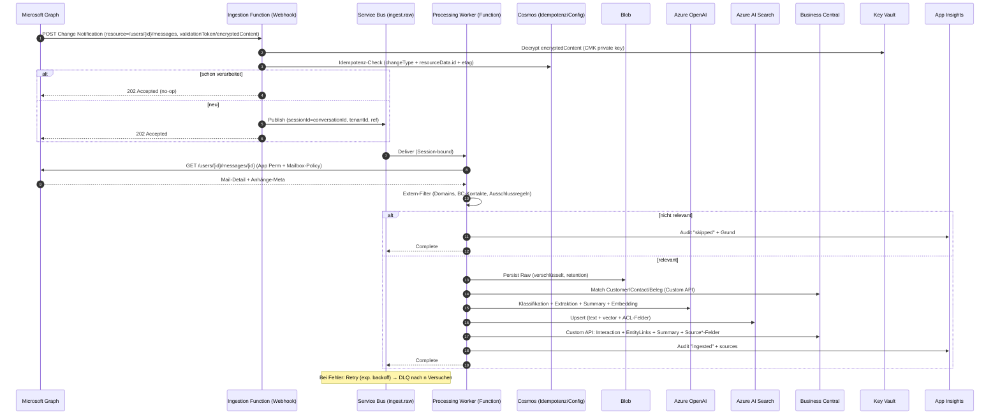

# 01 – Zielarchitektur & Komponentenübersicht

Bezug: [Planungsübersicht](00-overview.md) · Quelle der Wahrheit: [`../../instructions.md`](../../instructions.md).

## 1. Zielbild (Kurzfassung)

Der **Customer Communication Copilot** verbindet Business Central (SaaS), Outlook und Microsoft Teams zu einem aktiven, Grounded-AI-gestützten Kundenarbeitsplatz. Externe Kunden- und Kontaktkommunikation (E-Mail, Teams, Meetings, geteilte Dokumente) wird **serverseitig per Microsoft Graph erfasst**, klassifiziert, gematcht und als Metadaten + Zusammenfassung in BC abgelegt; Volltexte/Anhänge bleiben in Azure AI Search, Blob bzw. SharePoint. **Outlook-Add-in** und **Teams-App** liefern den Benutzern Kontext, Quellen und Antwortentwürfe – **ohne automatisches externes Senden**. Eine zentrale **Copilot-API** (synchron, latenzkritisch) und ein **Ingestion-Service** (asynchron, ereignisbasiert) trennen die Lasten. Hosting in Azure EU (Sweden Central / West Europe) inkl. Azure OpenAI EU Data Boundary, Multi-Tenant-fähig, mit strikter Mandanten-, Berechtigungs- und Datenresidenz-Trennung. Beobachtbarkeit, Auditierbarkeit und DSGVO-Konformität sind Querschnittsanforderungen.

## 2. C4 Context

```mermaid
C4Context
    title Customer Communication Copilot – System Context

    Person(emp, "Interner Mitarbeiter", "Vertrieb / Service / PM nutzt Outlook, Teams, BC")
    Person_Ext(cust, "Externer Kunde / Kontakt", "Sendet E-Mails, nimmt an Teams-Meetings/Chats teil")

    System_Boundary(ccc, "Customer Communication Copilot") {
        System(copilotApi, "Communication Copilot Service", "Synchrone Copilot-API: Kontext, Antwortvorschlag, Quellen")
        System(ingest, "Communication Ingestion Service", "Asynchrone Erfassung & Verarbeitung externer Kommunikation")
        System(addin, "Outlook Add-in", "Side Panel im Outlook-Kontext")
        System(teamsApp, "Teams App", "Bot, Message Extension, Tab")
        System(bcExt, "BC Extension (AL)", "Datenmodell, Pages, Custom APIs")
    }

    System_Ext(bc, "Microsoft Dynamics 365 Business Central (SaaS)", "Kunden, Kontakte, Belege, Projekte, Servicefälle")
    System_Ext(graph, "Microsoft Graph", "Mail, Teams Chats/Channels, Meetings, Files, Subscriptions")
    System_Ext(outlook, "Microsoft Outlook", "Desktop / Web / Mobile")
    System_Ext(teams, "Microsoft Teams", "Chats, Channels, Meetings")
    System_Ext(spo, "SharePoint / OneDrive", "Dokumente, Anhänge")
    System_Ext(entra, "Entra ID", "OAuth2, OBO, Admin Consent, App Roles")
    System_Ext(aoai, "Azure OpenAI (EU Data Boundary)", "Chat, Embeddings")
    System_Ext(search, "Azure AI Search", "Hybride Suche, Vector + BM25")
    System_Ext(kv, "Azure Key Vault", "Secrets, Keys, Zertifikate")
    System_Ext(blob, "Azure Blob Storage", "Roh-Payloads, Anhänge-Cache, Transkripte")
    System_Ext(appi, "Application Insights / Log Analytics", "Telemetrie, Audit, KPIs")

    Rel(emp, outlook, "Liest/schreibt E-Mails")
    Rel(emp, teams, "Chattet, nimmt an Meetings teil")
    Rel(emp, bc, "Arbeitet im ERP")
    Rel(cust, outlook, "Sendet/empfängt E-Mails")
    Rel(cust, teams, "Chats / externe Meetings")

    Rel(outlook, addin, "Lädt Side Panel (Office.js)")
    Rel(teams, teamsApp, "Lädt Bot/ME/Tab")
    Rel(bc, bcExt, "Lädt AL-Extension")

    Rel(addin, copilotApi, "REST/HTTPS, Bearer Token (OBO)")
    Rel(teamsApp, copilotApi, "REST/HTTPS, Bearer Token (OBO)")
    Rel(bcExt, copilotApi, "REST/HTTPS (S2S oder delegiert)")

    Rel(copilotApi, bc, "Custom APIs (OData v4)")
    Rel(copilotApi, graph, "Mail/Teams/Files lesen (delegated)")
    Rel(copilotApi, search, "Hybrid Query")
    Rel(copilotApi, aoai, "Chat / Embeddings")
    Rel(copilotApi, entra, "Token-Validierung, OBO")
    Rel(copilotApi, kv, "Secrets über Managed Identity")
    Rel(copilotApi, appi, "Telemetrie, Audit")

    Rel(graph, ingest, "Change Notifications (Webhook)")
    Rel(ingest, graph, "Delta-Queries, Detail-Abruf (App Permissions)")
    Rel(ingest, spo, "Dokumente / Anhänge laden")
    Rel(ingest, aoai, "Klassifikation, Extraktion, Summary, Embeddings")
    Rel(ingest, search, "Index-Upserts")
    Rel(ingest, blob, "Roh-Payload, Anhänge-Cache")
    Rel(ingest, bc, "Custom APIs: Interaction/EntityLink schreiben")
    Rel(ingest, kv, "Secrets")
    Rel(ingest, appi, "Telemetrie, Audit")

    Rel(spo, graph, "via Graph Files API")
```



## 3. C4 Container



## 4. Komponentenübersicht

| Komponente | Verantwortung | Technologie | Schnittstellen-Konsumenten | Zustand / Daten |
|---|---|---|---|---|
| BC Extension | Datenmodell, Pages, Custom APIs, Berechtigungen | AL, BC SaaS | Outlook Add-in, Teams App, Copilot API, Ingestion Worker | Communication Interaction & verwandte Tabellen (BC-DB) |
| Outlook Add-in | E-Mail-Analyse, Antwortentwurf, Quellen, Timeline-Eintrag | Office.js, React, TypeScript | Endbenutzer, Copilot API | zustandslos (Token im Kontext) |
| Teams App | Bot, Message Extension, Tab; Chat-/Meeting-Kontext | Teams Toolkit, Bot Framework v4, React | Endbenutzer, Copilot API | minimaler Bot-State (BotFramework Storage) |
| Copilot API | Synchrone Orchestrierung: Kontext, Match, Vorschlag, Summary | App Service Linux Container, .NET 8 / ASP.NET Core, Semantic Kernel | Add-in, Teams App, BC Extension | zustandslos; Token-Cache, Tenant-Config-Cache |
| Ingestion Functions | Empfang Graph-Notifications, Delta-Sync, Validation, Dispatch | Azure Functions Premium (EP1), .NET 8 isolated | Microsoft Graph (Webhook), Timer | Subscription-Registry, Idempotenz-Keys |
| Processing Worker | Pipeline: Filter → Match → Klass./Extr. → Summary → Index → BC-Write | Azure Functions Premium, ServiceBus-Trigger, Sessions | Service Bus | Roh-Payload (Blob), Idempotenz (Cosmos) |
| Graph Subscription Manager | Lifecycle/Renewal von Graph-Subscriptions, Tenant-Onboarding | Azure Function (Timer) | Microsoft Graph | Subscription-Metadaten (Cosmos) |
| Service Bus | Entkopplung, Retry, DLQ, Reihenfolge je Conversation | Azure Service Bus Premium, Topics + Sessions | Functions | Messages, DLQ |
| Azure AI Search | Hybride Suche (BM25 + Vector) je Mandant | Azure AI Search S2 | Copilot API, Worker | Indizes pro Mandant (mail, chat, doc, summary) |
| Blob Storage | Roh-Payloads, Anhänge, Transkripte | Azure Blob, ZRS, CMK | Worker, Copilot API (read) | Container je Mandant, Lifecycle-Policies |
| State Store (Cosmos DB) | Idempotenz, Dedupe, Tenant-Config, Subscription-Registry | Cosmos DB SQL API | Functions, Copilot API | partition by tenantId |
| Key Vault | Secrets, Zertifikate, CMK | Azure Key Vault (Premium) | alle Backend-Container via Managed Identity | – |
| App Configuration | Feature Flags, Konfig pro Mandant/Region | Azure App Configuration | Backend-Container | Konfig-Snapshots |
| Application Insights / Log Analytics | Telemetrie, Audit, KPIs | App Insights, LA Workspace | alle Backend-Container | Logs, Metriken, Custom Events |
| Entra ID | AuthN/AuthZ, OBO, App Roles, Admin Consent | Microsoft Entra ID | alle | – |
| Azure OpenAI | Chat, Function Calling, Embeddings | Azure OpenAI (EU Data Boundary) | Copilot API, Worker | – (no training on data) |

Detailspezifikationen siehe [BC-Datenmodell](02-bc-data-model.md), [BC-APIs](03-bc-apis.md), [Outlook](04-outlook-addin.md), [Teams](05-teams-app.md), [Backend](06-backend-service.md), [Ingestion](07-ingestion-pipeline.md), [AI](08-ai-orchestration.md), [Suche](09-data-search.md), [Matching](10-matching.md).

## 5. Datenflüsse

### 5a) Outlook Add-in: Mail-Analyse mit Antwortvorschlag



### 5b) Ingestion: neue externe E-Mail über Graph Change Notification



### 5c) Teams Message Extension: Nachricht analysieren und in BC ablegen

```mermaid
sequenceDiagram
    autonumber
    actor U as Mitarbeiter (Teams)
    participant TX as Teams ME (Action Command)
    participant BF as Bot Framework
    participant ID as Entra ID
    participant API as Copilot API
    participant G as Microsoft Graph
    participant SR as Azure AI Search
    participant AOAI as Azure OpenAI
    participant BC as Business Central

    U->>TX: "Analysieren & in BC ablegen" auf Chat-Nachricht
    TX->>BF: invoke composeExtension/submitAction (messageId, chatId, threadId)
    BF->>ID: SSO Token (TeamsFx) + OBO
    BF->>API: POST /v1/teams/message/analyze
    API->>G: GET /chats/{id}/messages/{id} (delegated; falls fehlend → Hinweis)
    G-->>API: Nachricht + Teilnehmer
    API->>API: Externe Teilnehmer prüfen (Domain/Guest)
    alt nur intern
        API-->>BF: Hinweis "intern – Ablage erfordert manuelle Bestätigung"
    end
    API->>BC: Match Customer/Contact (Teilnehmer-Mails)
    API->>SR: Hybrid-Query Kontext
    API->>AOAI: Klassifikation + Summary + Antwortvorschlag (mit Quellen)
    AOAI-->>API: Ergebnis
    API-->>BF: Adaptive Card (Kontext, Vorschlag, EntityLinks-Auswahl)
    BF-->>U: Zeigt Card im Compose-/Action-Flow
    U->>BF: Bestätigt EntityLinks + "In BC ablegen"
    BF->>API: POST /v1/interactions (source=teams, permalink)
    API->>BC: Custom API: Interaction + EntityLinks + Summary + Source*-Felder (chatId, messageId, permalink)
    BC-->>API: 201
    API-->>BF: OK
    BF-->>U: Bestätigung (Adaptive Card mit BC-Link)
```

## 6. Deployment & Topologie

- **Subscriptions:** `prod`, `nonprod` (dev/test/uat) getrennt; optional `shared-platform` (DNS, Front Door, Log Analytics zentral).
- **Region:** Primär **Sweden Central**, sekundär **West Europe** (für Azure-OpenAI-Verfügbarkeit / DR). Azure OpenAI im selben EU-Boundary; Pinning der Modell-Region.
- **Resource Groups (pro Stage):**
  - `rg-ccc-platform-<stage>` – APIM/Front Door, Log Analytics, App Configuration.
  - `rg-ccc-api-<stage>` – Copilot API (App Service Plan + App), Application Insights.
  - `rg-ccc-ingest-<stage>` – Functions Premium, Service Bus, Subscription Manager.
  - `rg-ccc-data-<stage>` – Search, Blob, Cosmos, Key Vault.
  - **Pro Mandant** zusätzlich: `rg-ccc-tenant-<tenantId>-<stage>` für mandantenspezifische Ressourcen (Key Vault, Search-Index/Service-Slice, Blob-Container, ggf. dedizierter Storage).
- **Multi-Tenant-Schnitt:** Geteilte Compute-Ressourcen (Copilot API, Functions), **logisch isolierte Daten** pro Mandant (eigene Search-Indizes/Index-Aliases, eigene Blob-Container, eigener Key Vault, eigene CMK). Premium-Mandanten: dedizierter App Service Plan / dediziertes Search-Replica möglich.
- **HA / Skalierung:**
  - App Service: Linux Plan **P1v3+** mit Auto-Scale (CPU/RPS), min. 2 Instanzen, Zone-Redundant.
  - Functions Premium: **EP1** mit Pre-warmed Instances, Auto-Scale nach Service-Bus-Backlog.
  - Service Bus Premium (Zone-Redundant), Cosmos DB Multi-Region-Read optional, Blob ZRS/GZRS.
  - Search S2 mit ≥2 Replicas (HA) und ausreichend Partitions je Mandant.
- **Netzwerk:**
  - **VNet-Integration** für Copilot API + Functions (Outbound).
  - **Private Endpoints** für Key Vault, Blob, Cosmos, Service Bus, Search, OpenAI (sofern verfügbar).
  - **Service Endpoints / Firewall** auf allen PaaS-Ressourcen, Public Access deaktiviert.
  - **Inbound:** Front Door Premium + WAF (optional), sonst APIM (intern/extern), TLS 1.2+, mTLS für S2S optional.
  - Graph-Webhooks: öffentlich erreichbarer Endpunkt nur über Front Door/APIM, IP-Allowlist (Microsoft Graph IPs) + Validation Token + JWT in `clientState`.
- **CI/CD:** GitHub Actions oder Azure DevOps; Bicep/Terraform für IaC; Slot-Deployment (App Service: staging/production), Functions: deployment slots; Canary über Front Door.

Details: [Sicherheit & Compliance](12-security-compliance.md).

## 7. Eventing & Queueing

**Empfehlung: Azure Service Bus Premium** (nicht Storage Queue, nicht reines Event Grid).

Begründung:
- **FIFO je Konversation** über **Sessions** (`sessionId = conversationId`/`chatId`) – wichtig für korrekte Thread-Reihenfolge und Dedupe.
- **Topics + Subscriptions** ermöglichen Fan-out (z. B. Indexer, Audit-Sink, ML-Re-Training) ohne Producer-Änderung.
- **DLQ**, **Scheduled Messages**, **Duplicate Detection (10 min)**, **Transactions**.
- **Premium**: VNet-Integration / Private Endpoint, vorhersagbare Latenz, höherer Durchsatz.
- Storage Queue: kein Pub/Sub, kein Sessions, kein DLQ-Komfort → ungeeignet.
- Event Grid: gut für Notifications (z. B. Blob-Created, Lifecycle), aber kein zuverlässiges Work-Queue-Pattern mit Sessions.

Topology:
- Topic `ingest.raw`
  - Sub `worker.process` (Sessions enabled, MaxDeliveryCount=5)
  - Sub `audit.sink` (alle Events, Read-only)
- Topic `ingest.normalized`
  - Sub `bc.writer`
  - Sub `search.indexer`
- Topic `ops.events` (Subscription-Renewals, Tenant-Onboarding, Health-Signals)

Retry & DLQ:
- Worker: **exponentielles Backoff** (1s, 5s, 30s, 2min, 10min) bis MaxDeliveryCount=5 → DLQ.
- Transiente Graph/AOAI-Fehler (429/5xx, `Retry-After`) → server-side retry; permanente Fehler (4xx Validation) → DLQ ohne Retry.
- DLQ-Operator-Tooling: Replay nach Korrektur; Alert via App Insights.
- **Idempotenz** via Cosmos: Key = `tenantId + resource + etag` (Mail) bzw. `tenantId + chatId + messageId + version` (Teams).

Event Grid wird **ergänzend** für Blob-Lifecycle und Subscription-Lifecycle-Events genutzt.

## 8. Multi-Tenant-Strategie

**Mandant ≜ (M365-Tenant-ID × BC-Company)**. Beide Dimensionen werden in jeder Anfrage propagiert (`x-ccc-tenant`, `x-ccc-bc-company`) und in jedem persistenten Datensatz gespeichert.

- **Daten-Isolation:**
  - **Search**: ein Index-Set pro Mandant (`mail-<tenant>`, `chat-<tenant>`, `doc-<tenant>`, `summary-<tenant>`). Plus ACL-Felder (UPN/AAD-Group-Ids) für `searchFilter`-basierte Berechtigungsprüfung **vor** Anzeige.
  - **Blob**: Container pro Mandant, **Customer-Managed Keys** im mandantenspezifischen Key Vault.
  - **Cosmos**: Partition Key = `tenantId`; logische Container pro Bereich (idempotency, subscriptions, config).
  - **BC**: Daten liegen ohnehin pro BC-Tenant/Company; Backend prüft Mapping `M365-Tenant ↔ BC-Tenant ↔ BC-Company`.
- **Schlüssel:** Pro Mandant eigener **Key Vault** + CMK; Rotation per Tenant policy. Globale Plattform-Secrets im zentralen Key Vault.
- **Logs:** Application Insights Custom-Dimension `tenantId` auf allen Events; Log Analytics Workspace zentral, aber Queries / Dashboards pro Mandant gefiltert. Optional **dedizierter LA Workspace pro Mandant** für Premium / regulatorische Anforderungen.
- **Compute:** Standardmäßig shared (Copilot API, Functions). Premium-Tier: dedizierte App Service Plan / Function App / Search Replica möglich.
- **Onboarding:** Tenant-Bootstrap-Workflow legt RG, Key Vault, Blob-Container, Search-Indizes, Cosmos-Items, Graph-Subscriptions an; deklarativ via IaC + Function-Workflow.
- **Egress:** Pro Mandant konfigurierbare Allowlists (BC-URL, SharePoint-Domains).

Siehe [Sicherheit & Compliance](12-security-compliance.md) für RBAC, Conditional Access und DSGVO.

## 9. Konfiguration & Secrets

- **Azure Key Vault** (pro Mandant + zentral): Secrets, Zertifikate, CMK; Zugriff ausschließlich über **Managed Identities** (System- bzw. User-Assigned). Keine Secrets in App Settings.
- **App Configuration** mit **Key-Vault-Referenzen** für Konfig + Feature Flags (Targeting per `tenantId`). Snapshots für reproduzierbare Releases.
- **Managed Identities:**
  - Copilot API (User-Assigned MI) → Key Vault (get/list secrets), App Configuration, Search (Query), Cosmos (DataReader), AOAI.
  - Ingestion Functions (User-Assigned MI) → Key Vault, Service Bus (Send/Listen), Cosmos (DataContributor), Blob (Contributor in eigenem Container), Search (DataContributor), AOAI, BC (über App Reg + S2S Cert in KV).
- **Entra App Registrierungen:** je Mandant separate Consent-Erteilung; Admin Consent für Application Permissions (Graph: `Mail.Read`, `ChannelMessage.Read.All` etc. – siehe [Graph-Feasibility](11-graph-feasibility.md)).
- **Geheimnisse:** S2S-Zertifikate (BC, Graph) werden als KV-Zertifikate mit Auto-Rotation gepflegt.
- **Dev-Loop:** Local Settings nutzen `DefaultAzureCredential` + Developer-Login; keine Secrets in Repo (gitleaks-Pre-Commit).

## 10. Observability

- **Application Insights** je Service mit gemeinsamem **Log Analytics Workspace**.
- **Strukturierte Logs** (Serilog/ILogger) inkl. `tenantId`, `userId` (oder Hash), `correlationId`, `decisionId`, `sourceUri`.
- **Distributed Tracing** (W3C Trace Context) über alle Hops (Add-in → API → Graph → AOAI → Search → BC).
- **Custom Audit Events** (separater Custom-Table): `ai.suggestion.created`, `ai.suggestion.accepted`, `interaction.persisted`, `ingest.skipped`, `ingest.failed`, `permission.denied`, `prompt.injection.detected`.
- **Dashboards:**
  - Operativ: RPS, p50/p95-Latenz, Fehlerquoten je Endpunkt, AOAI-Token-Verbrauch, Search-QPS, SB-Backlog, DLQ-Tiefe.
  - Fachlich: Anzahl Ingests, Match-Trefferquote, Akzeptanzrate Antwortvorschläge, Skip-Gründe.
- **KPIs / SLO-Vorschläge:**
  - Copilot API `/analyze`: **p95 ≤ 4 s** (ohne AOAI-Streaming-Komplettierung), Erfolgsrate **≥ 99 %** (excl. user errors). SLO-Window 30 Tage.
  - Ingestion E2E (Webhook → BC-Schreibung): **p95 ≤ 60 s**, **p99 ≤ 5 min**.
  - Verfügbarkeit Copilot API: **99,9 %** monatlich.
  - DLQ-Rate: **< 0,1 %** der Nachrichten/Tag.
  - Match-Confidence ≥ 0,8 in **≥ 80 %** der externen Mails (fachliche KPI).
- **Alerts:** SLO-Burn-Rate, AOAI-Quota, KV-Zertifikate Ablauf, Subscription-Renewal-Fehler, DLQ-Schwellen, Prompt-Injection-Detector-Spitzen.

## 11. Resilienz

- **Retries:** Polly-basierte Pipelines (Exponential Backoff + Jitter, Circuit Breaker pro Downstream: Graph, AOAI, Search, BC).
- **Circuit Breaker:** öffnet bei Fehlerrate > X% / Window; Fallback-Modi: Read-only-Kontext (ohne AOAI) → Anzeige BC-Daten + Quellen ohne neuen Vorschlag.
- **Idempotenz Ingestion:** Idempotency-Key `tenantId|resource|etag|version` in Cosmos (TTL 90 d). Doppelte Webhook-Notifications werden no-op.
- **Backpressure:** Service-Bus-Backlog-Metriken triggern Auto-Scale; Functions Premium hat Pre-Warmed-Instances; Worker batched AOAI-Calls (concurrency caps); Token-Quota-Manager pro Mandant.
- **Timeouts:** Hard timeouts pro Hop (Graph 30s, AOAI 60s, BC 20s, Search 5s); Gesamt-Request-Timeout der Copilot API ≤ 25s (Streaming bricht ab und liefert Teilergebnis).
- **Graceful Degradation:** Kontext ohne AI, AI ohne Suche, Suche ohne Embeddings (BM25 only) – jeweils als Feature-Flag.
- **Disaster Recovery:** Backups (Cosmos PITR, Blob ZRS/Soft-Delete, Search-Index Snapshots), Region-Failover-Runbook; RPO ≤ 15 min, RTO ≤ 4 h (Tier 1).

## 12. Technische Entscheidungen (ADR-light)

| ID | Entscheidung | Empfehlung | Begründung |
|---|---|---|---|
| ADR-01 | Hosting Copilot API | **Azure App Service (Linux Container)** | Synchroner, latenzkritischer HTTP-Workload mit Streaming; bessere Kontrolle über Cold-Starts, Networking, Sidecars; einfaches Container-Deployment; Slots/Canary; passende SKU-Skalierung (P1v3+). |
| ADR-02 | Hosting Ingestion + Worker | **Azure Functions Premium (EP1)** | Event-getrieben (Webhook, Service Bus, Timer), Auto-Scale nach Backlog, VNet-Integration, Pre-Warmed Instances; pay-per-execution mit planbarer Mindestkapazität; integrierte Trigger reduzieren Boilerplate. |
| ADR-03 | Messaging | **Azure Service Bus Premium** | Sessions (FIFO je Conversation), Topics, DLQ, Duplicate Detection, Private Endpoint; Event Grid nur ergänzend für Blob-/Lifecycle-Events. |
| ADR-04 | Suche / Wissensspeicher | **Azure AI Search (Hybrid)** | BM25 + Vector + Filter + Semantic Ranker; Multi-Tenant per Index; ACL-Filter; weniger Eigenbau als eigene Vektor-DB; integriert mit Skillsets. Eigene DB nur für strukturierte Metadaten (Cosmos). |
| ADR-05 | LLM | **Azure OpenAI (EU Data Boundary, Sweden Central)** | Datenresidenz EU, keine Trainingsverwendung, Function Calling, Streaming, Embeddings; Modell-Pinning + Versionierung. |
| ADR-06 | AuthN/AuthZ | **Entra ID + OBO + App Roles** | Delegierte Calls für UI-getriggerte Flows; Application Permissions nur für Ingestion (mit Mailbox-Application-Access-Policies). |
| ADR-07 | BC-Integration | **Custom APIs (OData v4, AL)** | Stabile Vertragsschicht; S2S-Auth (Azure AD App + Cert); keine Direktzugriffe auf BC-Tabellen aus Backend. |
| ADR-08 | Datenresidenz | **EU (Sweden Central / West Europe)** | DSGVO, Kunden-Erwartung, Azure OpenAI EU-Boundary; alle PaaS in EU; CMK in Mandanten-Key-Vault. |

Detail-ADRs in [Risiken & Entscheidungen](14-risks-decisions.md).

## 13. Offene Architekturfragen

1. **Graph Teams-Abdeckung:** Welche Teams-Daten (1:1, Gruppenchats, Kanal, Meeting-Chat, Transkripte) sind über App Permissions zuverlässig erfassbar – in welchem Lizenzmodell (E5/Teams Premium)? Siehe [Graph-Feasibility](11-graph-feasibility.md).
2. **Mailbox Scope:** Application Access Policies pro Pilot-Gruppe vs. tenant-weite Erfassung – wie wird die Pilotabgrenzung technisch durchgesetzt?
3. **Mandant ↔ BC-Company-Mapping:** 1:n oder n:m? Wie wird das Mapping verwaltet (BC-Setup-Tabelle vs. zentrales Tenant-Config-Repo)?
4. **Search-SKU & Sizing:** S2 vs. S3, Replica-/Partition-Plan pro Mandant; gemeinsamer vs. dedizierter Search-Service ab welcher Größe?
5. **Front Door / APIM:** Wird APIM für externe Konsumenten benötigt, oder reicht App-Service-internes Auth-Gating? Mehrwert von Front Door bei Single-Region?
6. **Premium-Isolation:** Ab welcher Mandantengröße/Compliance-Stufe wird auf dedizierte Compute / dedizierten Key Vault Premium (HSM) gewechselt?
7. **Anhänge-Strategie:** Originale persistieren vs. nur referenzieren (SharePoint/OneDrive Permalink)? Auswirkungen auf DSGVO-Lösch- und Auskunftsprozesse.
8. **AOAI-Modell-Strategie:** GPT-4o vs. GPT-4.1 vs. Mini-Modelle pro Pipeline-Stufe; Embedding-Modell (text-embedding-3-large vs. small) und Re-Embed-Strategie bei Modellwechsel.
9. **DR-Region:** Aktiver Active/Passive-Failover (Sweden ↔ West Europe) erforderlich, oder Backup/Restore-RTO ausreichend?
10. **Audit-Persistenz:** Reicht Log Analytics (90–730 Tage) oder muss Audit revisionssicher (immutable) in Blob + Legal-Hold gespiegelt werden?
11. **Bot-State-Speicher:** Cosmos vs. Azure Storage für Teams-Bot-State; PII-Implikationen.
12. **Front-Door-Bedarf für Graph-Webhooks:** TLS-Pinning, IP-Allowlist, validation handshake – reicht App Service Public-FQDN oder erforderlich Front Door + WAF?

---

Weiterführend: [BC-Datenmodell](02-bc-data-model.md) · [Backend-Service](06-backend-service.md) · [Ingestion](07-ingestion-pipeline.md) · [AI-Orchestrierung](08-ai-orchestration.md) · [Sicherheit & Compliance](12-security-compliance.md) · [MVP & Roadmap](13-mvp-roadmap.md) · [Risiken & Entscheidungen](14-risks-decisions.md) · [Offene Fragen](15-open-questions-next-steps.md).
