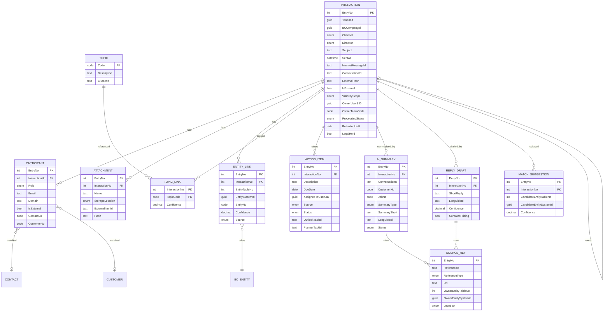

# 02 – Business-Central-Datenmodell, Pages und Berechtigungen

> Bezug: [`../../instructions.md`](../../instructions.md) Abschnitt 1 „Business Central Extension" und Erweiterungsteil „Datenmodell-Erweiterung". Architekturkontext: [01-architecture.md](01-architecture.md). Sicherheitsleitplanken: [12-security-compliance.md](12-security-compliance.md). Erfassungslogik: [07-ingestion-pipeline.md](07-ingestion-pipeline.md). AI-Output-Schemata: [08-ai-orchestration.md](08-ai-orchestration.md).
>
> Dieses Dokument beschreibt **Design**, nicht ausführbare AL-Quellen. Felder, Typen und Schlüssel sind so gewählt, dass sie BC-SaaS-konform und AppSource-tauglich umsetzbar sind.

---

## 1. Designprinzipien

1. **In BC nur Metadaten, Links, Zusammenfassungen, Quellenreferenzen.** Volltexte (Mail-Body, Teams-Nachrichten-Inhalte, Transkripte, Anhang-Inhalte) bleiben in Azure AI Search, Azure Blob bzw. SharePoint. BC ist „System of Record" für die strukturierte Kommunikationshistorie und für Verknüpfungen zu BC-Entitäten – nicht für Volltexte.
2. **Mandanten- und Company-Isolation.** Jeder persistente Datensatz trägt verpflichtend `M365 Tenant Id` (Microsoft Entra Tenant der Quelle) und nutzt die BC-Standard-Trennung pro Company (`DataPerCompany = true`). BC erzwingt zusätzlich serverseitig den Abgleich `Tenant Claim ↔ Datensatz-Tenant` in Custom-API-Codeunits.
3. **Source-IDs vollständig persistent.** Alle in `instructions.md` (Erweiterungsteil) geforderten Quellen-Identifikatoren (Internet Message ID, Conversation ID, Chat ID, Team ID, Channel ID, Online Meeting ID, Source Message ID, AAD User Object ID, Mailbox-Adresse) sind erste Bürger des Modells und einzeln durchsuchbar.
4. **Keine automatischen externen Effekte.** Tabellen modellieren ausschließlich Vorschläge/Entwürfe (Action Items, Reply Drafts, Summaries). Versand- oder Buchungslogik ist nicht Teil des Datenmodells.
5. **Berechtigungen vor Anzeige.** `User Visibility Scope` plus `IsAllowedToView`-Codeunit-Prüfung schließen Datensätze vor `IsEmpty`/`FindSet` aus. Pages zeigen nur, was der angemeldete BC-Benutzer fachlich sehen darf.
6. **Erweiterbarkeit über Enums mit `Extensible = true`.** Channels, Direction, Sensitivity, Roles, Statūs sind Enums, die Drittanbieter erweitern können (Telefonie, DMS, CRM-Schnittstellen aus `instructions.md` Grundprinzip 5).
7. **Datenminimierung & Hashing.** Wo Klartext nicht zwingend ist (Dedup, Vergleich), werden Hashes (SHA-256) gespeichert. Klartext-Bodies landen nicht in BC.
8. **Append-only-Charakter.** Interaction-Datensätze werden nicht hart gelöscht; Löschung läuft über `Legal Hold`-/`Retention Until`-Policy und einen orchestrierten Lösch-Workflow ([12-security-compliance.md §9](12-security-compliance.md)).

---

## 2. Tabellenübersicht

ID-Range-Vorschlag: **50000–50099** für interne Pilotphase. Für AppSource wird ein bei Microsoft beantragter dedizierter Object-ID-Bereich (typisch 70.xxx.xxx oder ein vom PartnerCenter vergebener Bereich) verwendet; die hier genutzten IDs bleiben dann nur als Mapping-Vorlage gültig. Affixe für Felderweiterungen folgen Konvention `IOI_CommHub_*`.

| ID | Name | Typ | Zweck |
|----|------|-----|-------|
| 50000 | Communication Interaction | Master/Header | Eine erfasste externe Kommunikationseinheit (E-Mail, Teams-Chat-Message, Channel-Message, Meeting). |
| 50001 | Communication Participant | Zeile | Teilnehmende Personen pro Interaction (intern/extern), inkl. Rolle. |
| 50002 | Communication Attachment | Zeile | Anhang-/Dokument-Referenzen (kein Inhalt in BC). |
| 50003 | Communication Entity Link | Zeile | M:N-Verknüpfung Interaction ↔ BC-Entität (Kunde, Auftrag, Projekt …). |
| 50004 | Communication Topic | Stamm | Thema/Kategorie (AI-Cluster oder kuratiert). |
| 50005 | Communication Topic Link | Zeile | M:N-Verknüpfung Interaction ↔ Topic mit Confidence. |
| 50006 | Communication AI Summary | Zeile | AI-erzeugte Zusammenfassungen (Einzel/Thread/Kunden-/Projekt-/Meeting-Briefing). |
| 50007 | Communication Action Item | Zeile | Aufgabenvorschläge aus AI-Analyse oder Benutzer-Erfassung. |
| 50008 | Communication Source Reference | Zeile | Quellenreferenzen (Search-Doc, SharePoint-Item, BC-Record, Web-URL) zu Summary/Reply. |
| 50009 | Communication Reply Draft | Zeile | Persistierte Antwortvorschläge (Kurz/Lang/Intern) inkl. Quellenliste. |
| 50010 | Communication Setup | Singleton | Tenant-/Company-weite Konfiguration (Endpunkte, Domains, Pilotgruppe, Sensitivity-Defaults). |
| 50011 | Communication Internal Domain | Liste | Domains/Tenant-IDs, die als „intern" gelten und Standard-ausgeschlossen werden. |
| 50012 | Communication Audit Log Entry | Zeile | Telemetrie-/Audit-Spur für DSGVO und Operations (kein Klartext). |
| 50013 | Communication Match Suggestion | Worksheet | Unbestätigte Matching-Vorschläge (Inbox für Korrektur). |
| 50014 | Communication Consent | Stamm/Audit | **Einwilligungsregister pro Pilot-Mailbox / Pilot-User** (Opt-in für Pilot ohne BV, gemäß ADR-27 / A16). Vorgelagerte Stage 0 der Ingestion-Pipeline ([07 §4 Stage 0](07-ingestion-pipeline.md)) prüft Gültigkeit. Audit-pflichtig ([12 §13](12-security-compliance.md)). |

Enums (Auszug, alle `Extensible = true`):

| ID | Enum | Werte |
|----|------|-------|
| 50000 | Communication Channel | Email, Teams Chat, Teams Channel, Teams Meeting, Manual, Other |
| 50001 | Communication Direction | Inbound, Outbound, Internal |
| 50002 | Communication Capture Method | Server Ingestion, Outlook Plugin, Teams Plugin, Manual, BC API |
| 50003 | Communication Processing Status | Pending, Processing, Completed, Failed, Excluded |
| 50004 | Communication Visibility Scope | Owner, Owner Team, Company |
| 50005 | Communication Sensitivity Level | Public, Internal, Confidential, Strictly Confidential, Restricted |
| 50006 | Communication Participant Role | From, To, CC, BCC, Member, Organizer, Presenter, Attendee |
| 50007 | Communication Storage Location | SharePoint, OneDrive, Azure Blob, External URL |
| 50008 | Communication Entity Link Source | AI Suggested, Rule, Manual, External API |
| 50009 | Communication Summary Type | Single Message, Thread, Customer Briefing, Project Briefing, Meeting Briefing, Topic, Chronological |
| 50010 | Communication Action Item Source | AI Suggested, User Created, External Imported |
| 50011 | Communication Action Item Status | Open, In Progress, Done, Cancelled, Rejected |
| 50012 | Communication Source System | M365 Exchange, M365 Teams, M365 SharePoint, Business Central, External |
| 50013 | Communication Source Reference Type | Search Doc, SharePoint Item, BC Record, Interaction Message, Web URL, Blob Object |
| 50014 | Communication Source Used For | Summary, Reply, Match, Classification |
| 50015 | Communication AI Summary Status | Draft, Generated, Edited, Approved, Stale |
| 50016 | Communication Consent Status | Pending, Granted, Withdrawn, Expired |

---

## 3. Tabellen – Felddefinitionen

> Konventionen: AL-Datentypen in BC SaaS. `BLOB`-Felder werden für Roh-/Volltexte **nicht** verwendet; `BLOB(CompressionType=Normal)` nur für sehr kurze AI-Kurzzusammenfassungen mit harter Längenbegrenzung. Längere Inhalte werden über `External Url`/`Blob Object Id` referenziert.

### 3.1 Table 50000 – Communication Interaction

| Feldname | Typ | Länge | Pflicht | Beschreibung | Index/Key | Datenschutz |
|---|---|---|---|---|---|---|
| Entry No. | Integer | – | ja | AutoIncrement, PK | PK | – |
| System Id | GUID | – | ja | BC-System-ID (für API). | – | – |
| Tenant Id | Guid | – | ja | Microsoft Entra Tenant der Quelle. | SK1 | – |
| Source System | Enum 50012 | – | ja | Quelle (M365 Exchange / Teams / BC / External). | – | – |
| Channel | Enum 50000 | – | ja | Kanal. | SK2 | – |
| Direction | Enum 50001 | – | ja | Inbound/Outbound/Internal. | – | – |
| Capture Method | Enum 50002 | – | ja | Erfassungspfad. | – | – |
| Capture Timestamp | DateTime | – | ja | Erfassungszeitpunkt im Backend. | – | – |
| Sent At | DateTime | – | nein | Originalsendezeit. | SK3 | – |
| Received At | DateTime | – | nein | Original-Empfangszeit. | – | – |
| Subject | Text | 250 | nein | Betreff (gekürzt). | SK4 | enthält ggf. PII |
| Snippet | Text | 500 | nein | Kurz-Snippet (≤ 500 Zeichen, vom Backend redacted). | – | enthält ggf. PII |
| Mailbox UPN | Text | 250 | nein | Postfach-UPN (Quell-Mailbox). | SK1 | personenbezogen (Benutzer) |
| Source User AAD Object Id | Guid | – | nein | AAD Object ID des Postfachbesitzers. | – | personenbezogen |
| Internet Message Id | Text | 250 | nein | RFC-822-`Message-Id` (E-Mail). | SK5 (mit Tenant Id) | – |
| Conversation Id | Text | 250 | nein | `conversationId` (Mail/Teams-Thread). | SK6 (mit Tenant Id) | – |
| Chat Id | Text | 100 | nein | Teams-Chat-ID. | SK7 | – |
| Team Id | Guid | – | nein | Teams-Team-GUID. | – | – |
| Channel Id | Text | 100 | nein | Teams-Channel-ID. | – | – |
| Online Meeting Id | Text | 250 | nein | `onlineMeetings.id`. | – | – |
| Source Message Id | Text | 250 | nein | Provider-Message-ID (Graph `id`). | SK8 (mit Tenant Id) | – |
| Parent Interaction No. | Integer | – | nein | Verweis auf Vorgänger im Thread. | SK9 | – |
| External Hash | Text | 64 | ja | SHA-256 über (Tenant Id + Source Message Id + Etag) zur Dedup. | SK10 (mit Tenant Id, **unique**) | – |
| Is External Communication | Boolean | – | ja | Ergebnis Externer-Filter (Stage 2/3). | SK11 | – |
| Sensitivity Level | Enum 50005 | – | ja | von MIP-Label/Heuristik abgeleitet. | – | – |
| User Visibility Scope | Enum 50004 | – | ja | Default `Owner Team`. | SK12 | – |
| Owner User Security Id | Guid | – | nein | BC-User-SID des fachlichen Owners. | SK12 | personenbezogen |
| Owner Team Code | Code | 20 | nein | Verweis auf User-Group/Team-Code. | SK12 | – |
| Processing Status | Enum 50003 | – | ja | Pending/Processing/Completed/Failed/Excluded. | SK13 | – |
| Processing Error | Text | 250 | nein | letzte Fehlermeldung (gekürzt). | – | – |
| AI Summary Status | Enum 50015 | – | ja | Draft/Generated/Edited/Approved/Stale. | – | – |
| Permalink Url | Text | 2048 | nein | Web-URL zum Original (Outlook Web, Teams Permalink). | – | – |
| BC Company Id | Guid | – | ja | BC-Company-System-ID (Doppelung zu `CurrentCompany` für Cross-Company-Reports). | SK1 | – |
| Search Doc Id | Text | 100 | nein | Stabile ID des korrespondierenden Search-Dokuments (`mail-{tenant}/...`). | – | – |
| Blob Object Id | Text | 250 | nein | Verweis auf Roh-MIME-Blob (sofern persistiert). | – | – |
| Retention Until | Date | – | nein | Aufbewahrung bis (errechnet aus Policy). | SK14 | – |
| Legal Hold | Boolean | – | nein | sperrt Löschung. | SK14 | – |
| Processing Restricted | Boolean | – | n**FK auf Communication Consent (Tabelle 50014)** – verweist auf die gültige Einwilligung der erfassten Mailbox zum Erfassungszeitpunkt (ADR-27 / A16). Bei fehlendem oder widerrufenem Consent darf der Datensatz nicht entstehen (Stage 0). | SK15 (mit Tenant Id)
| Consent Reference | Code | 20 | nein | Verweis auf Consent-Datensatz (z. B. Marketing-Opt-in). | – | – |
| Correlation Id | Guid | – | nein | Telemetrie-Korrelation Backend↔BC. | – | – |
| Created By Service Principal | Guid | – | nein | App-Object-ID, die geschrieben hat. | – | – |
| Last Modified At | DateTime | – | nein | letzte Änderung Backend/User. | – | – |

**Schlüssel:**

| Key | Felder | Zweck |
|-----|--------|-------|
| PK | Entry No. | – |
| SK1 | Tenant Id, BC Company Id, Sent At (desc) | Mandant/Company-Listen, Timeline. |
| SK5 | Tenant Id, Internet Message Id | E-Mail-Dedup. |
| SK6 | Tenant Id, Conversation Id, Sent At | Thread-Aggregation. |
| SK10 | Tenant Id, External Hash | Dedup, **SqlIndex unique**. |
| SK11 | Tenant Id, Is External Communication, Processing Status | Worker-Backlog, Filter. |
| SK12 | Tenant Id, BC Company Id, User Visibility Scope, Owner Team Code | Security Filtering. |
| SK14 | Tenant Id, Legal Hold, Retention Until | Lösch-/Hold-Job. |

### 3.2 Table 50001 – Communication Participant

| Feld | Typ | Länge | Pflicht | Beschreibung | Index | Datenschutz |
|---|---|---|---|---|---|---|
| Entry No. | Integer | – | ja | PK. | PK | – |
| Interaction No. | Integer | – | ja | FK → 50000.Entry No. | SK1 (mit Role) | – |
| Tenant Id | Guid | – | ja | Mandant. | SK2 | – |
| Role | Enum 50006 | – | ja | From/To/CC/BCC/Member/Organizer/Presenter/Attendee. | SK1 | – |
| Display Name | Text | 100 | nein | – | – | personenbezogen |
| Email Address | Text | 100 | nein | – | SK3 (mit Tenant) | personenbezogen |
| Email Domain | Text | 80 | nein | abgeleitet aus Email; eigener Index für Domain-Filter. | SK4 (mit Tenant) | – |
| AAD Object Id | Guid | – | nein | nur falls intern/Federated. | – | personenbezogen |
| Is External | Boolean | – | ja | Domain ≠ interne Domain. | – | – |
| Contact No. | Code | 20 | nein | BC Contact No. | SK5 (mit Tenant + Company) | personenbezogen |
| Customer No. | Code | 20 | nein | BC Customer. | SK6 | – |
| Vendor No. | Code | 20 | nein | BC Vendor. | – | – |
| Employee No. | Code | 20 | nein | BC Employee (intern). | – | personenbezogen |
| Match Confidence | Decimal | – | nein | 0..1, Confidence der Zuordnung. | – | – |
| Match Source | Enum 50008 | – | nein | AI/Rule/Manual. | – | – |

### 3.3 Table 50002 – Communication Attachment

> Anhänge werden **nicht in BC** gespeichert. Referenzen, Hash und Klassifikation reichen aus, die Datei selbst liegt in SharePoint, OneDrive oder Azure Blob.

| Feld | Typ | Länge | Pflicht | Beschreibung | Index | Datenschutz |
|---|---|---|---|---|---|---|
| Entry No. | Integer | – | ja | PK. | PK | – |
| Interaction No. | Integer | – | ja | FK → 50000. | SK1 | – |
| Tenant Id | Guid | – | ja | – | SK2 | – |
| Name | Text | 250 | ja | Dateiname. | – | personenbezogen ggf. |
| Mime Type | Text | 100 | nein | – | – | – |
| Size Bytes | BigInteger | – | nein | Originalgröße. | – | – |
| Storage Location | Enum 50007 | – | ja | SharePoint/OneDrive/Blob/External URL. | – | – |
| External Item Id | Text | 250 | nein | Drive-Item-ID, Blob-Key. | – | – |
| External Url | Text | 2048 | nein | klickbarer Link. | – | – |
| Hash SHA256 | Text | 64 | nein | Inhaltshash. | SK3 (mit Tenant) | – |
| Sensitivity Level | Enum 50005 | – | nein | aus MIP/Heuristik. | – | – |
| Is Indexed | Boolean | – | nein | in AI Search? | – | – |
| Is Excluded | Boolean | – | nein | manuell ausgeschlossen. | – | – |
| Search Doc Id | Text | 100 | nein | – | – | – |

### 3.4 Table 50003 – Communication Entity Link

| Feld | Typ | Länge | Pflicht | Beschreibung | Index | Datenschutz |
|---|---|---|---|---|---|---|
| Entry No. | Integer | – | ja | PK. | PK | – |
| Interaction No. | Integer | – | ja | FK → 50000. | SK1 | – |
| Tenant Id | Guid | – | ja | – | SK2 | – |
| Entity Table No. | Integer | – | ja | BC-Tabellen-ID (z. B. 18=Customer, 5050=Contact, 36=Sales Header, 167=Job). | SK3 (mit Entity System Id) | – |
| Entity System Id | Guid | – | ja | Stabile ID der BC-Entität. | SK3 | – |
| Entity No. | Code | 20 | nein | Cache des Schlüsselwertes (z. B. Customer No.). | SK4 | – |
| Entity Description | Text | 100 | nein | denormalisierter Name. | – | personenbezogen ggf. |
| Confidence | Decimal | – | ja | 0..1. | – | – |
| Source | Enum 50008 | – | ja | AI Suggested/Rule/Manual/External API. | SK5 | – |
| Confirmed By User SID | Guid | – | nein | BC-User-SID, der bestätigt hat. | – | – |
| Confirmed At | DateTime | – | nein | – | – | – |
| Linked At | DateTime | – | ja | – | – | – |

Eindeutigkeit: SqlIndex unique über (`Tenant Id`, `Interaction No.`, `Entity Table No.`, `Entity System Id`).

### 3.5 Table 50004 – Communication Topic

| Feld | Typ | Länge | Pflicht | Beschreibung | Index | Datenschutz |
|---|---|---|---|---|---|---|
| Code | Code | 20 | ja | PK pro Tenant/Company. | PK | – |
| Tenant Id | Guid | – | ja | – | SK1 | – |
| Description | Text | 100 | ja | Anzeigetext. | – | – |
| Cluster Id | Text | 64 | nein | ID eines AI-Clusters (Embedding-basiert). | – | – |
| Embedding Reference | Text | 250 | nein | Verweis auf zentralen Embedding-Vector (Vector Store). | – | – |
| Last Used At | DateTime | – | nein | für Aufräumen / Trending. | SK2 | – |

### 3.6 Table 50005 – Communication Topic Link

| Feld | Typ | Länge | Pflicht | Beschreibung | Index |
|---|---|---|---|---|---|
| Interaction No. | Integer | – | ja | FK. | PK Teil 1 |
| Topic Code | Code | 20 | ja | FK. | PK Teil 2 |
| Tenant Id | Guid | – | ja | – | SK1 |
| Confidence | Decimal | – | ja | 0..1. | – |
| Created At | DateTime | – | ja | – | – |

### 3.7 Table 50006 – Communication AI Summary

> **Größenhinweis:** BLOB-Felder in BC sind nicht für Multi-MB-Texte gedacht. Empfehlung: nur Kurzzusammenfassungen (≤ 4.000 Zeichen) im Feld `Summary Short`. Lange Briefings (> 4.000 Zeichen) werden in Azure Blob abgelegt und über `Long Summary Blob Id` referenziert (Cache der Inhaltslänge in `Summary Long Length`).

| Feld | Typ | Länge | Pflicht | Beschreibung | Index | Datenschutz |
|---|---|---|---|---|---|---|
| Entry No. | Integer | – | ja | PK. | PK | – |
| Interaction No. | Integer | – | nein | FK → 50000 (für Single-Message/Thread-Briefings). | SK1 | – |
| Conversation Id | Text | 250 | nein | für Thread-/Topic-/Chronological-Summaries. | SK2 | – |
| Customer No. | Code | 20 | nein | für Customer Briefing. | SK3 | – |
| Job No. | Code | 20 | nein | für Project Briefing. | SK4 | – |
| Tenant Id | Guid | – | ja | – | SK5 | – |
| Summary Type | Enum 50009 | – | ja | Single/Thread/Customer/Project/Meeting/Topic/Chronological. | – | – |
| Language | Code | 10 | nein | de/en/… | – | – |
| Summary Short | Text | 2048 | nein | Kurzfassung (≤ 2.048 Zeichen). | – | enthält ggf. PII |
| Summary Long Blob Id | Text | 250 | nein | Verweis auf Blob, sofern lange Fassung. | – | – |
| Summary Long Length | Integer | – | nein | Länge in Zeichen für UX. | – | – |
| Citations Json | Blob (CompressionType=Normal) | – | nein | JSON-Array mit Quellen-Refs (`src://…`); ≤ 16 KB. | – | – |
| Confidence | Decimal | – | nein | 0..1 (selbsteingeschätzt). | – | – |
| Status | Enum 50015 | – | ja | Draft/Generated/Edited/Approved/Stale. | – | – |
| Edited By User Flag | Boolean | – | nein | true, wenn Benutzer redigiert. | – | – |
| Edited By User SID | Guid | – | nein | – | – | – |
| Generated At | DateTime | – | ja | – | SK6 | – |
| Model Deployment | Text | 80 | nein | z. B. `gpt-4.1-eu`. | – | – |
| Model Version | Text | 40 | nein | – | – | – |
| Prompt Template Version | Text | 20 | nein | semver. | – | – |
| Schema Version | Text | 20 | nein | semver der Output-Struktur. | – | – |

### 3.8 Table 50007 – Communication Action Item

| Feld | Typ | Länge | Pflicht | Beschreibung | Index | Datenschutz |
|---|---|---|---|---|---|---|
| Entry No. | Integer | – | ja | PK. | PK | – |
| Interaction No. | Integer | – | nein | FK; optional, wenn nur via Summary erzeugt. | SK1 | – |
| Tenant Id | Guid | – | ja | – | SK2 | – |
| Description | Text | 250 | ja | Aufgabentext (Vorschlag). | – | enthält ggf. PII |
| Due Date | Date | – | nein | – | SK3 (mit Status) | – |
| Assigned To User SID | Guid | – | nein | BC-User-SID. | SK4 | personenbezogen |
| Linked Entity Table No. | Integer | – | nein | optionaler BC-Bezug. | – | – |
| Linked Entity System Id | Guid | – | nein | – | – | – |
| Source | Enum 50010 | – | ja | AI/User/External. | – | – |
| Status | Enum 50011 | – | ja | Open/InProgress/Done/Cancelled/Rejected. | SK3 | – |
| Approved By User SID | Guid | – | nein | bei AI-Vorschlag = Freigabe. | – | – |
| Approved At | DateTime | – | nein | – | – | – |
| Outlook Task Id | Text | 250 | nein | Graph-Todo-/Outlook-Task-ID. | – | – |
| Planner Task Id | Text | 250 | nein | Planner-Task-ID. | – | – |
| BC Task Id | Integer | – | nein | optional Verweis auf bestehendes BC-Task-/To-do-System (`Table 5080 Interaction` oder Standard-To-do). | – | – |
| Confidence | Decimal | – | nein | nur wenn AI-Quelle. | – | – |
| Created At | DateTime | – | ja | – | – | – |

### 3.9 Table 50008 – Communication Source Reference

| Feld | Typ | Länge | Pflicht | Beschreibung | Index | Datenschutz |
|---|---|---|---|---|---|---|
| Entry No. | Integer | – | ja | PK. | PK | – |
| Tenant Id | Guid | – | ja | – | SK1 | – |
| Reference Id | Text | 250 | ja | Source-URI (`src://search/...`, `src://bc/...`, `src://graph/message/...`). | SK2 (mit Tenant, **unique** mit Used-For + Owner-Entity) | – |
| Reference Type | Enum 50013 | – | ja | Search Doc/SharePoint Item/BC Record/Interaction Message/Web URL/Blob Object. | – | – |
| Url Or Identifier | Text | 2048 | nein | klickbarer Link bzw. opaque Identifier. | – | – |
| Owner Entity Table No. | Integer | – | nein | z. B. 50006 (Summary), 50009 (Reply Draft), 50000 (Interaction). | SK3 | – |
| Owner Entity System Id | Guid | – | nein | – | SK3 | – |
| Used For | Enum 50014 | – | ja | Summary/Reply/Match/Classification. | – | – |
| Cited At | DateTime | – | ja | – | – | – |
| Trust Level | Decimal | – | nein | 0..1 – Zuverlässigkeit der Quelle (Heuristik). | – | – |
| Quote | Text | 400 | nein | optionales wörtliches Zitat (gekürzt). | – | enthält ggf. PII |

### 3.10 Table 50009 – Communication Reply Draft (zusätzlich, abgeleitet aus AI-Schema `ReplySuggestion`)

| Feld | Typ | Länge | Pflicht | Beschreibung |
|---|---|---|---|---|
| Entry No. | Integer | – | ja | PK. |
| Interaction No. | Integer | – | ja | FK. |
| Tenant Id | Guid | – | ja | – |
| Language | Code | 10 | nein | – |
| Tone | Option (formal/neutral/friendly) | – | nein | – |
| Short Reply | Text | 2048 | nein | Kurzantwort. |
| Long Reply Blob Id | Text | 250 | nein | langer Entwurf in Blob. |
| Internal Assessment | Text | 2048 | nein | nicht für Versand. |
| Confidence | Decimal | – | nein | – |
| Contains Commitments | Boolean | – | nein | aus AI-Schema `safety`. |
| Contains Pricing | Boolean | – | nein | – |
| Contains Delivery Dates | Boolean | – | nein | – |
| Status | Option (Draft/Approved/Discarded) | – | ja | – |
| Approved By User SID | Guid | – | nein | – |
| Generated At | DateTime | – | ja | – |
| Edited By User Flag | Boolean | – | nein | – |

Quellen sind über `Communication Source Reference` mit `Owner Entity Table No. = 50009` verknüpft.

### 3.11 Table 50010 – Communication Setup (Singleton)

| Feld | Typ | Länge | Beschreibung |
|---|---|---|---|
| Primary Key | Code | 10 | konstant `''`. |
| Backend Base Url | Text | 250 | Base URL Copilot API. |
| Tenant Id | Guid | – | Default-Tenant (M365). |
| Pilot User Group Code | Code | 20 | Pilot-Sicherheitsgruppe (für Anzeige & Onboarding). |
| Default Visibility Scope | Enum 50004 | – | Default beim Insert (Empfehlung: Owner Team). |
| Default Sensitivity Level | Enum 50005 | – | Default-Klassifikation. |
| Default Retention Days | Integer | – | – |
| Allow Manual Capture | Boolean | – | manueller Capture in BC erlaubt. |
| Backend Service Principal Id | Guid | – | für Audit-Abgleich. |
| Notification Channel | Option (BC/Teams/Email) | – | Default-Benachrichtigung. |
| Long Summary Blob Container | Text | 100 | Container-Name. |

### 3.12 Table 50011 – Communication Internal Domain

| Feld | Typ | Länge | Beschreibung |
|---|---|---|---|
| Domain | Text | 80 | PK – z. B. `contoso.com`. |
| Tenant Id | Guid | – | ggf. zugehöriger M365-Tenant (Federated). |
| Treat As | Option (Internal/Federated-Internal/External) | – | – |
| Comment | Text | 250 | – |

### 3.13 Table 50012 – Communication Audit Log Entry

> Append-only; löschbar nur durch dedizierten Retention-Job.

| Feld | Typ | Länge | Beschreibung |
|---|---|---|---|
| Entry No. | BigInteger | – | PK. |
| Tenant Id | Guid | – | – |
| Correlation Id | Guid | – | – |
| Interaction No. | Integer | – | optional. |
| Event Type | Code | 40 | z. B. `interaction.persisted`, `ai.summary.generated`, `permission.denied`. |
| User SID | Guid | – | wer hat ausgelöst (oder Service-Principal-ID). |
| Service Principal Id | Guid | – | bei S2S. |
| Source Hash | Text | 64 | Hash der Quellenliste (kein Klartext). |
| Output Hash | Text | 64 | Hash des AI-Outputs (kein Klartext). |
| Model Deployment | Text | 80 | – |
| Token Count | Integer | – | – |
| Latency Ms | Integer | – | – |
| Severity | Option (Info/Warn/Error) | – | – |
| Message | Text | 250 | technische Kurznachricht (kein PII). |
| Created At | DateTime | – | – |
5 Table 50014 – Communication Consent

> Eigene BC-Tabelle gemäß **ADR-27 / A16** ([12 §10.3](12-security-compliance.md)). Hält die Opt-in-Einwilligung pro Pilot-Mailbox/User für den Pilot ohne BV (E-D2). Jede Mutation (Granted / Withdrawn / Re-Consent / Befristungsänderung) ist **audit-pflichtig** ([12 §13.1](12-security-compliance.md)). Alternative Realisierung als Erweiterung des `Communication Setup` ist möglich, hier als eigenständige Tabelle modelliert (klare Audit-Trennung, eigene Permission Sets).

| Feld | Typ | Länge | Pflicht | Beschreibung | Index | Datenschutz |
|---|---|---|---|---|---|---|
| Code | Code | 20 | ja | PK (z. B. `CC-0001`). | PK | – |
| Tenant Id | Guid | – | ja | M365-Tenant. | SK1 | – |
| Mailbox Address | Text | 250 | ja | UPN der Pilot-Mailbox. | SK2 (mit Tenant + Granted At) | personenbezogen |
| User Id | Guid | – | ja | AAD Object ID des einwilligenden Beschäftigten. | SK3 (mit Tenant) | personenbezogen |
| Consent Status | Enum 50016 | – | ja | Pending / Granted / Withdrawn / Expired. | SK4 | – |
| Granted At | DateTime | – | nein | Zeitpunkt der erteilten Einwilligung. | – | – |
| Withdrawn At | DateTime | – | nein | Zeitpunkt des Widerrufs (sofortige Wirkung). | – | – |
| Pilot Until | Date | – | ja | Befristung (max. 6 Monate ab `Granted At` gem. ADR-28); danach Re-Consent nötig. | SK5 | – |
| Document Version | Code | 20 | ja | Version des Einwilligungstextes (z. B. `2026-05-DE-v1.0`). | – | – |
| Audit Reference | BigInteger | – | nein | FK auf `Communication Audit Log Entry` (50012) der Status-Änderung. | – | – |
| Withdrawn Reason | Text | 250 | nein | Optional, keine Begründung erforderlich. | – | – |
| Language | Code | 10 | nein | Sprache des Formulars (de/en). | – | – |
| Last Modified By User SID | Guid | – | nein | Wer hat zuletzt geändert (DSB/HR). | – | – |
| Last Modified At | DateTime | – | nein | – | – | – |

**Schlüssel:**

| Key | Felder | Zweck |
|-----|--------|-------|
| PK | Code | – |
| SK2 | Tenant Id, Mailbox Address, Granted At (desc) | Lookup für Stage 0 (Consent-Check); jüngster Granted-Datensatz pro Mailbox. |
| SK4 | Tenant Id, Consent Status, Pilot Until | Job „Ablaufende Consents" für Re-Consent-Reminder. |

**Geschäftslogik:**

- **Insert** nur durch Permission Set `IOI_COMM_HUB_ADMIN` oder dedizierten DSB-User; jeder Insert/Modify schreibt automatisch `Communication Audit Log Entry`.
- **Widerruf**: `Consent Status = Withdrawn`, `Withdrawn At = NOW()` ⇒ Trigger startet Cleanup-Job (siehe [07 §4 Stage 0](07-ingestion-pipeline.md)).
- **Pilot Until-Ablauf**: Daily Job setzt automatisch `Consent Status = Expired`, blockiert weitere Erfassung; Re-Consent erforderlich.
- **Kein Löschen**: Historie bleibt für Audit erhalten (append-only); Hard-Delete nur durch Retention-Job nach gesetzlicher Aufbewahrungsfrist.

### 3.1
### 3.14 Table 50013 – Communication Match Suggestion

| Feld | Typ | Länge | Beschreibung |
|---|---|---|---|
| Entry No. | Integer | – | PK. |
| Interaction No. | Integer | – | FK. |
| Tenant Id | Guid | – | – |
| Candidate Entity Table No. | Integer | – | – |
| Candidate Entity System Id | Guid | – | – |
| Candidate Entity No. | Code | 20 | – |
| Confidence | Decimal | – | 0..1. |
| Match Reason | Text | 250 | z. B. „Domain match contoso.com → Customer 10000". |
| Status | Option (Pending/Confirmed/Rejected) | – | – |
| Reviewed By User SID | Guid | – | – |
| Reviewed At | DateTime | – | – |

---

## 4. Beziehungs-/ER-Diagramm



---

## 5. Indizes / Schlüsselstrategie

Performance-relevante SecondaryKeys (Auszug, vollständig in §3 je Tabelle):

| Anwendungsfall | Tabelle | Schlüssel |
|---|---|---|
| Dedup E-Mail | 50000 | `Tenant Id, Internet Message Id` (unique-fähig) |
| Dedup generisch | 50000 | `Tenant Id, External Hash` (SqlIndex unique) |
| Customer-Timeline | 50003 + 50000 | 50003: `Tenant Id, Entity Table No., Entity System Id`; Join → 50000.SK1 (`Tenant, Company, Sent At desc`) |
| Project-Timeline | analog mit Job-TableNo. | – |
| Worker-Backlog | 50000 | `Tenant Id, Is External Communication, Processing Status` |
| Thread-Aggregation | 50000 | `Tenant Id, Conversation Id, Sent At` |
| Security-Filtering | 50000 | `Tenant Id, BC Company Id, Visibility Scope, Owner Team Code` |
| Retention-Scan | 50000 | `Tenant Id, Legal Hold, Retention Until` |
| Match-Inbox | 50013 | `Tenant Id, Status, Confidence` |
| Topic-Filter | 50005 | `Tenant Id, Topic Code, Confidence` |

Hinweise:
- BC-`SqlIndex`-Eigenschaft nutzen, wo Unique-Garantie gefordert ist (Dedup).
- Für Listen mit Datumsabsteigend wird `Sent At` als letzter Schlüssel mit `Order = Descending` markiert (in AL über `SetCurrentKey` + `SetAscending(false)`).
- Filter müssen **vor** `IsEmpty`/`FindSet`/`Count` gesetzt sein (s. §7).

---

## 6. Permission Sets

Drei Default-Sets plus zwei Spezial-Sets. Werte: `R = Read, IM = Insert/Modify, D = Delete, X = Execute`.

| Permission Set | Zweck |
|---|---|
| `IOI_COMMHUB_READ` | Endbenutzer (Anzeige Timeline, FactBoxes). |
| `IOI_COMMHUB_USER` | Power-User (Korrektur Zuordnung, Action-Item-Bearbeitung, Match-Inbox). |
| `IOI_COMMHUB_ADMIN` | Setup, Domain-Pflege, Retention/Legal Hold, Hard-Delete. |
| `IOI_COMMHUB_API` | Backend-Service-Principal (Custom-API-Zugriff). |
| `IOI_COMMHUB_AUDIT` | DSB / Compliance (Read-only auf Audit-Log + Export). |

Matrix (Auszug):

| Tabelle | READ | USER | ADMIN | API | AUDIT |
|---|---|---|---|---|---|
| 50000 Communication Interaction | R | R, IM (Owner-Felder, VisibilityScope) | R, IM, D | R, IM | R |
| 50001 Participant | R | R, IM | R, IM, D | R, IM | R |
| 50002 Attachment | R | R, IM (Excluded-Flag) | R, IM, D | R, IM | R |
| 50003 Entity Link | R | R, IM, D (eigene Korrekturen) | R, IM, D | R, IM, D | R |
| 50004 Topic | R | R | R, IM, D | R, IM | R |
| 50005 Topic Link | R | R, IM | R, IM, D | R, IM | R |
| 50006 AI Summary | R | R, IM (Edit) | R, IM, D | R, IM | R |
| 50007 Action Item | R | R, IM (Status, Approve) | R, IM, D | R, IM | R |
| 50008 Source Reference | R | R | R, IM, D | R, IM | R |
| 50009 Reply Draft | R | R, IM (Status, Edit) | R, IM, D | R, IM | R |
| 50010 Setup | R | – | R, IM | R | R |
| 50011 Internal Domain | R | – | R, IM, D | R | R |
| 50012 Audit Log | – | – | R | IM | R, X (Export) |
| 50013 Match Suggestion | R | R, IM (Confirm/Reject) | R, IM, D | R, IM | R |
| Codeunit `IOI_CommHub_Mgmt` | X | X | X | X | – |
| Codeunit `IOI_CommHub_DataExport` (DSGVO) | – | – | X | – | X |

Hinweise:
- `READ` ist in `USER` enthalten; `USER` wird typischerweise zusätzlich zu einem Standard-BC-Permission-Set vergeben.
- `API` wird ausschließlich der Microsoft-Entra-App des Backends zugeordnet (S2S, siehe [03-bc-apis.md](03-bc-apis.md) §9).
- `AUDIT` darf weder Inhalte ändern noch Interaktionen sehen, nur Audit-Spuren.

---

## 7. Berechtigungslogik in Pages und APIs

**Verbindlich:** Filter setzen **vor** `IsEmpty`, `Count`, `FindSet`, `FindFirst`, `FindLast`. Ansonsten greifen Permission-Filter nicht zuverlässig auf das Result-Set durch.

```pseudo
// In Codeunit IOI_CommHub_Security
procedure ApplyVisibilityFilter(var Interaction: Record "IOI Comm Interaction") begin
    Interaction.SetRange("Tenant Id", CurrentTenantId());           // immer
    Interaction.SetRange("BC Company Id", CurrentCompanySystemId());// immer
    case GetEffectiveScopeForUser() of
        Scope::Owner:
            Interaction.SetRange("Owner User Security Id", UserSecurityId());
        Scope::"Owner Team":
            Interaction.SetFilter("Owner Team Code", '%1', CurrentUserTeamFilter());
        Scope::Company:
            ; // keine Einschränkung
    end;
    Interaction.SetFilter("Sensitivity Level", '<=%1', MaxAllowedSensitivity());
    // Hard-Skip Sensitivität "Strictly Confidential" für Standardrollen
end;
```

Pages rufen `ApplyVisibilityFilter` in `OnOpenPage` (Listen) bzw. `OnAfterGetCurrRecord` (Subforms) auf. Custom APIs rufen die gleiche Codeunit im `OnInsertRecord`/`OnModifyRecord` und in jedem Read-Codeunit auf. **Identische Logik in API und UI** verhindert Inkonsistenzen.

Zusätzlich: `IsAllowedToView(Rec)` als explizite Re-Prüfung, bevor sensible Felder (`Snippet`, `Subject` bei Confidential+) angezeigt werden – die Page maskiert solche Felder, wenn der Aufruf `false` liefert (Anzeige „[Zugriff eingeschränkt]").

---

## 8. Pages-Konzept

Alle Pages nutzen `SourceTable` aus dem Datenmodell und wenden den Visibility-Filter an. Layout-Skizzen sind als Bullet-Liste dargestellt.

### 8.1 Customer Communication Timeline (CardPart, Customer Card)
- **Quelle:** `Communication Interaction` (50000) gefiltert per `Communication Entity Link` mit `Entity Table No. = 18` (Customer) und `Entity System Id = Rec.SystemId`.
- **Layout:**
  - Repeater chronologisch (Sent At desc): Channel-Icon, Subject (gekürzt), Sender/Empfänger-Initialen, Confidence-Badge, Sensitivity-Indikator.
  - Action „Details" → öffnet 8.5.
  - Action „Manuelle Kommunikation hinzufügen" (nur `USER`/`ADMIN`).

### 8.2 Contact Communication Timeline (CardPart, Contact Card)
- analog 8.1, gefiltert auf `Entity Table No. = 5050` (Contact).

### 8.3 Project Communication Timeline (CardPart, Job Card)
- analog 8.1, gefiltert auf `Entity Table No. = 167` (Job).

### 8.4 Communication Interaction List (Worksheet)
- **Quelle:** 50000.
- **Filterbare Spalten:** Tenant, Company, Channel, Direction, Customer No., Job No., Topic, Sent At Range, Visibility, Processing Status.
- **Aktionen:** Bestätigen Match, Excluden, Re-Klassifizieren (ruft Backend), Re-Indexieren.

### 8.5 Communication Interaction Detail (Card)
- **Header:** Subject, Channel, Direction, Sent At, Sender (Participant.From), Tenant Snippet, Permalink.
- **FastTab „Teilnehmer"** → Subform 50001 mit Role/Email/Domain/IsExternal/MatchedEntity.
- **FastTab „Verknüpfungen"** → Subform 50003 (mit Action „Bestätigen", „Verwerfen").
- **FastTab „Themen"** → Subform 50005.
- **FastTab „Anhänge"** → Subform 50002 (Action „In SharePoint öffnen").
- **FactBox 8.6 AI Summary**, **8.7 Open Action Items**, **8.8 Related Documents**.
- **Action „Antwortvorschlag öffnen"** → Page für `Reply Draft` (50009).

### 8.6 AI Summary FactBox
- **Quelle:** 50006 letzter Datensatz pro Interaction/Conversation/Customer.
- **Layout:** Summary Type Picker (Single/Thread/Customer/Project/Meeting), Summary Short Text, Confidence-Bar, „Lange Fassung anzeigen" (lädt Blob), Citations als klickbare Liste.
- Action „Neu generieren" (ruft Backend `POST /summaries/regenerate`).

### 8.7 Open Action Items FactBox
- **Quelle:** 50007 mit `Status = Open`.
- **Layout:** Liste (Description, Due Date, Assigned To, Confidence-Badge bei AI), Inline-Aktion „Erledigt", „Ablehnen", „In Outlook/Planner anlegen".

### 8.8 Related Documents FactBox
- **Quelle:** Kombination 50002 (Anhänge der Interaction) + Backend-Lookup `GET /documents/related?customerNo=...` (Cache pro Page-Open).
- **Layout:** Dokument-Name, Quelle (SharePoint/OneDrive), letztes Änderungsdatum, Action „Öffnen".

### 8.9 Topic View
- **Quelle:** 50004 + 50005.
- **Layout:** Treeview Topic → Interactions; Filter pro Customer/Date.

### 8.10 Chronological View
- **Quelle:** 50000 ohne Customer-Filter, Sortierung Sent At desc, Heatmap nach Channel/Tag (Text-basiert: Counter pro Tag).

### 8.11 Matching Inbox
- **Quelle:** 50013 mit `Status = Pending`.
- **Layout:** Repeater mit Interaction-Subject, Kandidat, Confidence, „Bestätigen" / „Verwerfen" / „Anderen wählen" (Lookup auf BC-Entity).

### 8.12 Communication Setup (Card)
- **Quelle:** 50010.
- **FastTab „Backend":** Base URL, Service Principal ID.
- **FastTab „Mandant & Pilot":** Tenant Id, Pilot User Group Code.
- **FastTab „Defaults":** Default Visibility, Default Sensitivity, Default Retention Days.
- **FastTab „Domains":** Subform 50011 (Insert/Delete).
- **FastTab „Benachrichtigungen":** Default Channel, Long Summary Container.
- **Aktion „Verbindung testen"** (ruft `GET /setup/internalDomains` und prüft 200).

---

## 9. Telemetrie-/Logging-Felder

Pflicht in `Communication Audit Log Entry` (50012) und in jedem Custom-API-Response-Header `x-correlation-id`:

- `Correlation Id` (Guid, propagiert durch Backend ↔ BC).
- `Event Type` (z. B. `interaction.persisted`, `entity.linked`, `permission.denied`, `summary.generated`).
- `Latency Ms` (Verarbeitungsdauer pro Operation).
- `Source Hash` und `Output Hash` (SHA-256, kein Klartext).
- `Service Principal Id` bzw. `User SID`.
- `Model Deployment` / `Model Version` (bei AI-Schreibvorgängen).
- `Token Count` (AI-Calls).
- `Severity`.

In `Communication Interaction` selbst werden `Correlation Id`, `Created By Service Principal`, `Last Modified At` mitgeführt.

---

## 10. Datenschutz pro Feld

| Bereich | Felder | Behandlung |
|---|---|---|
| Personenbezogene Daten Externer | Participant.Display Name, Participant.Email, Participant.Domain, Subject, Snippet, AI Summary Text, Source Reference Quote | können DSGVO-Auskunft auslösen; Export per `IOI_CommHub_DataExport`-Codeunit. Snippets vor Persistierung backendseitig auf max. 500 Zeichen redigiert. |
| Personenbezogene Daten Beschäftigter | Mailbox UPN, Source User AAD Object Id, Owner User SID, Assigned To User SID, Edited By User SID | unterliegen Beschäftigtendatenschutz; **keine** Manager-Aggregationen (s. [12-security-compliance.md §10](12-security-compliance.md)). |
| Inhalte Sensitive Klassen | Mails mit Sensitivity Level „Strictly Confidential"/„Restricted" | werden in BC mit `Snippet = NULL` und `Subject = "[redacted]"` persistiert; Volltext nur in Search/Blob mit ACL. |
| Hashes statt Klartext | External Hash, Hash SHA256 (Attachment), Source Hash, Output Hash | für Dedup und Audit. |
| Löschen / Sperren | Legal Hold (sperrt Löschung), Processing Restricted (DSGVO Art. 18), Retention Until | Lösch-Job berücksichtigt beide Flags zwingend. |
| Pseudonymisierung | für AI-Briefings können Backend-Sanitizer Personennamen pseudonymisieren, BC speichert nur das Resultat ohne Re-Identifier-Tabelle. | Re-Identifizierung erfolgt über AAD-Object-Id, nicht über Klartext. |

Crypto-Shredding: Long-Summary-Blobs sind mit CMK pro Mandant verschlüsselt; Schlüsselrotation/-Vernichtung macht Inhalte unbrauchbar (siehe [12-security-compliance.md §9.3](12-security-compliance.md)).

---

## 11. Begrenzungen / Speicherempfehlungen

- **BC BLOB-Größe:** Praktikabel sind kurze Texte (≤ 2 KB unkomprimiert / ≤ 16 KB komprimiert). Längere Inhalte und Anhänge gehören **nicht** in BC. Daher:
  - `Summary Long` → Azure Blob, BC speichert nur `Long Blob Id` + Länge.
  - `Long Reply` → Azure Blob.
  - `Citations Json` → Blob mit `CompressionType=Normal`, ≤ 16 KB; bei Überschreitung in Blob ausgelagert.
- **Anhänge:** ausschließlich SharePoint/OneDrive/Blob. `Communication Attachment` ist reine Referenzhülle.
- **Volltexte (Mail-Body, Teams-Message-Body, Transkripte):** ausschließlich Azure AI Search + Azure Blob; BC kennt nur `Snippet` und `Search Doc Id`.
- **Anzahl Datensätze:** SK1/SK6/SK10 sind so geschnitten, dass auch große Tenants (Mio. Interactions) effizient filterbar bleiben; Heavy-Reporting läuft bevorzugt im Backend (Search).
- **Einfügeleistung:** Worker-Burst (z. B. 50 POST/s) → Empfehlung Outbox-Drosselung im Backend (siehe [07-ingestion-pipeline.md §14](07-ingestion-pipeline.md) offene Frage 10).

---

## 12. Offene Fragen / Annahmen

1. **AppSource Object-ID-Range:** Für AppSource-Veröffentlichung muss ein Microsoft-vergebener Range genutzt werden; 50000–50099 ist Pilot-/Per-Tenant-Range.
2. **Owner Team:** Wird `Owner Team Code` an BC-Standard-User-Groups gebunden oder an Entra-Groups (per Sync)?
3. **BC Task Integration:** Nutzung von `Table 5080 Interaction` (Standard-CRM) als Ziel für `Communication Action Item` oder eigenständig?
4. **Customer/Contact Match auf Participant:** Speichern wir Match in `Participant` (denormalisiert) und in `Entity Link`? Annahme: ja, weil Participant für Schnellsuche, Entity Link für M:N pro Interaction.
5. **Sensitivity-Mapping MIP → Enum 50005:** verbindliches Mapping in Setup-Page hinterlegen.
6. **Long Summaries:** wie lange dürfen lange Briefings sein (Token-/Storage-Budget pro Tenant)?
7. **Right-to-be-forgotten Kaskade:** technische Reihenfolge BC → Search → Blob → SharePoint klären (orchestriertes Delete-Script, siehe [12 §9.3](12-security-compliance.md)).
8. **Multi-Company-Sicht:** soll eine Interaction in mehreren Companies sichtbar sein, wenn dieselbe Entität (z. B. Konzernkunde) mehrfach existiert? Annahme: nein, eine Interaction gehört genau zu einer (Tenant, Company); Cross-Company-Reporting im Backend.
9. **Retention pro Datenklasse vs. pro Beleg-Bezug:** Felderweiterung `Retention Class` ggf. nötig.
10. **Telefonie/Call Records:** Erweiterungspunkt – Channel-Enum bereits offen; eigene Source-Felder (`Call Id`, `Phone Number`) später additiv.
