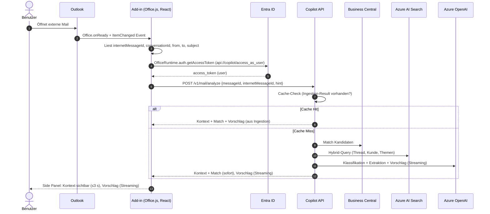
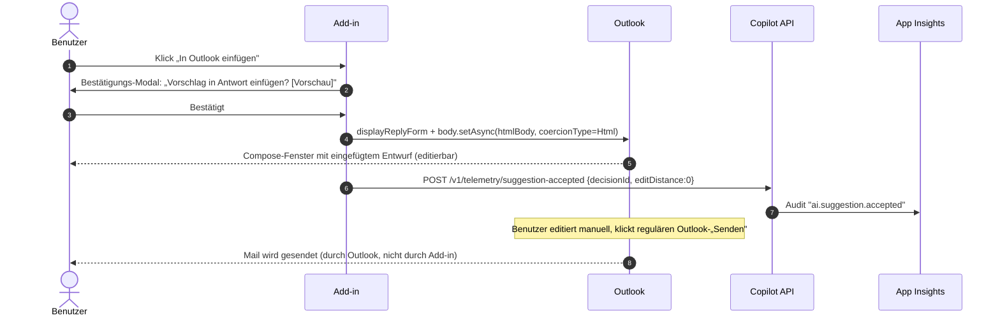
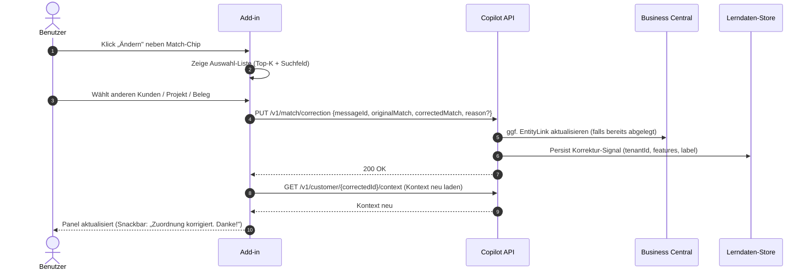

# 04 – Outlook Add-in: UX- und Funktionskonzept

> Bezug: [`../../instructions.md`](../../instructions.md), Abschnitt 2 ("Outlook Add-in") und „Outlook- und Teams-Plugins bleiben trotzdem notwendig". Architektur-Kontext: [01-architecture.md](01-architecture.md). AI-Verträge: [08-ai-orchestration.md](08-ai-orchestration.md). Ingestion-Abgrenzung: [07-ingestion-pipeline.md](07-ingestion-pipeline.md). Sicherheit: [12-security-compliance.md](12-security-compliance.md). Graph-Eignung: [11-graph-feasibility.md](11-graph-feasibility.md).

---

## 1. Ziel & Abgrenzung

### 1.1 Rolle des Add-ins

Das Outlook Add-in ist die **interaktive Arbeitsoberfläche** des Customer Communication Copilot direkt im Posteingang/Kompositionsfenster des Mitarbeiters. Es unterstützt **aktiv beim Lesen, Verstehen und Beantworten** externer Kundenkommunikation, indem es Kundenkontext, BC-Entitäten, bisherige Verläufe, erkannte Fragen/Aufgaben und einen Antwortentwurf samt Quellen einblendet.

### 1.2 Was das Add-in NICHT macht

- **Keine Massenerfassung**: Die unternehmensweite, hintergrundbasierte Erfassung externer Kommunikation übernimmt der **Communication Ingestion Service** (siehe [07-ingestion-pipeline.md](07-ingestion-pipeline.md)). Das Add-in greift **nicht** auf andere Postfächer zu und versucht **nicht**, „im Vorbeigehen" alles zu archivieren.
- **Kein automatischer Versand**: Antwortvorschläge werden ausschließlich als **Compose-Entwurf** eingefügt – das Senden ist und bleibt ein expliziter Klick des Benutzers im Outlook-Sendebutton.
- **Keine clientseitige Persistenz** von Inhalten: Mail-Bodies, Vorschläge und Quellen werden nicht im Add-in gecached oder im Browser-Storage abgelegt.
- **Keine Background-Auto-Aktion**: Das Panel agiert nur, wenn der Benutzer es öffnet bzw. eine Mail aktiv geöffnet ist (`ItemRead`/`ItemEdit`).

### 1.3 Verhältnis zu serverseitiger Erfassung

| Vorgang | Serverseitige Ingestion | Outlook Add-in |
|---|---|---|
| Erkennen, dass eine externe Mail eintrifft | ja, via Graph Change Notifications | nein (nicht zuverlässig) |
| Klassifizieren, Extrahieren, Summary erzeugen | ja (Hintergrund) | greift auf bereits erzeugte Summaries zurück; bei Cache-Miss wird synchron angefragt |
| In BC-Timeline ablegen | automatisch nach Match-Confidence | optional, **manuell** durch Benutzer (z. B. wenn Auto-Match unsicher war) |
| Antwortvorschlag erzeugen | nein (kein UI-Kontext) | ja, on-demand pro Mail |
| Zuordnung bestätigen oder korrigieren | nicht primär | **ja** – Add-in ist die Korrektur-UI |
| Anhang ablegen | nur referenzieren | Benutzer entscheidet aktiv „in SharePoint ablegen / mit Beleg verknüpfen" |

Die beiden Wege treffen sich an der **Copilot API**: das Add-in fragt dieselben Endpunkte an (`/v1/mail/analyze`, `/v1/interactions`, …) und nutzt bereits berechnete Ergebnisse aus dem Ingestion-Pfad als Cache, sofern vorhanden (Schlüssel: `internetMessageId` + `tenantId`).

---

## 2. Manifest-Konzept

### 2.1 Add-in-Typ

- **Add-in-Typ:** Office Add-in (Web Add-in, Office.js).
- **Surfaces:**
  - `MessageReadCommandSurface` (Ribbon im Lesemodus): Button „Copilot öffnen" + Pin-fähiges Task Pane.
  - `MessageComposeCommandSurface` (Ribbon im Verfassen-Modus): Button „Vorschlag einfügen" / „Aus Verlauf zitieren" + Task Pane.
  - **Pinnable Task Pane** (`<SupportsPinning>true</SupportsPinning>` in `VersionOverrides v1.1`), damit das Panel beim Wechsel zwischen Mails offen bleibt.
- **Item-Types:** Nur `Message` (keine Termin-/Kalender-Surfaces im MVP).
- **Hosts:** Outlook Web (OWA), Outlook Desktop (Win/Mac), Outlook Mobile (eingeschränkt – Mobile zeigt nur Read-Only-Zusammenfassung, keine Compose-Insertion im MVP).

### 2.2 Berechtigungen (Manifest `Permissions`)

| Stufe | Bedeutung | Bewertung |
|---|---|---|
| `Restricted` | nur Item-Metadaten | zu wenig |
| `ReadItem` | aktuelles Item lesen | zu wenig (kein Compose) |
| `ReadWriteItem` | aktuelles Item lesen + Compose-Body schreiben | **bevorzugt** für MVP |
| `ReadWriteMailbox` | gesamtes Postfach lesen/schreiben (REST) | nur falls clientseitig auf andere Mails zugegriffen werden müsste |

**Empfehlung: `ReadWriteItem`.**

Begründung:
- Für „Vorschlag in Antwort einfügen" reicht `Office.context.mailbox.item.body.setAsync` im Compose-Modus → `ReadWriteItem` genügt.
- Auf weitere Mails desselben Threads (für Verlaufsanzeige) greifen wir **nicht clientseitig**, sondern serverseitig über Microsoft Graph (mit Benutzer-OBO-Token, Scope `Mail.Read`) zu. Damit muss das **Add-in selbst** kein `ReadWriteMailbox` haben.
- `ReadWriteMailbox` würde Admin Consent erfordern und die Risiko-/Compliance-Bewertung deutlich erschweren (siehe [12-security-compliance.md](12-security-compliance.md), Abschnitt 3).

> Falls in einer späteren Phase „Aufgabe als Outlook-Task im Postfach anlegen" rein clientseitig erfolgen soll, wäre `ReadWriteMailbox` nötig. Im MVP erfolgt Aufgabenanlage **server-seitig** über Graph, daher nicht erforderlich.

### 2.3 Hosting

- Statisches Bundle (HTML/JS/CSS, React + TypeScript) wird vom Backend über einen dedizierten Endpunkt (`https://addin.<tenant-host>/outlook/`) ausgeliefert.
- Auslieferung über Azure Front Door / CDN mit Cache-Busting (Hashed Filenames). TLS 1.2+, HSTS, strikte CSP.
- API-Calls gehen ausschließlich an die **Copilot API** (`https://api.<tenant-host>/v1/...`); CORS auf Add-in-Domain beschränkt.
- Manifest wird zentral pro Mandant gehostet (siehe §14 Verteilung).

### 2.4 SSO via Entra ID

- **Primärer Pfad:** `OfficeRuntime.auth.getAccessToken({ allowSignInPrompt: true, allowConsentPrompt: true, forMSGraphAccess: false })` liefert ein **Add-in-Token** für die eigene API-Scope (`api://<copilot-app-id>/access_as_user`).
- Backend führt **On-Behalf-of (OBO)** durch, um mit Benutzeridentität gegen Microsoft Graph (Scope `Mail.Read`, `Mail.ReadBasic`, optional `MailboxSettings.Read`), Business Central und Azure AI Search (mit Filter) zu sprechen.
- **Fallback:** Falls SSO nicht verfügbar (z. B. ungewöhnliche Tenant-Policy, Outlook Mobile ohne Modern Auth), Pop-up-Login via `Office.context.auth.getAuthContextAsync` + MSAL.js Redirect-Flow als Backup.
- Das Add-in selbst speichert **keine** Tokens persistent. In-Memory only. Refresh erfolgt durch erneuten `getAccessToken`-Call.
- `Office.context.mailbox.getCallbackTokenAsync` wird **nicht** verwendet (würde Item-Token erzeugen, aber wir wollen Benutzer-Token für Graph/BC).
- Pre-Authorization: `<WebApplicationInfo>` im Manifest mit `Id` (Entra App-ID) und `Resource` = `api://<copilot-app-id>`. Scopes: `profile`, `openid`, `User.Read`, `access_as_user`.

---

## 3. UX-Konzept Side Panel – Hauptzustände

Layout-Konvention (alle Zustände):

```
Kopfleiste fest: Logo • [Status-Chip] • [Sprach-Toggle DE/EN] • [Hilfe ?] • [Schließen ✕]
Inhaltsbereich (scrollbar)
Fußleiste fest: Primäraktion(en) • Sekundäraktionen
```

### 3.1 Zustand: Initial / lädt

Trigger: Mail wird geöffnet, Add-in startet `analyze`-Call.

```
Kopf: Logo • Status: „Analysiere…" (animiertes Spinner-Chip) • DE • ?
Inhalt:
  Skelett-Karte 1: „Kunde wird ermittelt…"      [shimmer]
  Skelett-Karte 2: „Verlauf wird geladen…"      [shimmer]
  Skelett-Karte 3: „Antwortvorschlag …"         [shimmer]
  Hinweis: „Erste Erkenntnisse erscheinen in ca. 2–3 Sekunden."
Fuß: [Abbrechen]
```

- Time-to-First-Insight ≤ 3 s (siehe §7). Nach 6 s wird ein Hinweis „Dauert länger als üblich" eingeblendet, mit Option zum Abbrechen.

### 3.2 Zustand: „Kein passender Kunde gefunden"

Trigger: Pre-Match + AI-Reranker liefern keinen Kandidaten mit Confidence ≥ 0,5.

```
Kopf: Logo • Status: „Kein Treffer" (gelbes Warn-Chip) • DE • ?
Inhalt:
  Karte „Absender":
    From: anna.becker@example.com
    Domain: example.com (nicht in BC bekannt)
    Display Name: Anna Becker
  Karte „Vorschläge":
    Hinweis-Icon „Wir konnten keinen sicheren Treffer finden."
    [Suchfeld]: „In BC suchen (Kunde, Kontakt, Projekt, Beleg)…"
    Liste: 0 Vorschläge / oder: ähnlich klingende Kunden (Levenshtein/Domain-Similarity)
    Aktion: „Neuen Kontakt in BC anlegen" (Bestätigung erforderlich)
  Karte „Mail-Auszug":
    Betreff + erste 4 Zeilen (read-only) – als Kontext für die Suche
Fuß: [Auswahl bestätigen] (deaktiviert) • [Als „nicht relevant" markieren]
```

### 3.3 Zustand: „Mehrere mögliche Treffer"

Trigger: ≥2 Kandidaten mit Confidence-Spreizung < 0,15 ODER Top-Confidence < 0,75.

```
Kopf: Logo • Status: „Bitte Treffer wählen" (blaues Hinweis-Chip) • DE • ?
Inhalt:
  Karte „Erkannte Kandidaten":
    [○] Müller GmbH                       Kunde     92 %  ← Vorauswahl
         Begründung: Domain müller.de + Belegnr. SO-4711 in Mail
         Quelle-Chips: [Mail-Header] [Belegnr-Erkennung]
    [○] Müller GmbH & Co. KG              Kunde     78 %
         Begründung: ähnlicher Name
    [○] Projekt „Müller-Halle 2"          Projekt   65 %
         Begründung: Betreff-Keyword
    [→ Manuell suchen]
  Karte „Mail-Auszug" (read-only)
Fuß: [Treffer bestätigen] (Primär) • [Keiner passt → Manuell suchen]
```

- Auswahl ist **Pflichtinteraktion** – ohne Bestätigung wird der Kontext nur „provisorisch" angezeigt.
- Bestätigte Auswahl wird als **Korrektur-Signal** an das Backend gesendet (`PUT /v1/match/correction`), siehe §5/§6.

### 3.4 Zustand: „Treffer bestätigt – Kontext sichtbar"

Trigger: Eindeutiger Treffer (Confidence ≥ 0,85) ODER Benutzer hat Auswahl bestätigt.

```
Kopf: Logo • Müller GmbH (Kunde 10042) • 92 % [Ändern] • DE
Tab-Leiste: [Übersicht*] [Verlauf] [Dokumente] [Aufgaben]
Inhalt (Tab „Übersicht"):
  Karte „Kunde & Kontakt":
    Müller GmbH, DE-80331 München  [In BC öffnen ↗]
    Kontakt: Anna Becker (anna.becker@müller.de)
  Karte „Verknüpfte BC-Entitäten":
    • Auftrag SO-4711  – offen, Liefertermin 2026-06-04   [↗]
    • Projekt P-2206 „Halle 2"                            [↗]
    • Servicefall S-310                                    [↗]
    [+ weitere anzeigen (3)]
  Karte „Erkannt in dieser Mail":
    Frage: „Kommt die Lieferung diese Woche?"      [Aufgabe erstellen]
    Anfrage: „aktualisierte Zeichnung senden"       [Aufgabe erstellen]
    Bezug: SO-4711, Projekt P-2206
  Karte „Letzte AI-Zusammenfassung Kunde":
    Stand: 30.05.2026 17:12 – „Liefertermin SO-4711 wurde am … bestätigt …"
    [Quellen ▼]
Fuß: [Antwortvorschlag erzeugen] (Primär) • [In BC ablegen] (Sekundär)
```

### 3.5 Zustand: „Antwortvorschlag bereit"

```
Kopf: Logo • Müller GmbH • 92 % • DE
Tab-Leiste: [Übersicht] [Verlauf] [Dokumente] [Aufgaben] [Antwort*]
Inhalt:
  Banner: „Vorschlag basiert auf 4 Quellen. Bitte vor dem Senden prüfen."
  Karte „Kurzantwort":
    [Editierbarer Textbereich – DE]
    „Hallo Frau Becker, … die Lieferung SO-4711 ist für Donnerstag …"
    Quellen-Chips: [SO-4711] [Mail vom 28.05.] [Lieferschein 51002]
  Karte „Lange Antwort":  [▶ einblenden]
  Karte „Interne Einschätzung" (nur intern, nicht einfügbar):
    „Liefertermin wurde am 28.05. von Logistik bestätigt – stabil."
  Karte „Unsicherheiten":
    ⚠ „Aktualisierte Zeichnung liegt nicht vor – Rückfrage an Engineering empfohlen."
  Karte „Vorgeschlagene Rückfragen":
    • „Welche Zeichnungsrevision wird benötigt?" [+]
Fuß: [In Outlook einfügen] (Primär, externe Aktion → Bestätigung)
     [Als Entwurf speichern] (Sekundär, externe Aktion → Bestätigung)
     [Bearbeiten] [Verwerfen]
```

### 3.6 Zustand: „Fehler / nicht autorisiert"

```
Kopf: Logo • Status: „Fehler" (rotes Chip)
Inhalt:
  Icon ⚠
  Titel:    „Anmeldung erforderlich"  | „Backend nicht erreichbar"  | „Nicht berechtigt"
  Detail:   z. B. „Ihr Administrator hat den Zugriff auf BC noch nicht freigegeben."
  Korrelations-ID: ccc-2026-05-31-AB12CD (zum Kopieren)
  Hinweis:  Was als Nächstes zu tun ist (z. B. „Erneut anmelden", „Admin kontaktieren").
Fuß: [Erneut versuchen] • [Anmelden] (kontextabhängig)
```

Fehlerkategorien:
- `auth_required` (Token abgelaufen, kein Consent) → CTA „Anmelden".
- `permission_denied` (Benutzer hat kein BC-Recht auf Kandidat) → kein „Erneut versuchen", nur Hinweis.
- `backend_unreachable` (5xx, Timeout) → „Erneut versuchen", Banner mit Retry-Counter.
- `model_unavailable` (AOAI-Quota/Region) → Read-only Kontext bleibt sichtbar, nur Vorschlag fehlt (Degraded Mode).

---

## 4. Inhalts-Sektionen im Panel (Datenquellen)

| Sektion | Inhalt | Datenquelle | API-Endpunkt |
|---|---|---|---|
| Kunde/Kontakt + Confidence + Alternativen | Top-Treffer + bis zu 4 Alternativen, Begründung pro Treffer | Backend Matching (deterministisch + AI-Reranker, [10-matching.md]) | `POST /v1/mail/analyze` → `match` |
| Verknüpfte BC-Entitäten | Belege, Projekte, Servicefälle, Opportunities, Reklamationen | BC Custom APIs (Read) via Backend, gefiltert nach BC-Permissions des Users | `GET /v1/customer/{id}/context` |
| Bisheriger Verlauf (Timeline) | Letzte N Interactions: Mail, Teams, Meeting; mit Filter (Typ, Datum, Beteiligte) | Communication Interaction (BC) + Search-Index `summaries` | `GET /v1/customer/{id}/timeline?from=…` |
| Erkannte Fragen & Aufgaben | Strukturierte Extraktion (Capability C2) | Copilot API + AOAI | enthalten in `analyze`-Response |
| Relevante Dokumente | SharePoint-Treffer (Permalinks, kein Volltext im Panel) | Azure AI Search (Index `documents`), permission-trimmed | `GET /v1/customer/{id}/documents?query=…` |
| Antwortvorschlag | Kurz/Lang/Intern + Unsicherheiten + Rückfragen + Quellen-IDs | Copilot API + AOAI (Capability C3) | `POST /v1/mail/{id}/suggest-reply` |
| Aktionen | s. §4.1 | Backend → Compose / BC / Planner | siehe §6 |

### 4.1 Aktionen (Footer + Karten)

| Aktion | Bestätigung erforderlich? | Effekt |
|---|---|---|
| **In Outlook einfügen** | ja (Modal: „In Compose-Body einfügen?") | `Office.context.mailbox.item.body.setAsync` (Compose) bzw. öffnet Reply mit `displayReplyForm`+`setAsync` (Read) |
| **Als Entwurf speichern** | ja | erstellt Reply-Draft via Backend (Graph `users/me/messages/{id}/createReply` + Patch Body) – Mail bleibt im Entwurfsordner |
| **Timeline-Eintrag in BC erstellen** | nein (interne Aktion) | `POST /v1/interactions` mit Mail-Metadaten + Summary + EntityLinks |
| **Aufgabe erstellen** | nein (interne Aktion, Default-Ziel BC) | `POST /v1/tasks` (Ziel: BC, Outlook-Task, Planner – Auswahl im Dialog) |
| **Zuordnung korrigieren** | nein | `PUT /v1/match/correction` (siehe §5.3) |
| **Anhang in SharePoint ablegen** | ja | siehe §10 |
| **Anhang mit Beleg verknüpfen** | ja | siehe §10 |

> **Konvention:** Alle Aktionen mit **externem Effekt** (Mail-Compose, Mail-Draft, externe Mail-Adresse betroffen) erfordern eine explizite Bestätigung in einem Modal mit Vorschau des Effekts. Interne Aktionen (BC-Eintrag, interne Aufgabe) sind ohne Modal direkt ausführbar, aber undo-fähig (Snackbar mit „Rückgängig" für 5 s).

---

## 5. Interaktionsflüsse

### 5.1 Lese-Modus: E-Mail öffnen → Kontext + Vorschlag



### 5.2 Antworten-Flow: „Vorschlag einfügen"



### 5.3 Korrektur-Flow: anderen Kunden wählen



---

## 6. Daten- und API-Verträge zum Backend

| Operation | Trigger im Add-in | Request (Auszug) | Response (Auszug) | SLO (p95) |
|---|---|---|---|---|
| `POST /v1/mail/analyze` | Mail geöffnet (ItemChanged) oder „Erneut analysieren" | `{messageId, internetMessageId, conversationId, mailboxUpn, language?}` | `{decisionId, match:{candidates[], confidence}, context:{customer, entities[], timelinePreview[]}, extracted:{questions[], tasks[], topics[]}, suggestionRef?}` | **≤ 3 s (TTFI)** für Match+Context; Vorschlag streaming **≤ 6 s** Komplettierung |
| `POST /v1/mail/{id}/suggest-reply` | Klick „Antwortvorschlag erzeugen" (oder eager via `analyze`) | `{messageId, tone:'neutral'|'friendly'|'formal', language:'de'|'en', includeInternalNote:bool}` | `{decisionId, short, long, internal, uncertainties[], followUpQuestions[], sources[{id,label,url}]}` | **≤ 6 s** komplette Antwort, Streaming First-Token **≤ 1.5 s** |
| `GET /v1/customer/{id}/context` | Treffer bestätigt, Tab „Übersicht" | `id` (BC-Customer-No.), optional `companyId` | `{customer, contacts[], openDocs[], openServices[], openOpportunities[], aiSummaryRef}` | ≤ 1.5 s |
| `GET /v1/customer/{id}/timeline` | Tab „Verlauf" | `id, from?, to?, types[]?, page` | `{items[{id,type,date,subject,snippet,sources[]}], nextCursor}` | ≤ 1.5 s |
| `GET /v1/customer/{id}/documents` | Tab „Dokumente" | `id, query?` | `{items[{title,url,snippet,modified,owner}]}` | ≤ 2 s |
| `POST /v1/interactions` | „In BC ablegen" / „Timeline-Eintrag erstellen" | `{messageId, summary, entityLinks[], topics[], sources[], userConfirmed:true}` | `{interactionId, bcUrl}` | ≤ 2 s |
| `POST /v1/tasks` | „Aufgabe erstellen" | `{target:'bc'|'outlook'|'planner', title, due?, owner?, sourceMessageId, sources[]}` | `{taskId, url}` | ≤ 2 s |
| `PUT /v1/match/correction` | „Zuordnung korrigieren" | `{messageId, originalMatch, correctedMatch, reason?}` | `{ok:true, learningId}` | ≤ 1 s |
| `POST /v1/telemetry/suggestion-accepted` | „In Outlook einfügen" / Editier-Distanz beim Senden | `{decisionId, editDistance, sentAt?}` | `{ok:true}` | fire-and-forget |
| `POST /v1/attachments/{id}/classify` | Klick auf Anhang | `{attachmentId, messageId}` | `{class:'invoice'|'drawing'|'cv'|…, suggestedTarget:{type:'sharepoint'|'bcDoc', path?}}` | ≤ 2 s |

Alle Calls: HTTPS, `Authorization: Bearer <addin-token>`, `x-ccc-correlation-id`, `x-ccc-tenant`, `x-ccc-bc-company`. Streaming via `text/event-stream` (SSE) für Suggest-Reply.

---

## 7. Offline-/Fehlerverhalten und Performance-Budgets

### 7.1 Performance-Budgets

| Metrik | Budget |
|---|---|
| Time-to-First-Insight (Match + Kontext sichtbar) | **≤ 3 s p95** |
| Antwortvorschlag Streaming First-Token | ≤ 1.5 s p95 |
| Antwortvorschlag vollständig | **≤ 6 s p95** |
| Tab-Wechsel innerhalb des Panels | ≤ 200 ms (Daten gecached pro Sitzung) |
| Bundle-Size initial | ≤ 250 KB gzipped (Code-Splitting nach Tab) |
| Memory-Footprint Panel | ≤ 80 MB |

### 7.2 Offline / Degraded

- **Ohne Netzwerk:** Panel zeigt Header der Mail (aus Office.js lokal verfügbar) + Banner „Offline – kein Kundenkontext verfügbar". Keine Cache-Anzeige aus früheren Sessions (siehe §8).
- **Backend 5xx / Timeout:** Retry mit exponentiellem Backoff (1 s, 3 s, 9 s, dann „Erneut versuchen"-Button). Korrelations-ID anzeigen.
- **AOAI nicht verfügbar:** Kontext + Match werden trotzdem angezeigt; nur die Vorschlag-Karte zeigt Hinweis „Antwortvorschlag derzeit nicht verfügbar – Sie sehen weiterhin alle BC-Daten und Quellen." (Degraded Mode).
- **BC nicht verfügbar:** Match wird mit reduziertem Kontext gezeigt (nur Mail-Header-Infos), Banner „Business Central derzeit nicht erreichbar".
- **Token abgelaufen:** stilles Refresh über `getAccessToken`; bei Fehlschlag CTA „Anmelden".

### 7.3 Abbruch

Lange laufende Operationen (Vorschlag-Streaming) sind über `AbortController` abbrechbar; Backend bricht ggf. AOAI-Streaming ab (Kostenkontrolle).

---

## 8. Datenschutz / Privatsphäre im Plugin

- **Keine clientseitige Persistenz von Inhalten:** Mail-Bodies, Vorschläge, Quellen werden ausschließlich in React-State gehalten (Memory). Beim Schließen der Mail wird der State verworfen. Kein `localStorage`/`sessionStorage`/`IndexedDB` für Inhalte.
- **Persistiert (Memory + minimal):** nur UI-Präferenzen (Sprache, eingeklappte Tabs) – im `OfficeRuntime.storage` (geräte-/profilgebunden, kein PII).
- **Keine Telemetrie-PII:** Custom Events enthalten nur `tenantId`, `userObjectIdHash`, `decisionId`, `correlationId`. **Niemals** Mail-Body, Subject-Text, Empfänger-E-Mail.
- **Edit-Distance** (für Akzeptanzmetrik) wird **clientseitig** berechnet und nur als Zahl übertragen, nicht als Diff-Text.
- **„Work"-Profile only:** Add-in deaktiviert sich, wenn das Konto kein Work/School-Konto ist (`Office.context.mailbox.userProfile.accountType !== 'office365'`). Hinweis: „Copilot ist nur für Geschäftspostfächer aktiv."
- **„Externer Empfänger"-Banner:** beim Compose mit externer Empfängeradresse zeigt das Panel einen Hinweis: „Vorschlag basiert auf … – bitte vor dem Senden prüfen."
- **Source-Transparenz:** Jeder Vorschlag zeigt mindestens **einen** klickbaren Quellen-Chip; Klick öffnet Quelle (BC-Beleg, vorherige Mail) in neuem Tab/Fenster.
- **DSGVO-Hinweis:** Erstmalige Nutzung zeigt ein einmaliges Info-Modal: „Dieses Add-in sendet Metadaten der aktuellen Mail an den Communication Copilot Service Ihres Unternehmens. Inhalte werden nicht außerhalb der EU verarbeitet. Details: [Datenschutzhinweis]." (Bestätigung verpflichtend, Stand wird im Backend gespeichert, nicht im Client.)

---

## 9. Trust-Anforderungen (aus instructions.md)

| Anforderung | Umsetzung im Add-in |
|---|---|
| Antwortvorschlag muss **editierbar** sein | Vorschlag wird in `<textarea>` (oder Rich-Text-Editor) gerendert; Einfügen in Outlook-Compose erzeugt **editierbares HTML**, kein Locked-Content. |
| **Kein Auto-Send** | Es existiert keine UI-Aktion „Senden". `Office.context.mailbox.item.send()` wird **nicht** verwendet. Senden bleibt regulärer Outlook-Workflow. |
| **Quellen sichtbar** | Jede inhaltliche Aussage in Karten „Kontext", „Vorschlag", „Verlauf-Summary" trägt mindestens einen Quellen-Chip. Chip-Klick → Quelle. Vorschlag ohne Quellen wird **nicht angezeigt** (Backend liefert dann Fehler-Card, siehe [08-ai-orchestration.md] L2). |
| **Unsicherheiten markiert** | Eigene Karte „Unsicherheiten" mit Warn-Icon; Vorschlag enthält Inline-Markierungen `[?]` für unsichere Stellen mit Tooltip „Quelle: keine – Annahme". Confidence-Bar pro Match-Kandidat. |
| **Grounded AI** | Backend filtert Quellen pre-inference; Add-in zeigt ausschließlich gelieferte Quellen, fügt **keine** eigenen Inhalte hinzu. |
| **Berechtigungen beachten** | Add-in zeigt nur, was Backend liefert (Permission-Filter serverseitig). Kein clientseitiges „Hide" – stattdessen wird Inhalt erst gar nicht abgerufen. |

---

## 10. Anhangsbehandlung

- **Auflistung:** Anhänge erscheinen in der Karte „Anhänge" mit Icon (Dateityp), Größe, automatischer Klassifikation (z. B. „Rechnung", „Zeichnung", „Lebenslauf", „unbekannt"). Klassifikation erfolgt serverseitig (Capability C2 + Dateinamen-Heuristik), nicht clientseitig.
- **Aktionen pro Anhang (alle mit Bestätigung):**
  - „In SharePoint ablegen" – wählt vorgeschlagenes Ziel-Site/Library (basierend auf Kunde/Projekt). Modal mit Pfad-Vorschau.
  - „Mit Beleg verknüpfen" – wählt aus offenen BC-Belegen (SO/PO/Projekt/Service); Anhang wird im SharePoint-Bereich des Belegs abgelegt + Referenz im BC-Datensatz gesetzt.
  - „Nur in Communication Interaction referenzieren" (Default) – kein Re-Upload, nur Verweis auf Graph-`attachmentId`.
- **Keine Auto-Ablage:** Es gibt keinen automatischen Hintergrund-Upload aus dem Add-in. Auch der Ingestion-Service legt Anhänge nicht eigenständig in SharePoint ab; er referenziert lediglich. Aktive Ablage ist immer eine **bewusste Benutzeraktion**.
- **Sensible Anhänge:** Wenn Klassifikation `cv`, `contract` oder `legal` zurückliefert, zeigt UI Warn-Banner „Anhang enthält möglicherweise besonders schützenswerte Daten – Ablageort sorgfältig wählen."
- **Limit:** Anhänge > 25 MB werden nur referenziert, nicht im Panel als Vorschau geladen.

---

## 11. Lokalisierung

- **Primärsprache: Deutsch (DE-DE)**, Fallback **Englisch (EN-US)**.
- Ressourcen: i18n via `react-intl` / ICU MessageFormat; eine JSON-Datei pro Locale, geladen on-demand.
- Spracherkennung der Mail (für Antwortvorschlag) erfolgt **serverseitig** (Capability C8 in [08-ai-orchestration.md]). Das Add-in zeigt die erkannte Sprache an und erlaubt Override per Toggle (DE/EN/Auto).
- Datums-/Zahlenformate gemäß `Office.context.contentLanguage` bzw. `Office.context.displayLanguage`.
- Keine clientseitige Übersetzung von Mail-Inhalten (Privacy, Konsistenz).

---

## 12. Barrierefreiheit (A11y)

- WCAG 2.1 AA als Mindestziel.
- **Tastatur:** alle Aktionen ohne Maus erreichbar; logische Tab-Reihenfolge: Kopf → Tabs → Karten (in Lesereihenfolge) → Footer-Aktionen. Tastenkürzel: `Alt+1..4` für Tabs, `Alt+R` Antwortvorschlag, `Alt+I` In Outlook einfügen (mit Bestätigung).
- **Screenreader:** semantisches HTML (`<nav>`, `<main>`, `<section>`, `<article>`); `aria-live="polite"` für Streaming-Vorschlag; `aria-label` für Confidence-Bars („Treffer Müller GmbH, 92 Prozent Sicherheit").
- **Kontrast:** ≥ 4.5:1 (Text), ≥ 3:1 (UI-Komponenten); High-Contrast-Mode von Windows + Office-Themes (Light/Dark/Black) unterstützt via Office UI Fabric / Fluent UI Tokens.
- **Fokus-Indikator** sichtbar (2px Outline).
- **Bewegung:** `prefers-reduced-motion` deaktiviert Spinner-Animationen, behält Inhaltsanimationen kurz.
- **Quellen-Chips** haben sowohl Farbe als auch Icon (nicht nur Farbe als Information).

---

## 13. Telemetrie & Akzeptanzmetriken

| Metrik | Erhebung | Ziel |
|---|---|---|
| **Akzeptanzrate Vorschlag** | `(suggestion-accepted) / (suggestion-rendered)` | ≥ 60 % nach Pilot |
| **Edit-Distanz** | Levenshtein zwischen ursprünglichem Vorschlag und gesendetem Body (clientseitig berechnet, nur Zahl übertragen) | Median ≤ 25 % der Vorschlagslänge |
| **Korrekturrate Match** | `(match-correction) / (match-confirmed)` | ≤ 15 % |
| **TTFI (Match+Context)** | Client-Zeitstempel `panelOpened → matchRendered` | p95 ≤ 3 s |
| **Vorschlag komplett** | `panelOpened → suggestionDoneStreaming` | p95 ≤ 6 s |
| **Aktivierungs-Rate** | Anteil Mails mit geöffnetem Panel / externe Mails (Pilotgruppe) | ≥ 40 % |
| **Erfolgsrate „In BC ablegen"** | abgelegt / vorgeschlagen | ≥ 80 % bei Confidence ≥ 0.85 |
| **Fehlerquote** | Fehler-Events / Sessions | < 1 % |

Custom Events (Application Insights), keine PII (siehe §8). Korrelations-ID über alle Calls.

---

## 14. Manifest-Verteilung (Centralized Deployment)

- **Bevorzugt: Microsoft 365 Admin Center → Integrated Apps → Centralized Deployment.** Manifest wird einmalig pro Mandant hochgeladen und auf Pilotgruppe (Mail-aktivierte Sicherheitsgruppe) zugewiesen – konsistent mit Application Access Policy für Exchange (siehe [12-security-compliance.md]).
- **Pilot/Dev:** Sideload via Outlook-Add-ins-Manager pro Postfach; Manifest aus dev-Storage.
- **Versionierung:** SemVer im Manifest (`<Version>1.2.3</Version>`); Centralized Deployment unterstützt Update-Push ohne User-Interaktion. Breaking-Manifest-Changes (neue Permissions) erfordern erneuten Admin Consent.
- **AppSource:** **nicht** im MVP (interne Lösung pro Kunde). Als ISV-Offering später optional, dann mit Multi-Tenant-Manifest.
- **Outlook Web ↔ Desktop:** identisches Manifest, Office.js abstrahiert Plattform.
- **Mobile:** Manifest enthält `MobileFormFactor`-Section nur für Read-Only-Übersicht; Compose-Aktionen sind dort deaktiviert.

---

## 15. Offene Fragen

1. **Streaming-SSE in Outlook Desktop / WebView2:** Verhalten unter alten Edge-WebViews validieren; ggf. Long-Polling-Fallback einbauen.
2. **`OfficeRuntime.auth.getAccessToken` mit Conditional Access:** Welche CA-Policies (z. B. „compliant device") behindern SSO im Pilot? Test-Matrix mit IT erforderlich.
3. **Pinning auf Mobile:** `SupportsPinning` ist auf Mobile nicht verfügbar – akzeptabel oder eigene UX nötig?
4. **Sensitivity Labels:** Sollen Mails mit MIP-Label „Highly Confidential" das Add-in komplett deaktivieren oder nur die AOAI-Pipeline aussparen (Read-only-Kontext aus BC ja, AI-Vorschlag nein)?
5. **Compose-Insertion bei vorhandenem Body:** Anhängen vs. Ersetzen vs. an Cursor-Position einfügen – User-Test nötig.
6. **Gemeinsame Postfächer / Delegate Access:** Verhalten bei `mailbox.userProfile.accountType = 'shared'` – Add-in deaktivieren oder mit Hinweis weiterlaufen?
7. **Outlook-„Neue Outlook" (Monarch):** Add-in-Kompatibilität einzelner APIs (`displayReplyForm`, `setAsync` Coercion) testen.
8. **Edit-Distance vs. Privacy:** Reicht die Distanzzahl, oder soll zusätzlich eine **kategoriale** Bewertung („leicht/mittel/stark editiert") übertragen werden?
9. **Anhang-Klassifikation auf Client vs. Server:** rein serverseitig hat geringere Verzögerung bei vielen Anhängen, aber höhere Backend-Last; Schwellwert (`> 5 Anhänge → batched`) festlegen.
10. **Manifest-Konsens für Mehrsprachigkeit:** Soll der Anzeigename des Add-ins lokalisiert sein? (Manifest unterstützt `<Override Locale="…">`.)
