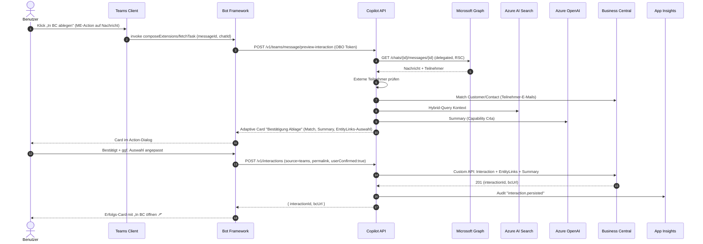
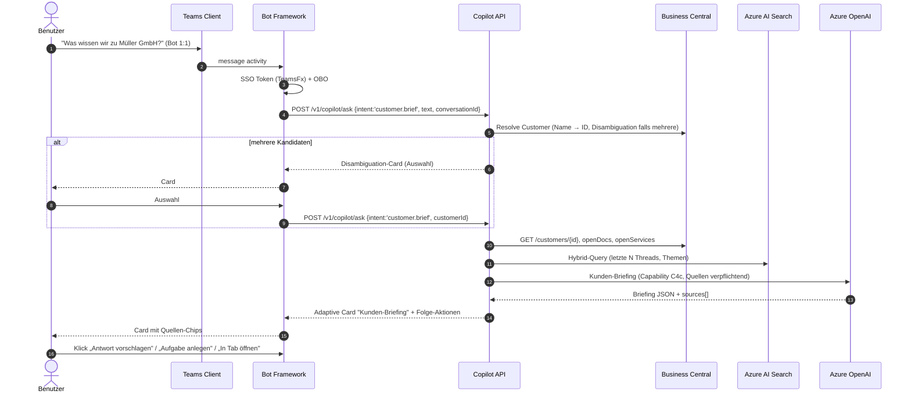

# 05 – Teams App: UX- und Funktionskonzept

> Bezug: [`../../instructions.md`](../../instructions.md), Abschnitt 3 ("Teams App") und „Outlook- und Teams-Plugins bleiben trotzdem notwendig". Architektur: [01-architecture.md](01-architecture.md). AI-Verträge: [08-ai-orchestration.md](08-ai-orchestration.md). Graph-Eignung & Lizenz-Risiken: [11-graph-feasibility.md](11-graph-feasibility.md). Sicherheit: [12-security-compliance.md](12-security-compliance.md). Outlook-Pendant: [04-outlook-addin.md](04-outlook-addin.md).

---

## 1. Ziel & Abgrenzung

### 1.1 Rolle der Teams App

Die Teams App ist die **interaktive Arbeitsoberfläche** des Customer Communication Copilot direkt in Microsoft Teams. Sie ergänzt die serverseitige Erfassung (Ingestion) und das Outlook Add-in um drei Bereiche:

| Bereich | Zweck |
|---|---|
| **Bot** (Personal & Team Scope) | Konversationelle Abfragen über Kunden, Verläufe, Aufgaben; Antwortvorschläge; Ablage in BC. |
| **Message Extension** | Aktionen direkt auf einer einzelnen Teams-Nachricht: analysieren, Kontext anzeigen, in BC ablegen, Antwort vorschlagen, BC-Beleg suchen. |
| **Tab** (Personal + ggf. Team-/Channel-Tab) | Eingebetteter Kunden-/Projekt-Arbeitsbereich (Timeline, Themen, Dokumente, Aufgaben, AI-Briefing, BC-Belege). |

### 1.2 Was die Teams App NICHT macht

- Sie ersetzt **nicht** die serverseitige Ingestion (vgl. [07-ingestion-pipeline.md](07-ingestion-pipeline.md)). Bots/Tabs sehen nur, was der Benutzer aktiv aufruft.
- **Kein automatischer Versand** von Teams-Nachrichten. Bot-Antwortentwürfe erscheinen ausschließlich als **Compose-Surface-Vorschlag** (vom Benutzer zu posten).
- **Keine proaktive Bot-Nachricht in fremde Chats** im MVP (Bot postet höchstens 1:1 an den Aufrufer, nicht in Gruppen, ausgenommen Tab-Update-Hinweise).
- Tab und Bot speichern keine Inhalte clientseitig; sie rufen die Copilot API.

### 1.3 Verhältnis zu Outlook Add-in & Ingestion

| Aspekt | Outlook Add-in | Teams App |
|---|---|---|
| Trigger | Mail geöffnet | Bot-Frage / ME-Aktion / Tab-Aufruf |
| Hauptobjekt | E-Mail | Teams-Nachricht / Kunde / Projekt |
| Wiederverwendete Backend-Endpunkte | identisch (`/v1/customer/.../context`, `/v1/match/correction`, `/v1/interactions`, `/v1/tasks`) | identisch |
| Antwortentwurf einfügen | Outlook Compose | Teams Compose Surface (ME) bzw. Adaptive Card mit „Kopieren"/„An Compose senden" |

---

## 2. Manifest-Konzept

### 2.1 Struktur

- **Teams App Manifest v1.17+** (Manifest Schema), enthält:
  - `bots[]` mit `botId` (Entra-App-ID des Bot-Service), `scopes: [personal, team, groupchat]`, `commandLists[]` (gehängte Slash-Commands).
  - `composeExtensions[]` (Message Extension): `botId`, `commands[]` (Action + Search), `messageHandlers[]` für Link Unfurling (optional, später).
  - `staticTabs[]` (Personal Tab „Mein Copilot": Übersicht, offene Threads, Briefings) und `configurableTabs[]` (Team-/Channel-Tab „Kundenarbeitsbereich").
  - `webApplicationInfo` mit `id` (Entra-App-ID) + `resource` für SSO.
  - `permissions: [identity, messageTeamMembers]` (klassische Permissions; weiterhin schmal halten).
  - `authorization.permissions.resourceSpecific[]` für RSC (siehe §2.3).
  - `validDomains[]`: Backend-Hosts.
  - `devicePermissions: []` (keine).
- **Bot-Registrierung:** Azure Bot Service (Channel: Microsoft Teams aktiviert), Messaging-Endpoint = `https://api.<tenant-host>/v1/teams/bot/messages`. Bot-ID = Entra-App-ID des Bot-Service-Principals.

### 2.2 Berechtigungen

| Berechtigung | Typ | Zweck | Bemerkung |
|---|---|---|---|
| `User.Read` (delegated) | Entra | Profil im Tab/Bot | Standard |
| eigene API-Scope `api://<copilot-app-id>/access_as_user` | Entra | OBO zum Backend | erforderlich |
| `Mail.ReadBasic` (delegated, optional) | Entra | nur falls Bot „Kontext zu meiner letzten Mail" liefern soll | optional, MVP-fern |
| Teams-Manifest `permissions: [identity, messageTeamMembers]` | Teams | Identität, Mention | gering |
| **RSC** (Application, Resource-Specific Consent) | siehe §2.3 | Channel-/Chat-Nachrichten lesen | präferiert ggü. Tenant-Wide |

### 2.3 RSC – Resource-Specific Consent

Begründung mit Verweis auf [11-graph-feasibility.md](11-graph-feasibility.md):

- **Channel-Nachrichten**: `ChannelMessage.Read.Group` (RSC) statt `ChannelMessage.Read.All` (Application) – vermeidet Pay-per-use des Teams Export API und beschränkt Zugriff auf Teams, in denen die App **installiert** ist.
- **Chat-Nachrichten** (1:1, Group): `ChatMessage.Read.Chat` / `Chat.Manage.Chat` (RSC) für die Chats, in denen die App **installiert** ist (z. B. via Message Extension Bring-Along).
- **Vorteile:** kein Tenant-Wide Admin-Consent für breite Mail-/Chat-Berechtigungen; geringere Lizenzkosten; klare Auditierbarkeit pro Team/Chat.
- **Nachteile / Konsequenzen:**
  - App muss pro Team/Chat installiert sein (manuell durch Team-Owner oder per Setup-Policy → automatische Installation in definierter Pilot-Gruppe).
  - Für **unternehmensweite, automatische** Erfassung (Ingestion) bleibt der Application-Permission-Pfad notwendig (siehe [11-graph-feasibility.md](11-graph-feasibility.md) §3.1–3.2). RSC adressiert primär die **interaktive** Nutzung in der Teams App.
- **Konkrete RSC-Permissions im Manifest** (App-Permission-Block):
  - `ChannelMessage.Read.Group`
  - `ChatMessage.Read.Chat` (für ME-Aktion auf eine konkrete Nachricht)
  - `TeamsTab.Create.Group` / `TeamsTab.ReadWriteForUser` falls Tab-Provisionierung gewünscht
  - `OnlineMeeting.ReadBasic.Chat` (Meeting-Chat-Kontext)

### 2.4 Personal vs. Team Scope

| Scope | Verwendung |
|---|---|
| **Personal** (`personal`) | Bot 1:1 mit dem Mitarbeiter, persönlicher Tab „Mein Copilot" mit Übersicht offener Threads, eigenen Aufgaben, Briefings. Default für MVP. |
| **Group Chat** (`groupchat`) | Bot in Gruppen-Chats nur **auf @-Mention**. ME-Aktionen in Chats verfügbar. |
| **Team** (`team`) | Konfigurierbarer Channel-Tab „Kundenarbeitsbereich Müller GmbH"; Bot in Channel nur auf @-Mention. |

Bot postet **niemals proaktiv** in Gruppen-/Channel-Kontexte (Trust-Leitplanke, §7).

### 2.5 SSO im Tab (und Bot)

- **Tab:** TeamsJS `authentication.getAuthToken()` liefert ID-Token für `api://<copilot-app-id>/access_as_user`. Backend führt **OBO** zu Graph/BC durch.
- **Bot:** TeamsFx-SSO über `OAuthCard` / `Single Sign-On` Bot Framework Pattern; falls Token nicht stillschweigend erhältlich, OAuth-Prompt mit Consent-Redirect. Backend nutzt OBO identisch.
- **Token-Hygiene:** keine Tokens in Bot-State persistieren – nur in-memory pro Turn. Bot Framework Storage enthält nur unsensible Konversationskontext-Felder (z. B. zuletzt erwähnter `customerId`, `decisionId`).

---

## 3. Bot – Konversationelle Use Cases

### 3.1 Allgemeines

- **Begrüßung** (Welcome Card) bei Erstinstallation: kurze Funktionsübersicht, Datenschutzhinweis, „Ich antworte nur auf Basis der Daten, die du sehen darfst", Beispiel-Fragen als Suggested Actions.
- Jeder Turn: Bot zeigt **Quellen-Chips** unter der Antwort (Adaptive Card-Block). Vorschläge sind in Karten gerendert mit klaren CTAs.
- **Folge-Aktionen** als Adaptive-Card-Buttons, die `Action.Submit` mit `data.intent` an den Bot senden.
- **Streaming**: Bot sendet typing-Indicator + Folge-Update-Activities (TeamsJS Streaming API, falls verfügbar; sonst zwei-stufig: „arbeite…" → finale Karte).

### 3.2 Intents (aus instructions.md)

#### I1 – „Was wissen wir zu diesem Kunden?"

- **Beispiel-Eingabe:** „Was wissen wir zu Müller GmbH?" / „Briefing zu Kunde 10042"
- **Lookup:** Customer-Identifikation (Name → Search/BC-Lookup, ggf. Disambiguation-Card mit Kandidaten); dann `GET /v1/customer/{id}/context` + `GET /v1/customer/{id}/timeline?limit=10` + Kunden-Briefing (Capability C4c, [08-ai-orchestration.md]).
- **Antwort-Pattern:** Adaptive Card „Kunden-Briefing" mit Header (Name, KdNr., Status), 3 Abschnitten („Aktuelle Themen", „Offene Belege", „Risiken/Offene Punkte"), unten Quellen-Chips.
- **Citations:** mind. 1 Quelle pro Abschnitt; Klick öffnet Quelle.
- **Folge-Aktionen:** [Verlauf öffnen] (öffnet Tab) · [Aufgabe anlegen] · [Antwort vorschlagen] · [Korrigieren – falscher Kunde]

#### I2 – „Fasse diesen Verlauf zusammen."

- **Beispiel:** Im Channel-/Chat-Kontext: „@Copilot fasse diesen Thread zusammen." (Reply auf einen Thread-Root) – Bot liest `replyToId`/`threadId` aus Aktivität.
- **Lookup:** `GET /chats/{id}/messages` bzw. `/teams/{id}/channels/{id}/messages/{id}/replies` über Backend (mit OBO – nur was der Benutzer sehen darf); plus etwaige verknüpfte BC-Entitäten.
- **Antwort-Pattern:** Card „Thread-Briefing" – Was/Wer/Offene Punkte/Empfehlungen.
- **Citations:** Permalinks der Originalnachrichten.
- **Folge-Aktionen:** [In BC ablegen] · [Aufgaben extrahieren] · [Antwort vorschlagen]

#### I3 – „Formuliere eine Antwort."

- **Beispiel:** „Antworte auf die letzte Nachricht von Anna" / als ME-Aktion „Antwort vorschlagen".
- **Lookup:** zugrundeliegende Nachricht + Kontext (Capability C3).
- **Antwort-Pattern:** Card „Antwortvorschlag" – Kurz/Lang/Unsicherheiten/Rückfragen.
- **Citations:** Quellen-Chips.
- **Folge-Aktionen:** [Vorschlag in Compose senden] (öffnet Compose Extension Surface, **nicht** Auto-Post) · [Bearbeiten] · [Verwerfen] · [Als Entwurf an mich senden] (Bot postet 1:1 an Aufrufer).

#### I4 – „Welche offenen Punkte gibt es?"

- **Beispiel:** „Welche offenen Punkte habe ich bei Müller GmbH?" / „Meine offenen Aufgaben"
- **Lookup:** `GET /v1/customer/{id}/openItems` (Aufgaben aus Communication Action Item, BC-To-Dos, offene Belege) + Capability C5 (Aufgabenextraktion aus jüngsten Threads).
- **Antwort-Pattern:** Adaptive Card mit Liste (Title, Owner, Due, Source); pro Item Buttons [Erledigt] [Übernehmen] [Quelle].
- **Citations:** pro Item.
- **Folge-Aktionen:** [Aufgabe in BC anlegen] · [In Planner anlegen] · [Briefing senden]

#### I5 – „Lege das in Business Central ab."

- **Beispiel:** Reply auf vorherige Bot-Antwort „Lege das in BC ab" oder ME-Aktion „In BC ablegen".
- **Lookup:** zugrundeliegende Nachricht + bereits ermittelter Match.
- **Bestätigungs-Card:** Vorschau der Ablage-Felder (Customer, Subject, Summary, EntityLinks, Attachments-Refs).
- **Aktion:** Nach Bestätigung `POST /v1/interactions`.
- **Citations:** Source = Teams-Permalink.
- **Folge-Aktionen:** [In BC öffnen] · [Aufgabe erstellen] · [Zuordnung korrigieren]

### 3.3 Disambiguation, Out-of-Scope, Sicherheit

- **Disambiguation:** Mehrere Kandidaten → Card mit Choice-Buttons; keine Annahme bei <0.85 Confidence ohne Auswahl.
- **Out-of-Scope-Anfragen** (z. B. „Berechne mir …", „Schreibe Code", „Wie ist das Wetter?") → freundliche Ablehnung + Hinweis auf Funktionsbereich.
- **Prompt-Injection-Schutz:** Inhalte aus Teams-Nachrichten/Mails sind in Prompts als `untrusted_content` markiert (siehe [08-ai-orchestration.md] §5).
- **Sprache:** automatische Erkennung; Override per `/language de|en` Befehl.

---

## 4. Message Extension – Action & Search Commands

### 4.1 Action Commands (Compose Surface)

| Command | Trigger-Kontext | Eingabe-Form | Ergebnis |
|---|---|---|---|
| **„Nachricht analysieren"** | Aktion auf Nachricht (`commandContext: message`) | keine (nutzt Nachrichteninhalt) | Adaptive Card mit Match (Top-K + Confidence), erkannte Fragen/Aufgaben, Antwortvorschlag + Quellen |
| **„Kundenkontext anzeigen"** | Aktion auf Nachricht ODER Compose | Form: Kunden-/Kontaktwahl (vorbelegt aus Match) | Card mit Customer-Context (offene Belege/Projekte/Tasks) |
| **„In BC ablegen"** | Aktion auf Nachricht | Bestätigungs-Form mit Match-Vorauswahl, EntityLinks-Mehrfachauswahl, Editierbare Summary | Karte „Erfolgreich abgelegt – BC-Link", oder Fehler-Card |
| **„Antwort vorschlagen"** | Aktion auf Nachricht (Reply-Kontext) | Form: Tonalität (neutral/formell/freundlich), Sprache (Auto/DE/EN), Länge | Compose-Surface mit Entwurfstext (Benutzer postet manuell) |
| **„Aufgabe erstellen"** | Aktion auf Nachricht | Form: Title (vorbelegt), Owner, Due, Ziel (BC/Outlook/Planner) | Bestätigungs-Card mit Link auf Task |

> **Trust-Leitplanke:** „Antwort vorschlagen" liefert das Ergebnis in das **Compose-Extension-Compose-Surface**. Der Benutzer entscheidet bewusst, ob er auf „Senden" klickt. Der Bot postet die Antwort niemals selbst.

### 4.2 Search Commands

| Command | Trigger | Suche | Ergebnis |
|---|---|---|---|
| **„BC-Beleg suchen"** | `composeExtensions/query` (Text-Eingabe in Compose) | `GET /v1/search/bc?q=…&types=so,po,project,service` | Liste mit `Card`-Items (Belegnr., Kunde, Status, Datum); Klick fügt Permalink/Card als Adaptive Card in die Nachricht ein |
| **„Kunde / Kontakt suchen"** | wie oben, Filter `types=customer,contact` | `GET /v1/search/bc?q=…&types=customer,contact` | Result-Items, Insert als Hero/Adaptive Card |

Beide respektieren BC-Berechtigungen (Backend-Filter).

### 4.3 Link Unfurling (optional, Folge-Phase)

- BC-Permalinks (`https://businesscentral.dynamics.com/...`) werden in Teams-Nachrichten zu Adaptive Cards entfaltet (Customer/Beleg-Snapshot). Erfordert `messageHandlers` im Manifest. **Out of Scope MVP**, in Roadmap halten.

---

## 5. Teams Tab – Kundenarbeitsbereich

### 5.1 Layout

```
Kopf: [Kunde wählen ▾ Müller GmbH]   • 92 % Confidence aus letzter Quelle • [In BC öffnen ↗]
Tab-Leiste: [Übersicht*] [Verlauf] [Themen] [Dokumente] [Aufgaben] [BC-Belege] [Briefing]
Inhalt (scrollbar):
  – Karten je nach aktivem Tab –
Fuß: [Antwort vorschlagen] (öffnet Aktion) • [In BC ablegen] (kontextabhängig)
```

### 5.2 Tabs (Inhalt = Datenquelle)

| Tab | Inhalt | Backend |
|---|---|---|
| **Übersicht** | Kunde + Kontakte + AI-Briefing-Snippet + offene Punkte | `GET /v1/customer/{id}/context`, `GET /v1/customer/{id}/briefing/latest` |
| **Verlauf (Timeline)** | Chronologisch: Mails, Teams, Meetings, BC-Interactions; Filter (Typ, Datum, Beteiligte, Sprache) | `GET /v1/customer/{id}/timeline` |
| **Themen** | Thematische Cluster (Lieferung, Reklamation, Preis, Vertrag, Projekt-X) – AI-generiert (Capability C4c) | `GET /v1/customer/{id}/topics` |
| **Dokumente** | SharePoint-Treffer + Anhänge aus Interactions, mit Permission-Trim | `GET /v1/customer/{id}/documents` |
| **Aufgaben** | Communication Action Items + BC-To-Dos + Planner (verlinkt) | `GET /v1/customer/{id}/openItems` |
| **BC-Belege** | Offene Angebote, Aufträge, Rechnungen, Servicefälle, Projekte, Opportunities | `GET /v1/customer/{id}/openDocs` |
| **Briefing** | Letzte Kundenbriefings (chronologisch + thematisch), [Neu erzeugen] | `GET /v1/customer/{id}/briefings`, `POST /v1/customer/{id}/briefing` |

> **Wichtig:** Tab und Outlook Add-in nutzen **dieselben Backend-Endpunkte**. UI ist komponenten-konsistent, aber für Teams an Fluent UI v9 / Teams Theming (Light/Dark/HighContrast) angepasst.

### 5.3 Personal Tab vs. Team-Tab

- **Personal Tab „Mein Copilot":** ohne fixen Kunden – startet mit „meine offenen Threads" + „heute fällig"; Kunden-Auswahl auf Demand.
- **Team-Tab (configurable):** beim Hinzufügen wählt Team-Owner einen Kunden/Projekt → Tab ist auf diese Entität gepinnt; alle Team-Mitglieder sehen denselben Bezug, jedoch **gefiltert nach individueller BC-Berechtigung** (siehe §11).

---

## 6. Trust-Leitplanken

| Anforderung | Umsetzung |
|---|---|
| **Keine automatische Teams-Nachricht nach außen** | Bot postet ausschließlich 1:1 an den Aufrufer oder als Reply-Card in dem Chat, in dem er @-mentioned wurde. Niemals proaktiv in Channels oder externe Chats. |
| **Senden nur durch Benutzer-Klick** | Antwortvorschläge werden in Compose-Surfaces / Adaptive Cards mit „Kopieren"/„An Compose senden" gerendert. Es gibt keinen Bot-Endpoint, der eine externe Teams-Nachricht im Namen des Benutzers veröffentlicht. |
| **Quellen sichtbar** | Jede inhaltliche Karte hat einen Quellen-Block (Chips mit `Action.OpenUrl`). Karten ohne Quellen werden als „Hinweis ohne Beleg" gerendert (Banner). |
| **Unsicherheiten markiert** | Eigene Karten-Sektion „Unsicherheiten / Annahmen"; Confidence-Badges. |
| **Kein Auto-Match-Übernahme** | Bei Confidence < 0.85 erzwingt Bot/ME eine Disambiguation-Card vor Aktion. |
| **Externe Empfänger werden ausgewiesen** | Card-Banner „Externer Teilnehmer: anna@müller.de (extern)", siehe §10. |

---

## 7. Adaptive-Card-Beispiele (verkürzt JSON)

### 7.1 Match-Vorschlag (ME „Nachricht analysieren")

```json
{
  "type": "AdaptiveCard",
  "version": "1.5",
  "body": [
    { "type": "TextBlock", "text": "Erkannte Zuordnung", "weight": "Bolder", "size": "Large" },
    { "type": "FactSet", "facts": [
      { "title": "Top-Treffer", "value": "Müller GmbH (Kunde 10042)" },
      { "title": "Confidence", "value": "92 %" },
      { "title": "Bezug", "value": "SO-4711, Projekt P-2206" }
    ]},
    { "type": "TextBlock", "text": "Alternativen", "weight": "Bolder", "spacing": "Medium" },
    { "type": "Input.ChoiceSet", "id": "selectedMatch", "style": "expanded", "value": "cust:10042",
      "choices": [
        { "title": "Müller GmbH (92 %)", "value": "cust:10042" },
        { "title": "Müller GmbH & Co. KG (78 %)", "value": "cust:10043" },
        { "title": "Projekt Müller-Halle 2 (65 %)", "value": "proj:P-2206" }
      ]
    },
    { "type": "TextBlock", "text": "Quellen", "weight": "Bolder", "spacing": "Medium" },
    { "type": "ActionSet", "actions": [
      { "type": "Action.OpenUrl", "title": "SO-4711 (BC)", "url": "https://bc/.../SO-4711" },
      { "type": "Action.OpenUrl", "title": "Vorherige Mail (Outlook)", "url": "https://outlook/..." }
    ]}
  ],
  "actions": [
    { "type": "Action.Submit", "title": "Bestätigen", "data": { "intent": "match.confirm" } },
    { "type": "Action.Submit", "title": "Antwort vorschlagen", "data": { "intent": "reply.suggest" } },
    { "type": "Action.Submit", "title": "In BC ablegen", "data": { "intent": "interaction.create" } }
  ]
}
```

### 7.2 Antwortentwurf (Bot/ME)

```json
{
  "type": "AdaptiveCard",
  "version": "1.5",
  "body": [
    { "type": "TextBlock", "text": "Antwortvorschlag (DE)", "weight": "Bolder", "size": "Large" },
    { "type": "Input.Text", "id": "draftBody", "isMultiline": true, "value": "Hallo Frau Becker, …" },
    { "type": "TextBlock", "text": "Unsicherheiten", "weight": "Bolder", "color": "Warning", "spacing": "Medium" },
    { "type": "TextBlock", "text": "Aktualisierte Zeichnung liegt nicht vor – Rückfrage empfohlen.", "wrap": true },
    { "type": "TextBlock", "text": "Quellen", "weight": "Bolder", "spacing": "Medium" },
    { "type": "ActionSet", "actions": [
      { "type": "Action.OpenUrl", "title": "SO-4711", "url": "https://bc/.../SO-4711" },
      { "type": "Action.OpenUrl", "title": "Lieferschein 51002", "url": "https://bc/.../DS-51002" }
    ]}
  ],
  "actions": [
    { "type": "Action.Submit", "title": "An Compose senden", "data": { "intent": "reply.toCompose" } },
    { "type": "Action.Submit", "title": "Als Entwurf an mich (1:1)", "data": { "intent": "reply.toSelf" } },
    { "type": "Action.Submit", "title": "Verwerfen", "data": { "intent": "reply.discard" } }
  ]
}
```

### 7.3 Aufgabe erstellen

```json
{
  "type": "AdaptiveCard",
  "version": "1.5",
  "body": [
    { "type": "TextBlock", "text": "Aufgabe erstellen", "weight": "Bolder", "size": "Large" },
    { "type": "Input.Text", "id": "title", "label": "Titel",
      "value": "Aktualisierte Zeichnung für SO-4711 anfragen" },
    { "type": "Input.Date", "id": "due", "label": "Fällig" },
    { "type": "Input.ChoiceSet", "id": "target", "label": "Ziel-System", "value": "bc",
      "choices": [
        { "title": "Business Central (BC-To-Do)", "value": "bc" },
        { "title": "Outlook-Aufgabe", "value": "outlook" },
        { "title": "Microsoft Planner", "value": "planner" }
      ]
    },
    { "type": "Input.Text", "id": "owner", "label": "Verantwortlich (UPN)" }
  ],
  "actions": [
    { "type": "Action.Submit", "title": "Erstellen", "data": { "intent": "task.create" } },
    { "type": "Action.Submit", "title": "Abbrechen", "data": { "intent": "cancel" } }
  ]
}
```

---

## 8. Datenflüsse

### 8.1 Message Extension Action „In BC ablegen"



### 8.2 Bot-Frage „Was wissen wir zu Kunde X?"



---

## 9. Externe Teilnehmer & rein interne Chats

### 9.1 Erkennung externer Teilnehmer

- Backend ermittelt aus Chat-/Channel-Mitgliedern (`tenantId` ≠ Home-Tenant ⇒ extern; Federated-Tenants per Allowlist als „intern" markierbar – siehe [11-graph-feasibility.md](11-graph-feasibility.md) §3.6).
- **UI-Hinweis:** Adaptive-Card-Banner „Externer Teilnehmer: <upn> (extern)" mit Kontrast-Icon. Im Tab erscheint im Header-Bereich ein „Externer Beteiligter"-Chip pro Thread.

### 9.2 Verhalten in rein internen Chats

- Default: **Add-in / ME inaktiv**. Wenn Benutzer „Nachricht analysieren" auf einer rein internen Nachricht aufruft, zeigt der Bot eine Karte:

  > „Diese Nachricht enthält keine externen Teilnehmer. Standardmäßig wird nur externe Kundenkommunikation erfasst. Möchtest du dennoch fortfahren? Diese Aktion benötigt eine explizite Bestätigung."

- Bei Bestätigung wird ein Audit-Event `internal.override.confirmed` geschrieben (siehe [12-security-compliance.md]).
- Im Tab werden **rein interne Threads gar nicht angezeigt** – konsistent mit Default-Ausschluss in der Ingestion ([07-ingestion-pipeline.md]).

---

## 10. Berechtigungs- und Sichtbarkeitsverhalten

- **Backend filtert** alle Inhalte nach BC-Permissions des aufrufenden Benutzers (Permission Sets, Verkaufsbereich-Zuordnung, Mandanten-/Company-Scope). Tab und Bot zeigen ausschließlich, was das Backend liefert.
- **Mehrere Benutzer eines Channel-Tabs** sehen technisch denselben Tab-URL, aber **unterschiedliche Inhalte** (Permission Trim per Backend). UI zeigt Hinweis: „Inhalte werden nach deinen Berechtigungen gefiltert."
- **Suche im Tab** (z. B. „BC-Beleg suchen") setzt Permission-Filter im Search-Index (siehe [12-security-compliance.md] §4 / [08-ai-orchestration.md] §4.2).
- Wenn ein Benutzer **keinerlei Recht** auf den Kunden des Tabs hat: leere Tab-Inhalte + Banner „Du hast keinen Zugriff auf diesen Kunden in Business Central." – ohne Daten preiszugeben.

---

## 11. Telemetrie & Akzeptanzmetriken

| Metrik | Erhebung | Ziel |
|---|---|---|
| **Bot-Akzeptanzrate** | Antwort-Cards mit Folge-Aktion ausgeführt / Antwort-Cards gesendet | ≥ 50 % |
| **ME-Action-Erfolgsrate** | erfolgreich abgeschlossene Aktionen / gestartete Aktionen | ≥ 90 % |
| **Match-Korrekturrate (ME/Bot)** | Korrekturen / bestätigte Matches | ≤ 15 % |
| **Edit-Distanz Antwortvorschlag** | clientseitig (Card-Input → Compose) berechnet, nur Zahl | Median ≤ 25 % |
| **Tab-Aktivität** | Tab-Öffnungen pro Pilot-Benutzer/Woche | ≥ 5 |
| **TTFI Bot** | Frage gesendet → erste Card | p95 ≤ 3 s (ohne Vorschlag) / ≤ 6 s mit Vorschlag |
| **Fehlerrate** | Fehler-Activities / Sessions | < 1 % |
| **Pay-per-use-Verbrauch (falls Modell B aktiv)** | Teams-Export-Calls/Tag | Kostenkappe pro Tenant (Alarm bei 80 %) |

PII-Regeln analog [04-outlook-addin.md] §13: keine Inhalte, keine UPNs, nur Hashes/IDs.

---

## 12. Lokalisierung & Barrierefreiheit

- **Lokalisierung:** DE (primär), EN (Fallback). Bot erkennt Sprache pro Turn (Capability C8) und antwortet entsprechend; manueller Override `/language de|en`. Adaptive Cards laden Locale-spezifische Strings serverseitig (Card-Generation), keine clientseitige Übersetzung.
- **A11y:**
  - Adaptive Cards nutzen semantische Container, `altText` für Icons/Bilder, korrekte Heading-Levels.
  - Tab UI: WCAG 2.1 AA, Tastatur-Navigation, Fluent UI v9 Tokens für Theming (Light/Dark/HighContrast).
  - Bot-Antworten enthalten zusätzlich plain-text-Variante für Screenreader (Bot Framework `text` neben `attachments`).
  - Bewegung respektiert `prefers-reduced-motion`.
  - Tastenkürzel im Tab: `Alt+1..7` für Tabs.

---

## 13. Verteilung

- **Pilot:** App-Paket (.zip Manifest + Icons) wird im **Teams Admin Center → Manage Apps → Upload** für die Organisation hochgeladen; Zuweisung via **App Setup Policy** an Pilot-Sicherheitsgruppe (Auto-Install in Personal Scope, optional Pre-Install in Pilot-Teams).
- **Sideload für Entwicklung:** „Upload an app" je Tester (TeamsToolkit / dev manifest), nur in Dev-Tenant.
- **Roll-out:** Stufenweise per **App Permission Policy** + **Setup Policy**; RSC-Permissions werden bei Installation pro Team/Chat ausgewiesen und vom Team-Owner bzw. Admin (über Setup Policy) bestätigt.
- **Versionierung:** SemVer im Manifest; Updates über Admin Center; Breaking Changes (neue RSC) erfordern explizite Re-Installation.
- **AppSource:** **nicht** im MVP. Optional als ISV-Auslieferung später.

---

## 14. Offene Fragen

1. **Pay-per-use vs. RSC-First:** Welche Teams nehmen am Pilot teil und wie schnell kann RSC-Installation tenant-weit ausgerollt werden, um Modell-B-Kosten zu vermeiden? (siehe [11-graph-feasibility.md] §3)
2. **Streaming-API für Bot-Antworten:** Verfügbarkeit der Teams-Streaming-Activities prüfen (Roll-out variiert pro Tenant); Fallback-UX definieren.
3. **Meeting-Side-Panel (in-Meeting App):** im MVP ausgeklammert – soll der Tab als Meeting-Side-Panel verfügbar sein? (Manifest `configurableTabs.context: ['meetingSidePanel']`)
4. **Federated-Tenants als „intern":** Welche Partner-Tenants gelten als intern (Tochterunternehmen)? Allowlist pflegen.
5. **Bot-Proaktivität:** Soll der Bot (1:1) eine tägliche Briefing-Push-Nachricht an Vertrieb/PM senden? Erfordert User-Opt-in und respektiert Quiet Hours.
6. **Channel-Tab-Provisionierung:** Tabs automatisch je Kunden-/Projekt-Channel anlegen (über `TeamsTab.Create.Group` RSC) – sinnvoll oder zu viel?
7. **Compose Surface für externe Chats:** TeamsJS-Verhalten der Compose-Insertion in externen Chats validieren (mancher Federated-Setup blockt es).
8. **Adaptive Card Universal Actions** (Bot-betriebene Actions ohne Bot Framework): Migration sinnvoll für Konsistenz Outlook ↔ Teams? Out of Scope MVP.
9. **DLP-/Sensitivity-Label-Verhalten:** Bot soll keine MIP-„Highly Confidential"-Inhalte in Prompts ziehen; Detektionsweg in Teams (anders als in Mail) klären.
10. **Reaktion auf gelöschte Nachrichten:** wenn die ursprüngliche Teams-Nachricht gelöscht wird, was passiert mit der bereits in BC abgelegten Interaction? (Hinweis-Banner im Tab; Löschen weiterhin nur durch Benutzer in BC.)
