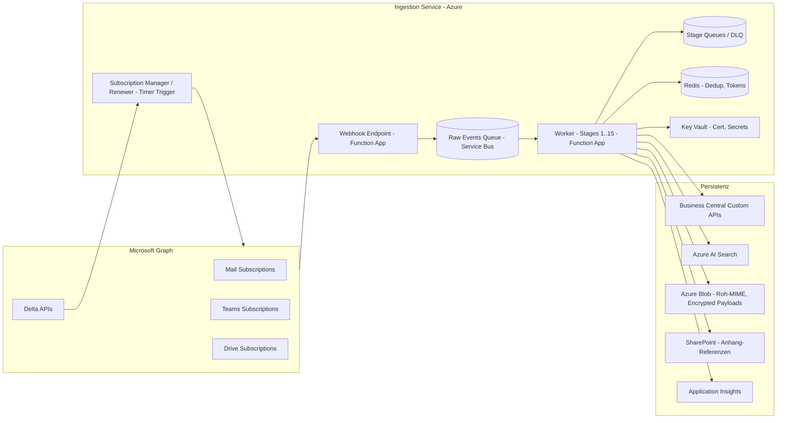
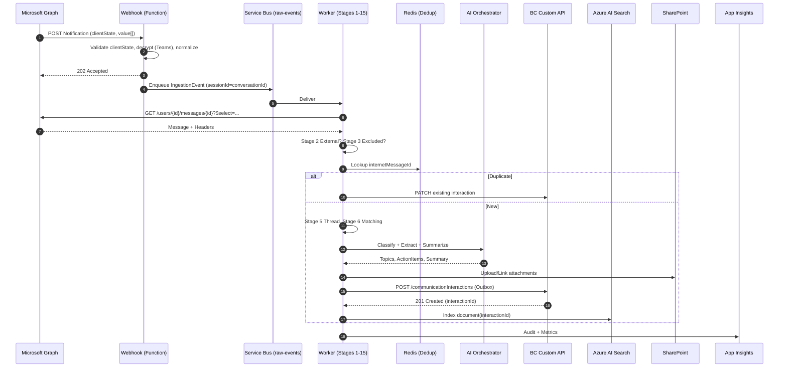

# 07 – Ingestion Pipeline (serverseitige Erfassung)

> Konzept des **zentralen Communication Ingestion Service** gemäß `instructions.md` Abschnitt „Nacharbeit / Erweiterung: Unternehmensweite Erfassung externer Kommunikation". Ergänzt das Backend-Konzept ([06-backend-service.md](06-backend-service.md)) und basiert auf der Graph-Bewertung in [11-graph-feasibility.md](11-graph-feasibility.md).

---

## 1. Ziel und Abgrenzung zum Outlook/Teams-Plugin

**Der Ingestion Service** erfasst **vollständig serverseitig**, unabhängig davon, ob ein Benutzer aktiv arbeitet. Er ist die **systemische Quelle** für die Kommunikationshistorie in Business Central.

**Outlook Add-in** ([04-outlook-addin.md](04-outlook-addin.md)) und **Teams App** ([05-teams-app.md](05-teams-app.md)) sind **Benutzeroberflächen** im delegierten Kontext: Sie unterstützen beim Lesen, Antworten, manuellem Markieren und Korrigieren von Zuordnungen, **erfassen aber nicht** systematisch.

| Aspekt | Ingestion Service | Outlook/Teams Add-ins |
|---|---|---|
| Auth-Kontext | Application Permission (Service Principal) | Delegated Permission (User Token) |
| Aktivitätsmodell | event-/zeitgesteuert, dauerhaft | nur wenn Benutzer aktiv |
| Vollständigkeit | systemisch, alle berechtigten Postfächer/Teams | punktuell, nur aktuell geöffnete Items |
| Rolle | Erfassen, Klassifizieren, Persistieren | Anzeigen, Vorschlagen, Korrigieren |

Doppelerfassung (Service + Add-in) wird über **Idempotenz-Keys** (siehe §6) verhindert.

---

## 2. Komponentenarchitektur

**Kernkomponenten:**

- **Webhook Endpoint** (Azure Function HTTP Trigger): Empfängt Graph Change Notifications inkl. `validationToken`-Handshake, validiert `clientState`, dechiffriert `encryptedContent` (Teams) und legt **Roh-Events** in `Q1` ab.
- **Subscription Manager / Renewer** (Timer Trigger): Erstellt, verlängert und überwacht alle Subscriptions; reagiert auf Lifecycle Notifications (`reauthorizationRequired`, `subscriptionRemoved`, `missed`).
- **Worker** (Function App / Service Bus Trigger): Führt die 15-Schritt-Pipeline aus (§4); skaliert nach Queue-Tiefe.
- **Service Bus Queues**: `raw-events`, je Stage-Queue für Retry/DLQ-Trennung; FIFO via `sessionId = conversationId/chatId`.
- **Redis Cache**: Dedup-Keys (Internet Message ID, Hash), Delta-Tokens, Subscription-State.
- **Key Vault**: Webhook Encryption Cert (Private Key), App-Registration-Secrets, BC-Service-Token.
- **Persistenz**: BC (Metadaten via Custom API – siehe [03-bc-apis.md](03-bc-apis.md)), Azure AI Search (Volltext/Embeddings), Blob (Raw-MIME, optional verschlüsselt), SharePoint-Links (keine Kopie).

---

## 3. Ereignisquellen

| Quelle | Mechanismus | Permission | Hinweis |
|---|---|---|---|
| **Mail – Neueingang** | Change Notification auf `users/{id}/mailFolders('Inbox')/messages` | `Mail.Read` (App) | TTL ≤ 3 d, Renewal alle ~2 d (siehe [11-graph-feasibility.md](11-graph-feasibility.md) §2.2) |
| **Mail – Ausgang (Sent)** | Change Notification auf `users/{id}/mailFolders('SentItems')/messages` | `Mail.Read` | für vollständige Threads |
| **Mail – Fallback** | Delta Query `messages/delta` | `Mail.Read` | Backfill + nach `missed` |
| **Teams 1:1/Group-Chats** | Change Notification `users/{id}/chats/getAllMessages` (encrypted Pflicht) | `Chat.Read.All` (App) **oder** RSC | TTL ≤ 60 min, Pay-per-use beachten |
| **Teams Channel-Messages** | Change Notification `teams/{id}/channels/getAllMessages` (encrypted Pflicht) | `ChannelMessage.Read.All` (App) **oder** RSC `ChannelMessage.Read.Group` | bei RSC: pro Team-Installation |
| **Teams Channel-Messages – Fallback** | Pull `teams/{id}/channels/{id}/messages/delta` | wie oben | Backfill |
| **Meeting-Transkripte** | Pull `users/{id}/onlineMeetings/{id}/transcripts` (kein Webhook) | `OnlineMeetingTranscript.Read.All` | nach Meeting-Ende, periodischer Sync |
| **OneDrive / SharePoint Drives** | Change Notification auf `drives/{id}/root` | `Files.Read.All` | Item-Granularität via Delta nachfassen |
| **Periodische Sync** | Timer Trigger | – | Sicherheitsnetz alle 6 h pro Quelle |

---

## 4. Pipeline-Stages (Stage 0 + 15 + Gap Monitor)

Jede Stage ist **idempotent**, **atomar persistierbar** und schreibt strukturierte Logs nach App Insights mit `correlationId = ingestionId`.

### Stage 0 – Consent-Prüfung (Hard-Stop bei fehlender Einwilligung)

> Vorgelagerte Pflicht-Stage gemäß **ADR-27 / A16** ([12 §10.3](12-security-compliance.md), [14 ADR-27](14-risks-decisions.md)). Wird **vor jedem Inhaltszugriff** ausgeführt – auch vor Mailbox-Lookup im Webhook und vor jedem Backfill-Item.

- Lookup in BC-Tabelle `Communication Consent` (Tab. 50014, siehe [02-bc-data-model.md](02-bc-data-model.md)) per Schlüssel (`Tenant Id`, `Mailbox Address`).
- Prüfung: `Consent Status = Granted` **und** `Pilot Until ≥ today` **und** `Withdrawn At IS NULL`.
- **Ergebnis „kein gültiger Consent" ⇒ Hard-Stop**: Roh-Event wird verworfen (keine Body-Lesung, keine Persistenz), Audit-Log-Eintrag `ingestion.skipped.no_consent` (Tenant, Mailbox-Hash, Zeitpunkt) – **keine Inhalts- oder Header-Daten geloggt**.
- Cache-TTL der Consent-Resolution: 5 min (kurze TTL, damit Widerruf mit sofortiger Wirkung greift).
- Lifecycle: Bei Widerruf (`Consent Status = Withdrawn`) wird zusätzlich ein Cleanup-Job angestoßen (Löschung bereits erfasster Inhalte gem. DSGVO Art. 17, Abgleich mit gesetzlicher Aufbewahrung – [12 §9](12-security-compliance.md)).

### Stage 1 – Eingangserkennung
- Eingang: Notification aus Webhook **oder** Delta-Polling-Treffer.
- Aktion: Roh-Event normalisieren in internes Schema `IngestionEvent` (Quelle, Resource, ResourceId, ChangeType, Timestamp, RawPayloadRef).
- Ergebnis: in `raw-events`-Queue.

### Stage 2 – Externe Beteiligung prüfen
- Implementiert Erfassungslogik 1–8 aus `instructions.md`:
  1. mind. ein externer Kontakt ⇒ extern
  2. Sender-/Empfänger-Domain ≠ interne Domains-Liste ⇒ extern
  3. bekannte BC-Kontakt-Mail beteiligt ⇒ relevant
  4. bekannte BC-Kunden-Domain beteiligt ⇒ relevant
  5. Belegnummer/Projektnummer/Ticketnummer/Angebotsnummer im Subject/Body via Regex ⇒ relevant
  6. Teams-Meeting mit `member.tenantId` ≠ Home oder Anonymous ⇒ extern
  7. Sharing mit externer UPN ⇒ relevant
  8. manuelles Flag aus Add-in (`SourceReference.ManualRelevance = true`) ⇒ relevant
- Erfüllt **keine** Bedingung ⇒ Stage 3.

### Stage 3 – Ausschlussregeln
- Interne Domain-Only ⇒ verwerfen (Default).
- Newsletter-Heuristik: `List-Unsubscribe`, `Precedence: bulk`, bekannte Newsletter-Sender-Liste ⇒ verwerfen.
- Sensitivity Label „Privat"/„Personal" oder Outlook-Kategorie „Privat" ⇒ verwerfen.
- Federated-Konzern-Tenants (siehe Konfiguration) ⇒ als „intern" behandeln.
- Verwerfen = **kein** BC-Eintrag, aber Audit-Log-Eintrag „filtered" (Grund), keine Inhaltsspeicherung.

### Stage 4 – Dublettenprüfung
- Schlüssel (zusammengesetzt):
  - Mail: `internetMessageId` (RFC 822, eindeutig pro Nachricht weltweit).
  - Teams: `chatId + messageId` bzw. `channelId + messageId`.
  - Body-Hash: SHA-256 über normalisierten Body als Sekundärschlüssel.
  - `conversationId` zur Thread-Aggregation.
- Cache-Lookup in Redis (TTL 90 Tage) + persistente Prüfung in BC `Communication Source Reference`.
- Treffer ⇒ Update statt Insert (Statusänderung, neue Empfänger, ergänzte Anhänge).

### Stage 5 – Thread-/Konversationszuordnung
- Mail: `conversationId` aus Graph + `inReplyTo`/`references`-Header.
- Teams: `replyToId` für Threading in Channels; Chat = ein Thread.
- Mapping auf BC-Tabelle `Communication Interaction` mit `ParentInteractionId`.

### Stage 6 – Kontakt-/Kundenerkennung
- Übergabe an **Matching-Service** ([10-matching.md](10-matching.md)):
  - Eingabe: Sender, Empfänger, Domain, externe Teams-Teilnehmer, erkannte Nummern.
  - Ausgabe: Liste `(BCEntityType, BCEntityId, Confidence)` mit mehreren Treffern.
- Confidence < Schwellwert (z. B. 0,6) ⇒ Status `NeedsReview`, weiter mit Best-Guess + Flag.

### Stage 7 – BC-Entitätsmatching
- Auflösung Belegnummern → Kunde, Projekt, Auftrag, Service, Opportunity.
- Erzeugt N `Communication Entity Link`-Datensätze mit `Confidence` und `MatchSource`.
- **Berechtigungsprüfung verschoben** auf Anzeigeseite (siehe [12-security-compliance.md](12-security-compliance.md)).

### Stage 8 – Klassifikation
- Aufruf AI-Orchestrator ([08-ai-orchestration.md](08-ai-orchestration.md)) mit Klassifikations-Prompt.
- Output: ein oder mehrere Topics (Frage, Aufgabe, Beschwerde, Risiko, Termin, …).
- Persistenz: `Communication Topic` mit Confidence.

### Stage 9 – Extraktion
- Strukturierte Extraktion: Fragen, Aufgaben, Risiken, Termine, Fristen, Verantwortliche, betroffene Belege/Artikel.
- Output: `Communication Action Item`-Datensätze (Status `Proposed`, nicht automatisch ausgeführt).

### Stage 10 – Dokument-/Anhangserkennung
- Inline-Anhänge: Metadaten (Name, MIME, Größe, Hash) extrahieren.
- Bei `referenceAttachment` (OneDrive/SharePoint-Link): Auflösung über Graph, `driveItemId`, `webUrl` speichern.
- Bei `fileAttachment`: optional in **SharePoint-Bibliothek „Communication Attachments"** ablegen statt in BC kopieren; in BC nur `Communication Attachment` mit `webUrl` + `driveItemId`.
- Volltext-Indexierung später in Stage 13.

### Stage 11 – AI-Zusammenfassung
- Nachrichten- und Thread-Summary via AI-Orchestrator.
- Output: `Communication AI Summary` mit Kurzantwort, ausführlicher Antwort, Unsicherheiten, Quellen.
- **Antwortvorschläge** sind Vorschläge, **kein automatisches Senden** (Grundprinzip 1).

### Stage 12 – Persistenz Metadaten in BC
- Aufruf BC Custom API (`/communicationInteractions` POST/PATCH – siehe [03-bc-apis.md](03-bc-apis.md)).
- Atomar mit Outbox-Pattern (siehe §6).
- Felder: alle „Source …"-Felder (Tenant, User, Mailbox, MessageId, ConversationId, ChatId, TeamId, ChannelId, MeetingId, InternetMessageId), `IsExternalCommunication`, `CaptureMethod`, `CaptureTimestamp`, `ProcessingStatus`.

### Stage 13 – Indexierung in Azure AI Search
- Index `communications`: Volltext (Subject, Body, Transkript, Anhang-OCR), Vector Embeddings, Filter-Felder (Tenant, Customer, Project, Visibility-Scope).
- Anhänge: separater Index `attachments`, verlinkt via `interactionId`.
- **Kein** Volltext in BC.

### Stage 14 – Benachrichtigung an zuständige Benutzer
- Konfigurierbar pro Benutzer/Rolle:
  - **BC My Notifications** (Default für BC-Nutzer).
  - **Teams Adaptive Card** an `User-Bot-Chat` (für Außendienst).
  - **E-Mail** (Fallback).
- Trigger: `IsExternalCommunication = true` AND (`Confidence < 0.6` OR `ContainsActionItem` OR `ContainsRisk`).
- **Keine** automatische Antwort nach außen.

### Stage 16 – Lücken-Monitor (Gap Monitor)

> Pflicht-Stage gemäß **ADR-29 / A19** ([14 ADR-29](14-risks-decisions.md)). Sichert die Vollständigkeit der Kommunikationshistorie über serverseitige Erfassung + Add-ins hinweg.

- Periodischer Job (Timer Trigger, alle 6 h pro Mailbox / Team).
- **Heuristiken**:
  - Conversation-IDs mit erkannten Antworten/Forwards, deren Folgenachrichten **fehlen** (z. B. `In-Reply-To`-Header verweist auf unbekannte Source Message ID).
  - **High-Water-Mark** je Mailbox/Team/Chat (letzte verarbeitete `receivedDateTime` / `lastModifiedDateTime`) gegen Graph-Delta-Query → erwartete Sequenz-Lücken.
  - Subscription-Lifecycle-Events `missed` ⇒ automatischer Delta-Backfill ab letztem bekannten Token.
- **Wiederaufnahme-Job** nach Ausfällen: liest High-Water-Mark aus persistentem Store, fordert Delta-Window an, durchläuft Stage 0–15 idempotent.
- **KPI** `gap_count_per_mailbox_per_day` in App Insights; Alert bei Schwellenüberschreitung.
- **Audit-Eintrag** `ingestion.gap_detected` mit Mailbox-Hash, Lücken-Fenster, Auflöse-Strategie.

### Stage 15 – Audit-Log
- Schreibt in `Audit Log Entry` (BC) **und** App Insights Custom Event:
  - Wer (`servicePrincipalId`), was (`stage`), wann, womit (`ingestionId`, `interactionId`), Ergebnis, AI-Modell-Version, Quellen-Hashes.
- Pflicht für DSGVO-Auskunft und Betriebsvereinbarung.

---

## 5. Sequenzdiagramm – Mail-Eingang von Webhook bis BC-Persistenz

---

## 6. Idempotenz-Strategie

- **Eindeutiger Idempotenz-Key** pro Ereignis:
  - Mail: `internetMessageId`.
  - Teams Chat: `chatId|messageId|etag`.
  - Teams Channel: `teamId|channelId|messageId|etag`.
- **Inbox-Pattern (Webhook)**: Webhook schreibt Roh-Event mit Idempotenz-Key in eine Inbox-Tabelle; doppelte Notifications (Graph kann replizieren) werden vor Queue-Insert verworfen.
- **Outbox-Pattern (BC-Persistenz)**: Worker schreibt Persistenz-Aktion lokal in Outbox-Tabelle in Storage; ein separater Publisher ruft BC-API. Damit ist „Worker-Crash nach BC-POST, vor Commit" auflösbar.
- **At-least-once + Dedup**: Service Bus liefert at-least-once; Worker prüft Idempotenz-Key gegen Redis (TTL 90 d) **und** gegen `Communication Source Reference` in BC (Source of Truth).
- **Update statt Re-Insert**: Bei Treffer im Idempotenz-Key wird `PATCH` mit Versionsabgleich (`etag`) durchgeführt.
- **Reihenfolge**: Service-Bus-Sessions auf `conversationId`/`chatId` ⇒ Reihenfolge je Thread garantiert.

---

## 7. Skalierung

- **Queue-basiert**: jede Stage entkoppelt; Worker skaliert horizontal nach Queue-Tiefe (KEDA / Azure Functions Premium).
- **Concurrency-Limits pro Quelle**:
  - Mail: max. 16 parallele Worker pro Mailbox (Graph-Throttling-Schutz).
  - Teams `getAllMessages`: max. 8 parallel tenant-weit (engere Limits).
- **Backpressure**: Wenn `Retry-After` von Graph ⇒ Worker pausiert Quelle X Sekunden; Service-Bus-Sitzung wird mit `ScheduledEnqueueTime` neu eingeplant.
- **Burst-Handling**: Backfill-Jobs (siehe §11) laufen in separater Queue mit niedriger Priorität, damit Live-Verarbeitung Vorrang hat.
- **Skalierungs-KPI**: Latenz „Notification → BC sichtbar" (Ziel P95 < 60 s im Live-Betrieb).

---

## 8. Fehlerbehandlung

- **Retry mit Exponential Backoff**: 5 Versuche, Faktor 2, Jitter ±20 %; Start 5 s, max. 5 min.
- **Differenzierte Fehlerklassen**:
  - **Transient** (Graph 429/503, Netzwerk): retry.
  - **AuthError** (401/403): Token-Refresh + Subscription-Reauth-Prozess (siehe §9), dann retry.
  - **DataError** (Schema, fehlendes Feld): direkt **DLQ** + Alert.
  - **DownstreamError** (BC API down): retry mit längerem Backoff, ab 30 min ⇒ DLQ + Alert.
- **Dead Letter Queue** pro Stage; manueller Re-Drive über Operator-Tool.
- **Alerting** via App Insights: Schwellwert-Alarme auf DLQ-Rate, Decrypt-Failures, Subscription-Renewal-Fehler, BC-API-5xx-Quote.
- **Poison-Message-Schutz**: nach 5 Auslieferversuchen ⇒ DLQ; nie endlos zurück.

---

## 9. Subscription-Lifecycle

| Phase | Aktion | Trigger |
|---|---|---|
| **Erstellen** | `POST /subscriptions` mit `clientState`, `notificationUrl`, `lifecycleNotificationUrl`, ggf. `encryptionCertificate` | bei neuer Mailbox/Team-Installation |
| **Renewen** | `PATCH /subscriptions/{id}` mit neuem `expirationDateTime` | Timer Trigger: Mail alle ~2 d, Teams alle ~45 min, Drives alle ~2 d (jeweils mit Puffer vor Ablauf) |
| **Reauth bei Token-Verfall** | App-Token erneuern, dann Renewal | Lifecycle-Notification `reauthorizationRequired` |
| **Recovery** | Delta-Sync ab letztem Token starten | Lifecycle-Notification `missed` |
| **Removal** | neue Subscription anlegen, alten State invalidieren | Lifecycle-Notification `subscriptionRemoved` |
| **Cert-Rotation** | neue Subscription mit neuem Public Key, Übergangsfenster ~7 d | geplante Cert-Erneuerung im Key Vault |

**Monitoring:**
- Alarm wenn Subscription < 25 % Restlaufzeit ohne Renewal.
- Alarm wenn `decryptFailureCount` > Schwellwert ⇒ Cert-Problem.

---

## 10. Datenfluss-Tabelle

| Quelle | Eingang | Stage | Ziel-Speicher | PII-Hinweis |
|---|---|---|---|---|
> **Pflicht-Backfill 24 Monate** pro Pilotpostfach gemäß **ADR-29 / A19** ([14 ADR-29](14-risks-decisions.md), [15 A19](15-open-questions-next-steps.md)) – Lücken in der Historie sind fachlich nicht akzeptabel.

- **Initial-Tiefe**: **24 Monate** pro Pilotpostfach (verbindlich). Erweiterungen darüber hinaus nur per expliziter Admin-Freigabe und mit aktualisierter Kostenschätzung.
- **Drosselung gemäß Graph-Limits**:
  - Eigene Backfill-Queue mit niedriger Priorität (Live-Verarbeitung hat Vorrang).
  - Pro Mailbox: max. 4 parallele Pull-Jobs, max. 1.000 Nachrichten / 10 min (gem. Graph 10k Req/10 min/Mailbox, [11 §6.5](11-graph-feasibility.md)).
  - Globaler Throughput-Cap konfigurierbar.
  - Bei `429`/`Retry-After`: exponentielles Backoff + Quellen-Pause.
- **Kosten-Cap (Pflicht)**: Pro Tenant/Mandant Hard-Budget für Backfill-Phase (Mail = Application-Permission ⇒ keine Pay-per-use-Kosten; Teams-Backfill = Pay-per-use, siehe [11 §6.1](11-graph-feasibility.md)). **Auto-Stop bei 100 % Cap**, Alert bei 80 %.
- **Consent-Gate (Stage 0)**: Backfill startet nie für eine Mailbox ohne gültigen Consent (ADR-27). Bei Widerruf während laufendem Backfill: sofortiger Abbruch + Cleanup.
- **Idempotenz** wie Live-Pfad (§6) – Wiederholungen führen zu Updates, nicht zu Duplikaten.
- **Fortschrittsanzeige**: Backfill-Job-Tabelle in BC mit `JobId`, `Source`, `Range`, `ProcessedCount`, `ErrorCount`, `Status`, `Estimated Cost`, `Spent Cost` + Page für Admin-User.
- **Pausieren / Fortsetzen / Wiederaufnahme**: Job-Tokens persistent, **High-Water-Mark** (siehe Stage 16) ermöglicht Restart nach Service-Neustart oder Ausfall.
- **Add-ins ersetzen serverseitige Erfassung nicht** – sie ergänzen sie nur (ADR-29)
---

## 11. Backfill- / Initial-Load-Strategie

- **Definierter Zeitraum** pro Mandant/Tenant konfigurierbar (z. B. „letzte 12 Monate") – Default 90 Tage.
- **Drosselung**:
  - Eigene Backfill-Queue mit niedriger Priorität.
  - Pro Mailbox: max. 4 parallele Pull-Jobs, max. 1.000 Nachrichten / 10 min.
  - Globaler Throughput-Cap konfigurierbar.
- **Idempotenz** wie Live-Pfad (§6) – Wiederholungen führen zu Updates, nicht zu Duplikaten.
- **Fortschrittsanzeige**: Backfill-Job-Tabelle in BC mit `JobId`, `Source`, `Range`, `ProcessedCount`, `ErrorCount`, `Status` + Page für Admin-User.
- **Pausieren / Fortsetzen**: Job-Tokens persistent, Restart nach Service-Neustart möglich.
- **Kostenkontrolle Teams-Backfill**: Pay-per-use-Kosten-Schätzung **vor** Start anzeigen (siehe [11-graph-feasibility.md](11-graph-feasibility.md) §6.1) und Admin-Bestätigung erfordern.

---

## 12. Monitoring & KPIs

| KPI | Definition | Ziel |
|---|---|---|
| Verarbeitete Nachrichten | Count Stage 12 erfolgreich pro Tag | Trend-Monitoring |
| Fehlerquote | DLQ-Einträge / Total Events | < 0,5 % |
| Latenz Eingang→BC sichtbar | `t(BC POST 201) – t(Graph Notification)` P95 | < 60 s Live, < 30 min Backfill |
| Dublettenquote | Updates / Inserts in Stage 4 | beobachten, sollte stabil sein |
| Matching-Konfidenz-Verteilung | Histogramm Confidence in Stage 6 | Anteil < 0,6 minimieren |
| Subscription-Health | Anzahl gesunder vs. abgelaufener Subscriptions | 100 % gesund |
| Decrypt-Failures (Teams) | Decryption-Errors / Notifications | 0 |
| Throttling-Events | 429-Responses pro Stunde | < 10 (Schwellwert konfigurierbar) |
| AI-Kosten | OpenAI-Tokens / Nachricht | Trend, Alarm bei > Budget |
| Teams Pay-per-use | Nachrichten × Preis | Tagesbudget-Cap mit Alarm |

Dashboards in App Insights + Azure Workbook; Alerts via Action Groups (Teams-Kanal `#copilot-ops`).

---

## 13. Sicherheit der Pipeline

- **Webhook-Validation**:
  - Graph `validationToken`-Handshake bei Subscription-Erstellung.
  - `clientState` (zufälliger Geheimwert pro Subscription, in Key Vault) bei jedem Notification-Aufruf gegen erwartetes Signal prüfen; Mismatch ⇒ 400 + Alert.
- **Netzwerk**:
  - Function App in VNet integriert, eingehender Traffic via Azure Front Door / API Management mit IP-Filter auf Microsoft-Graph-IP-Ranges (Service-Tag `AzureCloud.<region>.MicrosoftGraph` soweit verfügbar – ergänzend WAF).
  - Hinweis: Microsoft Graph veröffentlicht keine eng abgesteckte IP-Liste; IP-Filter ist **defense in depth**, nicht alleinige Schutzschicht. Hauptschutz bleibt `clientState`.
- **Encrypted Content (Teams)**:
  - Decryption-Cert (X.509 RSA 4096) in **Key Vault Premium / HSM**.
  - Webhook ruft Key Vault `decrypt` für `dataKey` (RSA-OAEP), entschlüsselt `data` (AES-CBC) und prüft `dataSignature` (HMAC-SHA256) – Reihenfolge gemäß Microsoft-Spezifikation.
  - Cert-Rotation jährlich, mit Übergangsfenster (zwei aktive Subscriptions).
- **Identität & Secrets**: alle Secrets in Key Vault, Function App nutzt System-Assigned Managed Identity; **keine** Secrets in App Settings im Klartext.
- **Logging-Hygiene**: Audit-Log enthält **keine** Klartext-Bodies, nur Metadaten + Hashes; Volltext landet ausschließlich in den dafür vorgesehenen Stores (Blob/AI Search) mit Verschlüsselung at rest.
- **Rate-Limit am Webhook-Endpoint**: gegen DoS auf Notification-URL (z. B. APIM Policy 1000 req/min/IP).
- **Privilege Separation**: Service Principal hat **nur** Graph-Application-Permissions; BC-Service-User hat **eigene**, minimale Rechte (kein Admin-User).

---

## 14. Offene Fragen / Risiken

1. **Application Access Policy**: Wer im Tenant pflegt die Pilot-Mail-Sicherheitsgruppe, die den Mail-Scope einschränkt? (siehe [11-graph-feasibility.md](11-graph-feasibility.md) §2.4)
2. **Federated Tenants**: Konfigurierbare Liste „intern-äquivalenter Tenants" – wo gepflegt (BC Setup Tabelle vs. App Config)?
3. **Encrypted Content**: Key Vault Premium (HSM) verfügbar? Wer betreibt Cert-Rotation? SLA bei Cert-Verlust?
4. **Backfill-Tiefe und -Kosten**: Welcher Zeitraum darf initial geladen werden – Kosten Pay-per-use für Teams-Backfill explizit freizugeben.
5. **Newsletter-Heuristik**: Welche False-Negative-Rate ist akzeptabel? Whitelist BC-relevanter Newsletter (z. B. Kundenportal-Bestätigungen)?
6. **Sensitivity-Labels-Mapping**: Welche Labels werden wie behandelt (erfassen, nur Metadaten, ausschließen)?
7. **Notifications**: Standard-Kanal pro Benutzer – BC My Notifications, Teams oder E-Mail? Default tenant-weit?
8. **DLQ-Operationsmodell**: Wer betreibt Re-Drive? SLA für DLQ-Sichtung?
9. **Datenresidenz**: Müssen alle Stores (Blob, AI Search, App Insights) in EU-Region (z. B. West Europe / Germany West Central)?
10. **BC-API-Last**: Kann die BC-Custom-API den Live-Throughput tragen (z. B. 50 POST/s im Burst), oder ist Outbox-Drosselung nötig?
11. **Telefonie-Erweiterung**: Wird Call-Records-Metadatenerfassung ([11-graph-feasibility.md](11-graph-feasibility.md) §6.7) später integriert? Schon Stages reservieren?
12. **Right-to-be-forgotten**: Löschanfrage trifft BC + Blob + AI Search + SharePoint-Anhänge – orchestrierter Lösch-Workflow erforderlich.
