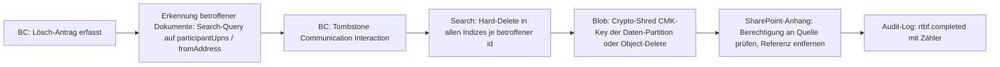

# 09 – Daten- und Suchkonzept

> Bezug: [`../../instructions.md`](../../instructions.md) Abschnitt 6 (Daten- und Suchkonzept).
> Kontext: [01-architecture.md](01-architecture.md), [07-ingestion-pipeline.md](07-ingestion-pipeline.md), [08-ai-orchestration.md](08-ai-orchestration.md), [11-graph-feasibility.md](11-graph-feasibility.md), [12-security-compliance.md](12-security-compliance.md), [02-bc-data-model.md](02-bc-data-model.md), [03-bc-apis.md](03-bc-apis.md), [10-matching.md](10-matching.md).
>
> Designdokument; keine Implementierung. Beispiel-Schemata sind JSON-ähnlich und für Azure AI Search (`2024-07-01` API) vorgesehen.

---

## 1. Zielsetzung und Leitprinzipien

Der Suchstack ist die zentrale **Grounding-Quelle** des Copilot. Er liefert die Quellen, auf denen jeder AI-Output beruht (siehe [08 §1 L1/L2](08-ai-orchestration.md)) und ist gleichzeitig die Datenbasis für Kandidatengenerierung im Matching ([10-matching.md](10-matching.md)).

| # | Prinzip | Konkrete Umsetzung |
|---|---|---|
| P1 | **Keine Volltexte in Business Central** | BC speichert nur Metadaten, Links, Hashes, Zusammenfassungen, Quellenreferenzen ([02-bc-data-model.md §1](02-bc-data-model.md)). Bodies/Transkripte/Anhänge liegen in Azure AI Search, Azure Blob bzw. SharePoint. |
| P2 | **System of Record bleibt die Quelle** | Mail/Teams: Microsoft 365. Dokumente: SharePoint/OneDrive. BC-Stamm: Business Central. AI Search ist **abgeleiteter** Index – jederzeit aus den Quellen rebuildbar. |
| P3 | **Mandant + Company als Schlüssel** | Pro M365-Tenant ein eigenes Index-Set (`*-{tenantId}`); jedes Dokument trägt zusätzlich `companyId` (BC-Company-System-Id) als verpflichtendes Filterfeld. |
| P4 | **ACL-basierte Pre-Filter vor AI** | Jeder Query erzwingt `tenantId`, `companyId`, Visibility-Scope, optional `aclUserIds`/`aclGroupIds`. Filter werden **serverseitig im Backend** aus dem User-Token + BC-Rollen abgeleitet, nicht vom Client. Post-hoc Redaction ist verboten. |
| P5 | **Hybrid Search (BM25 + Vector) als Default** | Klassische lexikalische Suche und semantische Vektorsuche werden in einer einzigen Hybrid-Query kombiniert; Semantic Ranker als Reranker. |
| P6 | **EU-Datenresidenz** | Primärregion **Sweden Central** (Search + OpenAI EU Data Boundary), sekundär West Europe / France Central. Keine Cross-Region-Replikation außerhalb der EU. |
| P7 | **Embedding-Modell zentral konfiguriert** | `text-embedding-3-large` (3072 dim) für alle Indizes; Modellname versioniert (`embeddingModelVersion` pro Dokument), siehe [08 §3.3](08-ai-orchestration.md). |
| P8 | **Index ≠ Backup** | AI Search ist nie das einzige Persistenzziel. Right-to-be-forgotten und DR laufen über Source-of-Truth + Re-Index (siehe §8/§9). |
| P9 | **Datenminimierung im Index** | Nur retrievebezogene Felder; PII-Detektion vor Indexierung, Sensitivity-Label propagiert; vertrauliche Felder sind `retrievable=false` wo möglich. |

---

## 2. Indexlandschaft

Pro M365-Tenant existiert ein eigenes **Index-Set**. Index-Aliase entkoppeln logischen Namen vom physischen Index (für Re-Indexing ohne Downtime).

| Index | Inhalt | Quelle | Aktualisierung | Embedding | Tier-Empfehlung |
|---|---|---|---|---|---|
| `interactions-{tenantId}` | E-Mails (Header, Subject, Body-Chunks), Teams 1:1- und Channel-Messages, Permalinks | Ingestion Service ([07](07-ingestion-pipeline.md)) via Push | near-real-time (Webhook → Worker → Push, P95 ≤ 60 s) | `text-embedding-3-large` (3072) auf Subject + Body-Chunk | S1 Pilot, **S2 Prod** |
| `transcripts-{tenantId}` | Meeting-Transkripte (chunked je Sprecher-Block, 30–60 s Fenster) | Ingestion (Pull `onlineMeetings/{id}/transcripts`) | nach Meeting-Ende, periodischer Sync alle 6 h | 3072 auf Chunk-Text | S2 (große Volumen, lange Texte) |
| `documents-{tenantId}` | SharePoint-/OneDrive-Dokumente, Mail-Anhänge (chunked, OCR-Output für PDF/Bilder) | Ingestion via Push (Standard) + optional Indexer für Bulk-Backfill | bei Drive-Notification (Push) bzw. nächtlich (Backfill) | 3072 auf Chunk-Text | **S2 Prod** (Vektor-Quota) |
| `bc-master-{tenantId}` | Customer, Contact, Vendor, Project, Opportunity – Stammdaten + Aliase + Such-Synonyme | BC Custom API ([03](03-bc-apis.md)) via Push (Delta-Trigger in BC + Backend-Worker) | bei BC-Änderung (≤ 5 min Lag) + nächtlicher Reconcile | 1536 (reduziert) auf `displayName + aliases + description` | **S1 Pilot, S2 Prod** (klein, viele Queries) |
| `bc-documents-{tenantId}` | Verkaufsangebote, Aufträge, Rechnungen, Servicefälle, Reklamationen – Belegnummern + Kopfdaten + AI-Beschreibung | BC Custom API via Push | bei BC-Änderung (≤ 5 min Lag) | 1536 auf `description + headerNotes` | S1 Pilot, S2 Prod |
| `summaries-{tenantId}` | AI-Zusammenfassungen (Einzel / Thread / Customer / Project / Meeting), siehe [08 §2 C4a–C4e](08-ai-orchestration.md) | Worker (nach C4-Generierung) via Push | bei Erzeugung/Edit/Approve | 3072 auf Summary-Text | S1 Pilot, S2 Prod |
| `tasks-{tenantId}` | offene Action Items (`status ∈ {Open, In Progress}`), inkl. Owner, Due-Date, Quelle | BC Custom API via Push | bei Statuswechsel | 1536 auf `title + description` | S1 (klein) |

> Naming-Konvention: Aliase `*-current`, physische Indizes `*-{tenantId}-v{n}` (z. B. `interactions-tenant1-v3`). Re-Embed bei Modellwechsel ⇒ neuer `vN+1` und Alias-Switch.

---

## 3. Index-Schema-Beispiele

### 3.1 `interactions-{tenantId}` (vollständig)

```json
{
  "name": "interactions-tenant1-v1",
  "fields": [
    { "name": "id",                "type": "Edm.String",         "key": true,   "filterable": true,  "retrievable": true },
    { "name": "tenantId",          "type": "Edm.String",                       "filterable": true,  "retrievable": true,  "facetable": false },
    { "name": "companyId",         "type": "Edm.String",                       "filterable": true,  "retrievable": true,  "facetable": true  },
    { "name": "channel",           "type": "Edm.String",                       "filterable": true,  "facetable": true,    "retrievable": true },
    { "name": "direction",         "type": "Edm.String",                       "filterable": true,  "facetable": true,    "retrievable": true },
    { "name": "interactionId",     "type": "Edm.String",                       "filterable": true,  "retrievable": true,  "comment": "BC SystemId" },
    { "name": "conversationId",    "type": "Edm.String",                       "filterable": true,  "retrievable": true },
    { "name": "internetMessageId", "type": "Edm.String",                       "filterable": true,  "retrievable": true },
    { "name": "chatId",            "type": "Edm.String",                       "filterable": true,  "retrievable": true },
    { "name": "channelId",         "type": "Edm.String",                       "filterable": true,  "retrievable": true },
    { "name": "teamId",            "type": "Edm.String",                       "filterable": true,  "retrievable": true },

    { "name": "subject",           "type": "Edm.String",  "searchable": true, "retrievable": true,  "analyzer": "de.lucene" },
    { "name": "subject_en",        "type": "Edm.String",  "searchable": true, "retrievable": false, "analyzer": "en.lucene" },
    { "name": "bodyChunk",         "type": "Edm.String",  "searchable": true, "retrievable": true,  "analyzer": "de.lucene" },
    { "name": "bodyChunkEn",       "type": "Edm.String",  "searchable": true, "retrievable": false, "analyzer": "en.lucene" },
    { "name": "chunkIndex",        "type": "Edm.Int32",                       "filterable": true,  "retrievable": true },
    { "name": "language",          "type": "Edm.String",                      "filterable": true,  "facetable": true,    "retrievable": true },

    { "name": "fromAddress",       "type": "Edm.String",  "searchable": true, "filterable": true,  "retrievable": true,  "analyzer": "keyword" },
    { "name": "fromDomain",        "type": "Edm.String",                      "filterable": true,  "facetable": true,    "retrievable": true },
    { "name": "fromDisplayName",   "type": "Edm.String",  "searchable": true, "retrievable": true },
    { "name": "toAddresses",       "type": "Collection(Edm.String)",          "filterable": true,  "retrievable": true },
    { "name": "participantUpns",   "type": "Collection(Edm.String)",          "filterable": true,  "retrievable": true },

    { "name": "sentAt",            "type": "Edm.DateTimeOffset",              "filterable": true,  "sortable": true,     "retrievable": true,  "facetable": true },
    { "name": "permalinkUrl",      "type": "Edm.String",                      "retrievable": true },

    { "name": "linkedEntityIds",   "type": "Collection(Edm.String)",          "filterable": true,  "retrievable": true,  "comment": "z.B. customer:10000, salesOrder:SO-4711" },
    { "name": "topics",            "type": "Collection(Edm.String)",          "filterable": true,  "facetable": true,    "retrievable": true },

    { "name": "visibilityScope",   "type": "Edm.String",                      "filterable": true,  "retrievable": true,  "comment": "owner | ownerTeam | company" },
    { "name": "ownerUserOid",      "type": "Edm.String",                      "filterable": true,  "retrievable": false },
    { "name": "ownerTeamCode",     "type": "Edm.String",                      "filterable": true,  "retrievable": false },
    { "name": "aclUserIds",        "type": "Collection(Edm.String)",          "filterable": true,  "retrievable": false },
    { "name": "aclGroupIds",       "type": "Collection(Edm.String)",          "filterable": true,  "retrievable": false },
    { "name": "sensitivity",       "type": "Edm.String",                      "filterable": true,  "facetable": true,    "retrievable": true,  "comment": "public|internal|confidential|strictlyConfidential|restricted" },
    { "name": "retentionUntil",    "type": "Edm.DateTimeOffset",              "filterable": true,  "retrievable": true },
    { "name": "legalHold",         "type": "Edm.Boolean",                     "filterable": true,  "retrievable": true },
    { "name": "containsPii",       "type": "Edm.Boolean",                     "filterable": true,  "retrievable": true },

    { "name": "embeddingModelVersion", "type": "Edm.String",                  "filterable": true,  "retrievable": true },
    { "name": "contentVector",     "type": "Collection(Edm.Single)",          "searchable": true,  "retrievable": false,
      "dimensions": 3072, "vectorSearchProfile": "hnsw-3072-cos" }
  ],
  "vectorSearch": {
    "algorithms": [
      { "name": "hnsw-default", "kind": "hnsw",
        "hnswParameters": { "m": 4, "efConstruction": 400, "efSearch": 500, "metric": "cosine" } }
    ],
    "profiles": [
      { "name": "hnsw-3072-cos", "algorithm": "hnsw-default",
        "vectorizer": "aoai-embedding-3-large" }
    ],
    "vectorizers": [
      { "name": "aoai-embedding-3-large", "kind": "azureOpenAI",
        "azureOpenAIParameters": {
          "resourceUri": "https://aoai-eu-sweden.openai.azure.com",
          "deploymentId": "text-embedding-3-large",
          "modelName": "text-embedding-3-large",
          "authIdentity": { "kind": "userAssignedIdentity" }
        } }
    ],
    "compressions": [
      { "name": "scalar-int8", "kind": "scalarQuantization",
        "scalarQuantizationParameters": { "quantizedDataType": "int8" },
        "rerankWithOriginalVectors": true, "defaultOversampling": 4 }
    ]
  },
  "semantic": {
    "configurations": [
      { "name": "interactions-semantic",
        "prioritizedFields": {
          "titleField": { "fieldName": "subject" },
          "prioritizedContentFields": [ { "fieldName": "bodyChunk" } ],
          "prioritizedKeywordsFields": [ { "fieldName": "topics" }, { "fieldName": "fromDomain" } ]
        } }
    ]
  },
  "analyzers": [],
  "suggesters": [
    { "name": "sg", "searchMode": "analyzingInfixMatching",
      "sourceFields": [ "subject", "fromDisplayName", "fromAddress" ] }
  ]
}
```

### 3.2 `documents-{tenantId}` (vollständig)

```json
{
  "name": "documents-tenant1-v1",
  "fields": [
    { "name": "id",              "type": "Edm.String",         "key": true,   "filterable": true,  "retrievable": true },
    { "name": "tenantId",        "type": "Edm.String",                       "filterable": true,  "retrievable": true },
    { "name": "companyId",       "type": "Edm.String",                       "filterable": true,  "facetable": true,   "retrievable": true },

    { "name": "driveId",         "type": "Edm.String",                       "filterable": true,  "retrievable": true },
    { "name": "driveItemId",     "type": "Edm.String",                       "filterable": true,  "retrievable": true },
    { "name": "siteId",          "type": "Edm.String",                       "filterable": true,  "retrievable": true },
    { "name": "webUrl",          "type": "Edm.String",                       "retrievable": true },
    { "name": "fileName",        "type": "Edm.String",  "searchable": true,  "retrievable": true,  "analyzer": "de.lucene" },
    { "name": "fileExtension",   "type": "Edm.String",                       "filterable": true,  "facetable": true,   "retrievable": true },
    { "name": "mimeType",        "type": "Edm.String",                       "filterable": true,  "retrievable": true },
    { "name": "fileHash",        "type": "Edm.String",                       "filterable": true,  "retrievable": true },

    { "name": "title",           "type": "Edm.String",  "searchable": true,  "retrievable": true,  "analyzer": "de.lucene" },
    { "name": "contentChunk",    "type": "Edm.String",  "searchable": true,  "retrievable": true,  "analyzer": "de.lucene" },
    { "name": "contentChunkEn",  "type": "Edm.String",  "searchable": true,  "retrievable": false, "analyzer": "en.lucene" },
    { "name": "chunkIndex",      "type": "Edm.Int32",                        "filterable": true,  "retrievable": true },
    { "name": "language",        "type": "Edm.String",                       "filterable": true,  "facetable": true,   "retrievable": true },
    { "name": "keyPhrases",      "type": "Collection(Edm.String)",  "searchable": true, "filterable": true, "facetable": true, "retrievable": true },

    { "name": "linkedEntityIds", "type": "Collection(Edm.String)",           "filterable": true,  "retrievable": true },
    { "name": "documentClass",   "type": "Edm.String",                       "filterable": true,  "facetable": true,   "retrievable": true,  "comment": "offer | order | invoice | drawing | contract | other" },
    { "name": "modifiedAt",      "type": "Edm.DateTimeOffset",               "filterable": true,  "sortable": true,    "retrievable": true,  "facetable": true },
    { "name": "modifiedByUpn",   "type": "Edm.String",                       "filterable": true,  "retrievable": true },

    { "name": "visibilityScope", "type": "Edm.String",                       "filterable": true,  "retrievable": true },
    { "name": "aclUserIds",      "type": "Collection(Edm.String)",           "filterable": true,  "retrievable": false },
    { "name": "aclGroupIds",     "type": "Collection(Edm.String)",           "filterable": true,  "retrievable": false },
    { "name": "sensitivity",     "type": "Edm.String",                       "filterable": true,  "facetable": true,   "retrievable": true },
    { "name": "retentionUntil",  "type": "Edm.DateTimeOffset",               "filterable": true,  "retrievable": true },
    { "name": "legalHold",       "type": "Edm.Boolean",                      "filterable": true,  "retrievable": true },
    { "name": "containsPii",     "type": "Edm.Boolean",                      "filterable": true,  "retrievable": true },

    { "name": "embeddingModelVersion", "type": "Edm.String",                 "filterable": true,  "retrievable": true },
    { "name": "contentVector",   "type": "Collection(Edm.Single)",           "searchable": true,  "retrievable": false,
      "dimensions": 3072, "vectorSearchProfile": "hnsw-3072-cos" }
  ],
  "vectorSearch": { "$ref": "wie 3.1" },
  "semantic": {
    "configurations": [
      { "name": "documents-semantic",
        "prioritizedFields": {
          "titleField": { "fieldName": "title" },
          "prioritizedContentFields": [ { "fieldName": "contentChunk" } ],
          "prioritizedKeywordsFields": [ { "fieldName": "keyPhrases" }, { "fieldName": "documentClass" } ]
        } }
    ]
  }
}
```

> ACL-Felder (`aclUserIds`, `aclGroupIds`, `visibilityScope`, `sensitivity`, `retentionUntil`, `legalHold`) sind **in jedem** Index Pflicht; sie werden auch für `summaries-*`, `transcripts-*`, `bc-*` und `tasks-*` analog modelliert.

---

## 4. Hybrid- und Semantic-Suche

### 4.1 Default-Query-Pattern

```json
POST /indexes/interactions-tenant1-v1/docs/search?api-version=2024-07-01
{
  "search": "Lieferstatus Auftrag 4711",
  "queryType": "semantic",
  "semanticConfiguration": "interactions-semantic",
  "queryLanguage": "de-de",
  "captions": "extractive|highlight-true",
  "answers": "extractive|count-1",
  "top": 8,
  "vectorQueries": [
    {
      "kind": "text",
      "text": "Lieferstatus Auftrag 4711",
      "fields": "contentVector",
      "k": 50,
      "exhaustive": false
    }
  ],
  "filter": "tenantId eq 'T1' and companyId eq 'C1' and (visibilityScope eq 'company' or aclUserIds/any(u: u eq 'oid-of-user') or aclGroupIds/any(g: search.in(g, 'g1,g2,g3'))) and sensitivity ne 'restricted' and (legalHold eq true or retentionUntil gt 2026-05-31T00:00:00Z)",
  "select": "id,subject,bodyChunk,permalinkUrl,fromAddress,sentAt,linkedEntityIds,sensitivity",
  "highlight": "subject,bodyChunk"
}
```

### 4.2 Konfigurations-Vorgaben

- **kNN**: HNSW, `metric=cosine`, `m=4`, `efConstruction=400`, `efSearch=500`. `k=50` Vektor-Kandidaten, danach Reranking auf `top=8`.
- **BM25 vs. Vektor**: Hybrid Fusion (RRF, von Search nativ) – kein manuelles Gewicht. Bei reinen Number-Queries (z. B. „SO-4711") wird ein **Number-Boost** (`searchFields=subject,bodyChunk` mit `^3` auf `subject`) verwendet, Vektoranteil wird unterdrückt (`vectorQueries[].weight=0.3`).
- **Semantic Ranker**: aktiviert für alle interaktiven Queries (Outlook/Teams). Für Bulk-Matching (Ingestion) deaktiviert (Kostengrund).
- **Score-Threshold**: minimaler `@search.rerankerScore ≥ 1.5` (Skala 0–4) für „starkes Treffer-Set"; darunter zeigt UI „unsicher", AI bekommt das Treffer-Set trotzdem mit `confidence_low`-Hinweis.
- **Multi-Query / HyDE** (optional, A/B-Flag `feature.hyde`): max. 3 Sub-Queries pro User-Anfrage, RRF-Fusion (siehe [08 §4.3](08-ai-orchestration.md)). Default **aus** für Cost-Control, eingeschaltet für Briefings (C4b–C4e).
- **Cross-Index-Federation**: für AI-Briefings parallele Queries über `interactions-*`, `documents-*`, `summaries-*` mit identischem Filter; Ergebnis-Fusion im Backend (Reciprocal Rank Fusion, dedupe nach `linkedEntityIds`).

### 4.3 Spell-/Synonym-Handling

- **Synonym Maps** je Tenant: Produktnamen-Aliase, Belegnummer-Präfixe (`SO`, `VA`, `AB`).
- `speller=lexicon` für Outlook-/Teams-User-Queries.

---

## 5. Indexierungs-Strategie

### 5.1 Push (Standard)

**Begründung**: Berechtigungslogik, Idempotenz, Reihenfolge je Konversation, Kontrolle über Embedding-Aufrufe (Kosten), Fehlerbehandlung.

- Quelle: Ingestion Worker ([07 Stage 13](07-ingestion-pipeline.md)) sowie BC-Backend-Worker (für `bc-master-*`, `bc-documents-*`, `tasks-*`).
- Mechanik: `mergeOrUpload` mit Idempotenz-Key `id` (= Hash aus Source-IDs). At-least-once + Dedup wie in [07 §6](07-ingestion-pipeline.md).
- Embeddings: **integrierte Vektorisierung** über `vectorizer=azureOpenAI` (Search ruft AOAI selbst). Vorteil: weniger Round-trips, einheitliches Modell. Fallback: Worker erzeugt Embedding selbst (z. B. bei Modellpinning oder Token-Quota-Steuerung pro Tenant).
- Reihenfolge: Service-Bus-Sessions auf `conversationId` ⇒ Index-Updates pro Thread sequenziell.

### 5.2 Pull (nur Backfill)

- **Pull-Indexer** auf SharePoint nur für **Bulk-Initial-Load** und **Re-Index** (siehe §8). Kein Live-Pull, weil:
  - keine ACL-Synchronisation aus SharePoint-Permission-Modell ohne Zusatzaufwand,
  - keine Idempotenz mit BC-Schreibungen,
  - keine Ingestion-Pipeline-Stages (Match, Klassifikation) anwendbar.
- Konfiguration im Backfill: dedizierter Indexer mit Feldmapping + Skill-Pipeline (§5.3), schreibt in `documents-{tenantId}-backfill`, anschließend Alias-Switch.

### 5.3 Skill-Pipeline (vor Index-Write)

| Skill | Zweck | Output-Feld |
|---|---|---|
| Language Detection (Azure AI Language) | `language` setzen, Analyzer-Wahl (`de.lucene` vs. `en.lucene`) | `language` |
| PII Detection (Azure AI Language) | `containsPii` + ggf. Pseudonymisierung in `bodyChunk` (Hash für Telefonnummern, IBAN) | `containsPii`, gefilterter Text |
| Key Phrase Extraction (optional) | bessere Recall bei kurzen Suchbegriffen | `keyPhrases` |
| OCR (Document Intelligence Read) | nur `documents-*` für Bilder/PDF-Scans | füllt `contentChunk` |
| Custom Splitter | semantisches Chunking (Mail: Quote-Trennung; Doc: 1.000 Token mit 100-Token-Overlap) | `bodyChunk`/`contentChunk` + `chunkIndex` |
| Custom ACL-Resolver | Auflösung Mailbox-Owner / SharePoint-Permissions in `aclUserIds`/`aclGroupIds` | ACL-Felder |
| Embedding (AOAI `text-embedding-3-large`) | 3072-dim Vektor pro Chunk | `contentVector` |

> Die Skill-Pipeline läuft im Worker (Push-Modus); im Pull-Indexer wird sie als Search-Skillset abgebildet.

---

## 6. ACL-Filter-Pattern

### 6.1 Pflichtfilter pro Query

Das Backend baut den Filter aus Token-Claims + BC-Rollen-Lookup, **nicht** aus Client-Eingaben. Beispiel-Filterstring:

```
tenantId eq '11111111-2222-3333-4444-555555555555'
and companyId eq 'aaaaaaaa-bbbb-cccc-dddd-eeeeeeeeeeee'
and (
      visibilityScope eq 'company'
   or aclUserIds/any(id: id eq '00000000-1111-2222-3333-444444444444')
   or aclGroupIds/any(g: search.in(g, 'group-vk-eu,group-service-de,group-pm'))
   or ownerUserOid eq '00000000-1111-2222-3333-444444444444'
)
and sensitivity ne 'restricted'
and (legalHold eq true or retentionUntil gt 2026-05-31T00:00:00Z)
```

### 6.2 Sensitivity-Schwelle

Das Backend leitet aus der BC-Rolle des Benutzers eine maximale Sensitivity ab:

| BC-Rolle | Maximale Sensitivity |
|---|---|
| `IOI_COMMHUB_USER` | `internal` |
| `IOI_COMMHUB_KEY_USER` | `confidential` |
| `IOI_COMMHUB_ADMIN` | `strictlyConfidential` |
| niemand | `restricted` (nur über separaten Break-Glass-Flow, immer auditiert) |

Filter ergänzt entsprechend: `sensitivity in ('public','internal','confidential')`.

### 6.3 Cross-Tenant-Schutz

- Tenant-Filter ist **Pflicht** in jedem Query (Backend wirft 500, falls leer).
- Search-Index-Name enthält `tenantId` ⇒ zusätzliche physische Trennung.
- API-Key/Managed-Identity pro Tenant getrennt; Backend wählt MI-Identität nach Tenant-Routing aus.

---

## 7. Sizing-Vorschlag

### 7.1 Pilot

- **Annahmen**: 1 M365-Tenant, 50 Mailboxen, 12 Monate Backfill, 200 GB Mailvolumen, 1 Mio Mails, 200k Teams-Nachrichten, 500k SharePoint-Dokumente, 2k Meeting-Transkripte.
- **SKU**: **Standard S1** (1 Replica, 1 Partition).
  - 25 GB Storage / Partition, 35 M Vektor-Elemente / Partition (S1 mit Quantisierung), max. 50 Indizes.
  - Reicht für den Pilot, aber **kein HA** (1 Replica). Akzeptabel für nicht-produktive Pilotphase.
- **Vector-Quota-Rechnung** (3072 dim float32 = 12 KB/Vector, mit `int8`-Quantisierung ca. **3 KB/Vector** + Overhead):
  - Interactions: 1 Mio + 200k = 1,2 Mio × 3 KB ≈ **3,6 GB Vektoren**.
  - Documents (chunked, ⌀ 5 Chunks): 500k × 5 × 3 KB ≈ **7,5 GB Vektoren**.
  - Transcripts (chunked, ⌀ 30 Chunks): 2k × 30 × 3 KB ≈ **0,2 GB**.
  - Summary/Tasks/BC-Master: < 0,5 GB.
  - **Summe ≈ 12 GB** Vektoren, plus ≈ 8 GB Textinhalt + Metadaten ⇒ ≈ **20 GB**, passt in S1.

### 7.2 Voll-Rollout (Prod)

- **Annahmen**: bis zu 10 Tenants × ⌀ Pilot-Volumen, oder 1 Großmandant × 10× Pilot.
- **SKU**: **Standard S2** (Default, 2 Replicas zone-redundant, 2 Partitions). Ggf. **S3** bei > 100 GB Storage / Tenant oder hoher QPS (> 30 QPS Hybrid-Vector).
  - S2: 100 GB / Partition, 100 M Vektoren / Partition (mit Quantisierung), 12 Indizes pro Service – für **mehrere Tenants** entweder mehr Partitions oder **mehrere Search-Services** (1 Service je Mandanten-Cluster, IaC).
- **Replicas/Partitions**: ≥ 2 Replicas (HA + Read-Scale), Partitions nach Storage-Bedarf (Faustregel: +1 Partition je 80 GB Index-Daten).
- **Storage-Trennung pro Tenant**: bei regulatorischen Anforderungen (z. B. eigener Customer-Managed Key) **eigener Search-Service** pro Mandant; sonst geteilter Service mit Index-Set pro Mandant.
- **Vector-Quota**: bei 10× Pilot ≈ **120 GB Vektoren** ⇒ 2 Partitions S2 (200 GB Quota), Headroom 40 %.

### 7.3 Beispiel-Quotenrechnung „1 Mio Interactions"

| Posten | Annahme | Größe |
|---|---|---|
| Text pro Interaction | 3 KB (Subject + Snippet + Body-Chunk-Header) | 3 GB |
| ACL- + Metadatenfelder | 0,5 KB / Doc | 0,5 GB |
| Vektor (3072 dim, int8 quantisiert) | 3 KB / Doc | 3 GB |
| HNSW-Graph + Indexstrukturen | ≈ 0,5 × Vektor-Volumen | 1,5 GB |
| **Summe `interactions-*`** | | **≈ 8 GB** |

> Originalvektoren (12 KB/Doc) werden bei `rerankWithOriginalVectors=true` zusätzlich gehalten; Faustregel: realer Storage ≈ 4× quantisiert. Bei strikter Quota → `rerankWithOriginalVectors=false` (etwas schlechtere Recall@k).

### 7.4 Azure OpenAI Sizing

- **Embeddings**: `text-embedding-3-large` Deployment in Sweden Central, **PTU oder Pay-As-You-Go**. Ingestion-Burst-Schätzung: 1 Mio Chunks × 500 Tokens = 500 M Tokens Backfill; bei PAYG ⇒ einmaliger Kostenblock. Prod-Steady-State: ⌀ 50k neue Chunks/Tag × 500 Tokens = 25 M Tokens/Tag.
- Rate-Limit pro Deployment beachten (z. B. 350 RPS / 1 M TPM); Worker mit Token-Bucket-Drosselung.

---

## 8. Lifecycle

### 8.1 Re-Index

- **Trigger**: Schema-Change, Embedding-Modell-Wechsel, Korrektur-Bedarf.
- **Pattern**: neuer physischer Index `*-vN+1` wird parallel befüllt (Backfill aus Source-of-Truth: Blob/SharePoint/BC), Daten-Vergleich, anschließend **Alias-Switch**, alter Index nach 7 d gelöscht.

### 8.2 Delta-Updates

- Push pro Event (siehe §5.1). `mergeOrUpload` mit `id`-Stabilität.
- Periodischer **Reconcile** (nächtlich): Worker vergleicht BC-Counts mit Search-Counts pro `linkedEntityId`, korrigiert Drift.

### 8.3 Tombstones / Löschungen

- Ingestion empfängt `deleted`-Notification (z. B. Mail aus Inbox gelöscht): Worker setzt im Index `mergeOrUpload` mit Tombstone-Feld `deleted=true` + entfernt `bodyChunk`, danach `delete` nach Retention-Frist (Default 30 d Soft, dann Hard).
- BC-Löschung einer `Communication Interaction` (Admin) ⇒ direktes `delete` per `id`.

### 8.4 Right-to-be-forgotten (DSGVO Art. 17)

Orchestrierter Workflow (auch in [12 §9](12-security-compliance.md) referenziert):



- Crypto-Shred ist nur möglich, wenn pro Subject ein eigener Key existiert; alternative: Object-Delete + Versions-Purge.
- SLA: Bestätigung an Betroffenen ≤ 30 Tage (DSGVO).

### 8.5 Embedding-Versionierung

- Jedes Dokument trägt `embeddingModelVersion`.
- Bei Modellwechsel: neue Vektor-Spalte / neuer Index-Vintage `vN+1`; **kein Mischen** alter und neuer Vektoren in denselben kNN-Query.
- Übergangsfenster mit zwei aktiven Indizes pro Set; Reads können A/B-getestet werden.

---

## 9. Backup / DR der Indizes

- **Azure AI Search bietet keine Index-Snapshots**. Konsequenz: Index ist **abgeleiteter Datenbestand**, Backups laufen über Source-of-Truth.
- **Source-of-Truth-Strategie**:
  - Mail-Roh-MIME ⇒ Blob (ZRS, CMK, Lifecycle 7 a) – Re-Index möglich.
  - Teams-Nachrichten ⇒ Roh-Payload in Blob (verschlüsselt, retention 7 a).
  - Transkripte ⇒ Blob.
  - SharePoint-Dokumente ⇒ SharePoint (eigenes Backup über M365 Backup / Drittanbieter).
  - BC-Daten ⇒ BC SaaS Standard-Backups.
- **DR-Plan**:
  - **RPO ≤ 24 h** (Re-Index bis zum Stand des letzten erfolgreichen Backfills).
  - **RTO ≤ 8 h** für Index-Wiederherstellung über vorbereitete IaC + parallele Backfill-Worker.
  - **Sekundärregion**: West Europe als Stand-by; Index wird **nicht aktiv repliziert**, sondern bei Disaster on-demand neu aufgebaut. Search Replicas in Primärregion sind zone-redundant (HA).
- **Test**: zweimal jährlich vollständiger Re-Index-Drill in nonprod.

---

## 10. Kostenüberlegungen (Sweden Central, Größenordnung)

> Preisangaben sind Größenordnungen für Planungszwecke (Stand 2026, EUR, ohne Rabatte). Vor Commit aktuelle Kalkulator-Werte verwenden.

| Komponente | Pilot | Prod (10× Pilot) |
|---|---|---|
| Azure AI Search S1 (1 Replica, 1 Partition) | ≈ 230 €/Monat | – |
| Azure AI Search S2 (2 Replicas, 2 Partitions) | – | ≈ 1.800 €/Monat |
| Vektor-Quota (in S1/S2 inkludiert) | 0 | 0 |
| Semantic Ranker (Standard, in QPS-Quota inkl. bis 1k QPS/Monat) | 0 | ggf. ≈ 1 €/1k Queries oberhalb Free-Tier |
| AOAI `text-embedding-3-large` (Backfill 500 M Tokens, einmalig) | ≈ 65 € | ≈ 650 € |
| AOAI Embeddings Steady-State (25 M Tokens/Tag) | ≈ 100 €/Monat | ≈ 1.000 €/Monat |
| Blob ZRS (Roh-Payloads, 200 GB / 2 TB, hot) | ≈ 5 €/Monat | ≈ 50 €/Monat |
| Document Intelligence (OCR, 500k Pages Backfill) | ≈ 750 € einmalig | ≈ 7.500 € einmalig |

**Hebel zur Kostenreduktion**: int8-Quantisierung, kleinere Embedding-Dimension (1536) für `bc-master-*`/`tasks-*`, Semantic Ranker nur interaktiv, Multi-Query/HyDE nur für Briefings, OCR nur für PDFs ohne Textschicht.

---

## 11. KPIs

| KPI | Definition | Ziel |
|---|---|---|
| **Recall@k=8** | gelabeltes Eval-Set: Anteil Anfragen, bei denen der „goldene" Treffer in Top-8 enthalten ist | ≥ **0,90** |
| **MRR (Mean Reciprocal Rank)** | für Eval-Set | ≥ **0,75** |
| **P95-Latenz Hybrid-Query** | Backend-seitig gemessen, exkl. AOAI | ≤ **350 ms** |
| **P95-Latenz Hybrid + Semantic Ranker** | | ≤ **800 ms** |
| **Indexing-Lag** | `t(IndexUpsert) − t(GraphNotification)` P95 | ≤ **60 s** |
| **Stale-Rate** | Anteil Dokumente in `bc-master-*` älter als BC-Quelle | ≤ **0,5 %** |
| **Anteil Queries mit ACL-Hit > 0** | Sanity-Check (sonst Filter zu restriktiv oder ACL-Bug) | ≥ **95 %** |
| **Permission-Leak-Rate** (synthetic test) | Anteil Queries, in denen ein Dokument außerhalb der User-ACL erscheint | **0 %** (Hard-SLA) |
| **Embedding-Drift** | Anteil Dokumente mit veraltetem `embeddingModelVersion` | ≤ **5 %** außerhalb Migrationsphasen |

---

## 12. Offene Fragen

1. **Search-Service-Topologie für Multi-Tenant**: ein zentraler Service mit Index-Sets je Mandant **oder** eigener Service pro Mandant? Trade-off Kosten ↔ Isolation/CMK.
2. **Customer-Managed Keys (CMK) auf Search**: pro Mandant eigener Key Vault + CMK – wer pflegt Rotation? (Verbindung zu [12-security-compliance.md](12-security-compliance.md)).
3. **PTU vs. PAYG für AOAI-Embeddings**: PTU lohnt ab welchem Steady-State-Volumen? Pilot-Messung notwendig.
4. **Synonym-Maps**: Pflege durch Customizer pro Mandant oder zentral? UI in BC-Setup vorgesehen?
5. **OCR-Strategie**: Document Intelligence (teurer, besser) vs. Tesseract-Self-host (billiger, schwächer)?
6. **HyDE / Multi-Query**: Kosten/Nutzen-Messung im Pilot – welche Eval-Setups?
7. **Sensitivity-Mapping**: M365 Sensitivity Labels ↔ Copilot-Sensitivity-Enum: 1:1-Tabelle finalisieren, wer pflegt sie pro Mandant?
8. **Cross-Tenant-Suche** (z. B. ISV-Konzern mit mehreren M365-Tenants): explizit ausgeschlossen oder via dediziertem Audit-Workflow erlaubt?
9. **Right-to-be-forgotten Granularität**: Crypto-Shred je Subject (Key pro Person) realistisch, oder Object-Delete-Workflow ausreichend?
10. **Backup für `summaries-*`**: Re-Generierung kostet AOAI-Tokens – sollen Summaries dauerhaft im Blob als Source-of-Truth abgelegt werden? (Empfehlung: ja.)
