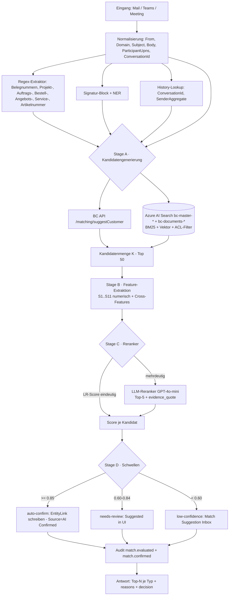

# 10 – Zuordnungs- und Matching-Logik

> Bezug: [`../../instructions.md`](../../instructions.md) Abschnitt 7 (Zuordnungslogik).
> Kontext: [01-architecture.md](01-architecture.md), [02-bc-data-model.md](02-bc-data-model.md), [03-bc-apis.md](03-bc-apis.md), [07-ingestion-pipeline.md](07-ingestion-pipeline.md) Stage 6/7, [08-ai-orchestration.md](08-ai-orchestration.md) §2 C6, [09-data-search.md](09-data-search.md) (Index `bc-master-*`), [12-security-compliance.md](12-security-compliance.md).
>
> Designdokument; keine Implementierung.

---

## 1. Ziel

Matching ordnet eine eingehende Kommunikationseinheit (E-Mail, Teams-Nachricht, Meeting, Anhang) **mehreren** BC-Entitäten zu (Customer, Contact, Project, Sales Quote, Sales Order, Service Order, Opportunity, …) und liefert je Treffer eine **Konfidenz** und eine **Begründung**.

| Ziel | Umsetzung |
|---|---|
| **Mehrfachtreffer mit Konfidenz** | Top-N pro Entitätstyp, Skala 0,0–1,0; nie „eindeutige" Antwort erzwingen, wenn mehrere Kandidaten plausibel sind. |
| **Mensch entscheidet final** | Auto-Confirm nur ab `≥ 0,85`; sonst UI-Vorschlag mit Bestätigen/Ablehnen/Korrigieren. Outlook/Teams/BC zeigen alle Kandidaten transparent. |
| **Erklärbarkeit** | Jeder Treffer trägt strukturierte Begründung (Signal-Beiträge), siehe §10. |
| **Lernen aus Korrekturen** | Korrekturen werden als `Communication Entity Link (Source=Manual)` gespeichert und fließen als Prior in zukünftige Matches ein (§6). |
| **Berechtigungstreu** | Match-Lookup darf nur Entitäten zurückgeben, die der Aufrufende sehen darf – Pre-Filter im Backend (§11). |
| **Performant** | Synchroner Pfad (UI) ≤ 100 ms je Query nach Cache, ≤ 400 ms Cold (§9). |

---

## 2. Eingangssignale

| # | Signal | Quelle | Default-Gewicht | Hinweise |
|---|---|---|---|---|
| S1 | **E-Mail-Adresse exact** auf Contact | Mail-Header `From`/`To`, BC `Contact.E-Mail`, Alt-Mail-Tabelle | **0,40** | stärkstes Einzelsignal; mehrere Contacts mit gleicher Mail möglich (Verteiler) ⇒ alle als Kandidaten |
| S2 | **Domain match** auf Customer/Vendor | `fromDomain`, BC `Customer.E-Mail-Domain`-Lookup-Tabelle (gepflegt + automatisch aus History) | **0,25** | dämpfen für generische Domains (`gmail.com`, `t-online.de`) – Allowlist „freie Provider" → Gewicht 0,05 |
| S3 | **Anzeigename** Fuzzy-Match auf Contact-Name | `fromDisplayName`, BC `Contact.Name`/`First Name`/`Last Name` | **0,10** | Levenshtein/Jaro-Winkler ≥ 0,9 |
| S4 | **Betreff/Body-Schlüsselwörter** | Subject + Body, AI Search auf `bc-master-*` (Aliase, Beschreibungen) | **0,08** | semantischer Score wird auf 0–1 normalisiert |
| S5 | **Erkannte Nummern** (Kunden-, Projekt-, Beleg-, Auftrags-, Bestell-, Angebots-, Service-, Reklamations-, Artikelnummer) | Regex auf Subject + Body, abgestimmt auf BC Numerierungsserien | **0,30** je Nummer (capped 0,30 gesamt) | hochpräzises Signal; mehrere Nummern erhöhen Konfidenz, verteilen sich aber auf Beleg-Entitäten |
| S6 | **Signatur** (NER + Domain Lookup) | Body-Footer-Block (heuristische Extraktion), Azure AI Language NER, Domain-Lookup | **0,07** | Backup, falls `From` ein Generic-Postfach ist |
| S7 | **Konversations-/Thread-Historie** | `conversationId` → frühere `Communication Entity Link` mit `Source ∈ {Manual, AI Confirmed}` | **0,20** | „Vorherige Mail im Thread war Customer X mit Conf 0,95" ⇒ starkes Prior |
| S8 | **Teams-Kontext** (Team/Channel/Chat-Mitglieder, externe Tenants) | Graph: `chat.members[]`, externe `tenantId`, Team-Name-Mapping (BC-Setup `Team ↔ Customer`) | **0,15** | Channel-Mitglieder mit externer Domain bevorzugt |
| S9 | **Manuelle Korrektur** (User bestätigt/korrigiert) | `Communication Entity Link.Source=Manual` | **1,00 (overrides)** | höchstes Gewicht; sperrt automatisches Re-Matching, bis Benutzer löst |
| S10 | **Sender-History-Prior** | Aggregation pro `(senderAddress, senderDomain)` aus bisher bestätigten Zuordnungen | **0,15** (variabel) | „90 % aller Mails von `tim.mueller@kunde.de` waren Customer 10000" → Prior 0,90 |
| S11 | **DKIM/DMARC Pass + bekannte Domain** | Mail-Header | **0,02** (Anti-Spoofing-Boost) | nur als Multiplikator: bei DMARC-Fail wird S1/S2-Beitrag halbiert |

> Gewichte sind **Defaults**; finale Werte werden durch das Reranker-Modell (§3) gelernt. Summe der Roh-Beiträge wird auf 0–1 normalisiert (Logistic, §3.2).

---

## 3. Matching-Architektur

### 3.1 Hybrid: Regelbasis + Reranker

```
[ Eingang: Mail / Teams-Nachricht / Meeting ]
                │
                ▼
┌──────────────────────────────────┐
│ Stage A – Kandidatengenerierung  │  deterministische Regeln + Search
│  · Lookup S1/S2/S5 in BC + Index │
│  · BM25 + Vektor auf bc-master-* │
│  · History-Lookup S7/S10         │
│  → Kandidatenmenge K (Top-50)    │
└──────────────────────────────────┘
                │
                ▼
┌──────────────────────────────────┐
│ Stage B – Feature-Extraktion     │  pro Kandidat ein Feature-Vektor
│  · S1..S11 als numerische Feats. │
│  · Cross-Features (Domain×Hist.) │
└──────────────────────────────────┘
                │
                ▼
┌──────────────────────────────────┐
│ Stage C – Reranker / Scoring     │  zwei Modi (konfigurierbar):
│  C1: Logistic Regression (LR)    │   default, latency- und  
│       on Features (kalibriert)   │   kostenarm
│  C2: LLM-Reranker (GPT-4o-mini)  │   für Edge-Cases / Erklärung
│  → score(k) ∈ [0,1] je Kandidat  │
└──────────────────────────────────┘
                │
                ▼
┌──────────────────────────────────┐
│ Stage D – Schwellenentscheidung  │
│  ≥ 0,85  →  auto-confirm          │
│  0,60–0,84 → needs-review         │
│  < 0,60  →  low-confidence        │
└──────────────────────────────────┘
                │
                ▼
       [ Antwort: Top-N je Typ ]
```

### 3.2 Modellwahl Reranker

- **Default Logistic Regression** (sklearn / ONNX, im Backend gehostet, < 5 ms Inferenz). Kalibriert über Platt-Scaling, sodass `score` als Wahrscheinlichkeit interpretierbar ist.
- **LLM-Reranker** (GPT-4o-mini, [08 §2 C6](08-ai-orchestration.md)) optional: nur wenn LR-`score` zwischen 0,40 und 0,75 liegt **oder** mehrere Top-Kandidaten innerhalb 0,05 zueinander – LLM bekommt Top-5 + Mail-Header + extrahierte Hinweise und liefert Reranking + `evidence_quote`.
- **Kein End-to-End-LLM** für die gesamte Kandidatenmenge (Kosten, Latenz, Erklärbarkeit).

### 3.3 Schwellen

| Schwelle | Bedeutung | UI-Verhalten |
|---|---|---|
| `score ≥ 0,85` | **auto-confirm** | EntityLink wird mit `Source=AI Confirmed` geschrieben; UI zeigt grünen Status, Benutzer kann jederzeit korrigieren. |
| `0,60 ≤ score < 0,85` | **needs-review** | EntityLink mit `Status=Suggested`, gelbes Banner; UI fordert Bestätigung vor Persistenz in BC-Timeline der Entität. |
| `score < 0,60` | **low-confidence** | kein automatischer Link; Vorschlag in `Communication Match Suggestion`-Tabelle ([02 §2 50013](02-bc-data-model.md)); Benutzer kann manuell zuordnen. |
| `score < 0,30` | **reject** | Kandidat wird nicht angezeigt, außer im „Alle Kandidaten anzeigen"-Diagnose-Modus. |

---

## 4. Mehrfachtreffer-Modell

Pro Eingang werden **mehrere Top-N-Listen** je Entitätstyp zurückgegeben (analog zu [03 §4.2 `/matching/suggestCustomer`](03-bc-apis.md)):

| Entitätstyp | Top-N (Default) |
|---|---|
| Customer | 3 |
| Contact | 5 |
| Project | 3 |
| Sales Quote | 3 |
| Sales Order | 5 |
| Service Order | 3 |
| Opportunity | 3 |

Beispiel-Antwort (entspricht `instructions.md` Abschnitt 7):

```json
{
  "messageId": "<CAEz...@mail.example.com>",
  "evaluatedAt": "2026-05-31T08:14:13Z",
  "modelVersion": "matching-lr-v3 + rules-v7",
  "matches": {
    "customer": [
      { "entityNo": "10000",     "label": "Müller GmbH",      "confidence": 0.92, "reasons": [...] },
      { "entityNo": "10042",     "label": "Müller & Söhne",   "confidence": 0.41, "reasons": [...] }
    ],
    "contact": [
      { "entityNo": "C00045",    "label": "Tim Müller",       "confidence": 0.95, "reasons": [...] }
    ],
    "project": [
      { "entityNo": "P-ALPHA",   "label": "Projekt Alpha",    "confidence": 0.78, "reasons": [...] }
    ],
    "salesOrder": [
      { "entityNo": "SO-004711", "label": "AB Müller 4711",   "confidence": 0.65, "reasons": [...] }
    ]
  },
  "decision": "needs-review"
}
```

`decision` = strengster Status über alle Top-1-Treffer aller Typen (z. B. wenn Customer auto-confirm, Project needs-review ⇒ Gesamt `needs-review`).

---

## 5. Confidence-Skala mit UI-Verhalten

| Score | Outlook Add-in | Teams App / ME | BC Page |
|---|---|---|---|
| ≥ 0,85 (auto) | grüner Chip „Erkannt: Müller GmbH (92 %)", Klick → Korrektur-Dialog | Adaptive Card mit gesetzter Auswahl, „Übernehmen" | Timeline zeigt Eintrag mit grünem Symbol |
| 0,60–0,84 (review) | gelber Chip „Vermutlich Müller GmbH (78 %) – bitte bestätigen" + Liste alternativer Kandidaten | Adaptive Card mit Choice-Set, ohne Vorauswahl bei mehrdeutig | gelbes Symbol, Pflicht-Bestätigung vor „In BC ablegen" |
| < 0,60 (low) | grauer Chip „Keine sichere Zuordnung – manuell zuweisen" + Suchfeld | Adaptive Card mit Suchbox | rotes Symbol, Eintrag nur in Inbox-View `Match Suggestion` |
| Auto-Confirm + DMARC-Fail | Status auf `needs-review` herabgestuft (Anti-Spoofing) | gleich | gleich |

---

## 6. Trainings- und Lernpfad

### 6.1 Korrektur-Capture

- Jede Benutzeraktion in Outlook/Teams/BC erzeugt einen `Communication Entity Link` mit:
  - `Source = Manual`
  - `Status = Confirmed | Rejected | Replaced`
  - `OriginalSuggestion` (JSON-Snapshot der AI-Vorschläge)
  - `CorrectionReasonCode` (optional: Wrong-Customer, Wrong-Order, Spam, …)
- Audit-Event `match.corrected` mit `userId`, `score_before`, `entity_chosen`.

### 6.2 Aggregation pro Sender

- Materialized View `MatchHistoryAggregate` pro `(tenantId, senderAddress, senderDomain)`:
  - `confirmedCount[entityType, entityNo]`,
  - `rejectedCount[entityType, entityNo]`,
  - `lastConfirmedAt`, `historyDepth`.
- Update nach jedem `match.corrected` und `match.confirmed`.

### 6.3 Prior-Berechnung

```
prior(entity | sender) =
   (confirmedCount + alpha) /
   (confirmedCount + rejectedCount + alpha + beta)
```

mit Laplace-Smoothing (`alpha=1`, `beta=2`). Prior fließt als Feature `f_history_prior` in den LR-Reranker.

### 6.4 Periodisches Retraining

- **Cadence**: monatlich, automatisiert (Azure ML / Function-Job).
- **Daten**: alle `match.confirmed` + `match.rejected` Events der letzten 12 Monate (mit Mandant als Stratifizierungsmerkmal).
- **Validation**: Hold-out 20 % zeitlich (jüngste 20 % der Korrekturen) – verhindert Data Leakage.
- **Model-Promotion**: Canary 10 % Traffic, A/B vs. aktives Modell, Promotion bei AUC-Verbesserung ≥ 0,01 und keine FP-Erhöhung > 0,5 pp.
- **Per-Tenant-Modell** ab ≥ 5.000 Trainingsereignissen, sonst globales Modell + Tenant-Feature.

---

## 7. Edge Cases

| Fall | Behandlung |
|---|---|
| **Verteiler/DLs** (`einkauf@kunde.de`) | mehrere Contacts möglich → alle als Kandidaten; `prior` aus History dämpft auf wahrscheinlichsten; `confidence` selten > 0,80 |
| **Reseller-Gateway** (z. B. Mails kommen über `info@reseller.de` weiter) | DMARC + Header `Reply-To` als zusätzliches Signal; Reseller-Domain in BC als „Gateway-Domain" markieren ⇒ S2 deaktiviert, S5/S7 wirken |
| **Mehrere Customer-Nummern für eine Domain** (Konzern, Tochter) | Domain-Lookup liefert N Kandidaten; Tie-Break über S5 (Belegnummer), S7 (Thread-Historie), S10 (Sender-Prior); UI zeigt Top-3 |
| **Gleiche Person in mehreren Kunden** (B2B-Kontakt arbeitet für 2 Firmen) | beide Customer-Kandidaten zurückgeben; Tie-Break über S5/S7 |
| **Fusionen / Umfirmierungen** | BC-Setup-Tabelle `Customer Alias` (alte → neue Nummer); Matching folgt Aliasen, schreibt aber auf aktuelle Nummer |
| **Generische Postfächer** (`info@`, `noreply@`, `service@`) | S1 deaktiviert, S5/S6/S7 erforderlich; sonst `low-confidence` |
| **Newsletter-Pattern** (`List-Unsubscribe`-Header, `Precedence: bulk`) | Bereits in Ingestion Stage 3 ([07 §4](07-ingestion-pipeline.md)) verworfen; falls explizit erfasst, harter Score-Cap 0,40 |
| **Externe Teams-Gäste ohne Mail-Match** | Teams `member.userId` (AAD) → Lookup über BC `Contact.AAD Object Id`; falls kein Match: `low-confidence` |
| **Anhang ohne Body-Inhalt** (z. B. weitergeleitete PDF ohne Text) | OCR-Output (siehe [09 §5.3](09-data-search.md)) speist S5 (Belegnummer im Dokument) |
| **Internationale Schreibweisen** (Umlaute, ASCII-Folding) | Search-Synonym-Map + Analyzer-Konfig (`ascii-folding`); Levenshtein in S3 |
| **Sehr kurze Mails / „Danke"-Nachrichten** | S7 (Thread-Historie) dominiert; falls kein Thread: `low-confidence` |

---

## 8. Daten-Lookups in BC

Das Matching nutzt die in [03-bc-apis.md](03-bc-apis.md) definierten Endpunkte:

- `POST /matching/suggestCustomer` (siehe [03 §3 #12](03-bc-apis.md)): bündelt Anfrage mit `candidates` (E-Mail, Domain, Subject-/Body-Hints, Teilnehmer) und liefert vorgereihte Kandidaten.
- `GET /context/customer({customerNo})` / `/context/contact` / `/context/project` (siehe [03 §3 #13–#15](03-bc-apis.md)): Kontext-Anreicherung für UI und LLM-Reranker.
- `GET /interactions?$filter=conversationId eq '...'` für S7.

Caching im Backend:
- **Tenant-bewusst** (Cache-Key inkl. `tenantId`, `companyId`, `actingUserOid`).
- **TTL kurz**: Match-Lookups 60 s, Context-Lookups 300 s.
- **Invalidierung**: Bei `match.corrected` oder BC-Webhook „Customer geändert" werden Cache-Einträge des betroffenen Senders/Customers gepurged.
- Cache-Layer: Redis ([07 §2](07-ingestion-pipeline.md)).

---

## 9. Performance

- **Soft-Match-Index in Azure AI Search** (`bc-master-{tenantId}`, [09 §2](09-data-search.md)): BM25 auf `displayName`/`aliases` + Vektor auf `description` ⇒ Kandidatengenerierung in 1 Round-trip.
- **Latenz-Budget Synchron-Pfad** (Outlook/Teams Side-Panel):
  - Cache-Hit: ≤ **30 ms** (Backend-In-Memory).
  - Cache-Miss + Search-only: ≤ **100 ms** (P95).
  - Cache-Miss + LR-Reranker: ≤ **150 ms** (P95).
  - Mit LLM-Reranker: ≤ **800 ms** (P95) – nur bei Mehrdeutigkeit.
- **Asynchron-Pfad** (Ingestion Stage 6/7): keine harte UI-Frist; Worker batcht 16 parallel pro Mailbox ([07 §7](07-ingestion-pipeline.md)).
- **Kandidatenzahl**: Stage A liefert max. 50, Stage C reranked auf Top-N pro Typ – verhindert kombinatorische Explosion.

---

## 10. Erklärbarkeit

Jeder Treffer enthält `reasons[]` mit strukturierter Begründung. Die UI rendert daraus eine lesbare Zeile.

```json
{
  "entityType": "customer",
  "entityNo": "10000",
  "label": "Müller GmbH",
  "confidence": 0.92,
  "decision": "auto-confirm",
  "reasons": [
    { "signal": "S2_domain",        "value": "kunde.de → Customer 10000", "contribution": 0.25 },
    { "signal": "S10_history_prior","value": "12 frühere Zuordnungen, 100% Conf",  "contribution": 0.42 },
    { "signal": "S5_number",        "value": "Auftragsnummer SO-004711 erkannt",   "contribution": 0.30 },
    { "signal": "S7_thread",        "value": "Vorherige Mail im Thread war Customer 10000 (Conf 0.95)", "contribution": 0.20 },
    { "signal": "S11_dmarc",        "value": "DMARC=pass",                                              "contribution": 0.02 }
  ],
  "calibratedScore": 0.92,
  "topAlternatives": [
    { "entityNo": "10042", "label": "Müller & Söhne", "confidence": 0.41,
      "reasonsShort": "Domain-Aliase, kein History-Prior" }
  ]
}
```

UI-Text: „Domain `kunde.de` → Customer 10000 (12 frühere Zuordnungen, Confidence-Anteil 0,42); Auftragsnummer `SO-004711` erkannt → Confidence-Anteil 0,30; DMARC=pass."

---

## 11. Sicherheits- und Datenschutzaspekt

- **Pre-Filter mit Visibility / ACL**: Match-Lookup ruft Search nur mit ACL-Filterstring (siehe [09 §6](09-data-search.md)) auf. Entitäten, die der Anfragende nicht sehen darf, sind im Kandidatenset **nicht** enthalten.
- **BC-seitige Doppelsicherung**: Das BC-Custom-API-Endpunkt `/matching/suggestCustomer` führt zusätzlich `IsAllowedToView` ([02 §1](02-bc-data-model.md)) gegen den `actingUserOid` aus.
- **Kein Information-Leakage über Konfidenz**: Treffer-Konfidenzen werden auch bei `score < 0,30` nicht nach außen geleakt – gefilterte Kandidaten sind im Response nicht enthalten (kein „existiert, aber Du darfst nicht").
- **Logging der Quelle**: jeder Match-Aufruf erzeugt Audit-Event `match.evaluated` mit Hash der Eingangs-Mail (kein Body!), `actingUserOid`, `tenantId`, Anzahl Kandidaten, Top-Score.
- **DSGVO**: Sender-History ist personenbezogen (Mail-Adresse) ⇒ unterliegt Right-to-be-forgotten ([09 §8.4](09-data-search.md)); Aggregat-View muss bei Lösch-Antrag bereinigt werden.
- **Kein Cross-Tenant-Lernen**: Trainingsdaten bleiben pro M365-Tenant; globales Modell wird nur auf anonymisierten, aggregierten Features (ohne Sender-Klartext) trainiert.

---

## 12. Test- und Eval-Strategie

- **Gelabeltes Eval-Set ≥ 500 Beispiele** (Pilot-Mandant), mind. 50 je Entitätstyp, balanciert über Edge Cases (§7).
- **Metriken**:
  - **Top-1-Accuracy** (Top-1 entspricht goldener Zuordnung): Ziel ≥ **0,85**.
  - **Top-3-Accuracy**: Ziel ≥ **0,95**.
  - **AUC** des LR-Modells: Ziel ≥ **0,90**.
  - **Precision/Recall** je Schwelle (`auto-confirm`, `needs-review`).
- **Kosten-FN/FP** (Business-orientiert):
  - **FP auto-confirm** (falsche Zuordnung wird automatisch geschrieben): hoch (Datenqualitäts-Schaden) ⇒ Schwelle 0,85 konservativ.
  - **FN low-confidence** (richtige Zuordnung wird nicht vorgeschlagen): mittel (User muss manuell suchen).
- **A/B-Testing**:
  - Schwellen-Tuning (`auto-confirm` 0,80 vs. 0,85 vs. 0,90) je Mandant.
  - LLM-Reranker an/aus für Mehrdeutigkeits-Cluster.
- **Drift-Monitoring**: monatlicher Vergleich Top-1-Accuracy auf rollendem Eval-Set; Alert bei Abfall > 3 pp.
- **Synthetic Tests** (Permission-Trim, Cross-Tenant): wöchentlich automatisiert.

---

## 13. Schnittstelle zu Ingestion, Outlook, Teams

| Aufrufer | Modus | Endpunkt | Latenz-Klasse | Antwortgröße |
|---|---|---|---|---|
| Outlook Add-in | synchron, UI | Backend `POST /v1/matching` (proxiert auf BC `/matching/suggestCustomer` + AI-Search) | L1 ≤ 1 s | Top-N je Typ, mit `reasons` |
| Teams App / ME | synchron, UI | gleich | L1 ≤ 1 s | gleich |
| Ingestion Worker | asynchron, Bulk | direkter Backend-Call (S2S), kein UI-Reranker | L4 (Batch) | volle Kandidatenliste, geschrieben in `Communication Entity Link` |
| BC Page (manuelle Suche) | synchron | Backend, mit User-Token | L1 | gleich |

> **Single Source of Truth** für die Matching-Logik ist der Backend-Service. BC ruft das Backend auf (nicht andersherum), um Modellversion und Reranker konsistent zu halten.

---

## 14. Mermaid-Flowchart der Matching-Pipeline



---

## 15. Beispiel-Berechnung (durchgerechnet)

**Eingang**: E-Mail von `tim.mueller@kunde.de` an `vertrieb@contoso.com`,
Subject: „AW: Lieferstatus Auftrag SO-004711 / aktualisierte Zeichnung",
Body-Auszug: „Kommt unsere Lieferung diese Woche? Bitte Zeichnung Rev. C senden.",
DMARC: `pass`, ConversationId: `AAQk...` (gleicher Thread enthält 4 frühere Mails, alle bestätigt zu Customer 10000).

**Kandidat zu bewerten**: `Customer 10000 – Müller GmbH`.

| Signal | Wert | Beitrag (LR-gelernt) |
|---|---|---|
| **S1** Mail-Adresse exact | `tim.mueller@kunde.de` matched Contact `C00045`, der gehört zu Customer 10000 | indirekt über Contact (siehe S1' unten) |
| **S2** Domain | `kunde.de` ist in BC `Customer.Domain`-Tabelle Customer 10000 zugeordnet (Allowlist „freie Provider": nein) | **+0,25** |
| **S3** Anzeigename | `Tim Müller` ≈ Contact `Tim Müller` (Levenshtein 1.0) | **+0,03** (klein, weil bereits durch S1 abgedeckt) |
| **S5** Erkannte Nummer | Regex `SO-\d{6}` ⇒ `SO-004711` ⇒ Sales Order existiert ⇒ verknüpft mit Customer 10000 | **+0,30** (cap erreicht) |
| **S7** Thread-Historie | `conversationId` enthält 4 frühere bestätigte Links auf Customer 10000 (Conf-Mittel 0,95) | **+0,20** |
| **S10** Sender-History-Prior | `(kunde.de, tim.mueller@kunde.de)`: 12 bestätigte Zuordnungen → Customer 10000, 0 abgelehnt; Prior = (12+1)/(12+0+1+2) = 0,87 | **+0,17** (skaliert mit Prior) |
| **S11** DMARC pass | bekannte Domain | **+0,02** |
| **S6** Signatur | `-- Tim Müller, Müller GmbH, Einkauf` enthält Customer-Name | **+0,03** |
| **S4** Schlüsselwörter | „Lieferung", „Zeichnung Rev. C" – semantischer Score 0,42 (geringer Beitrag, da generische Begriffe) | **+0,03** |

**Roh-Summe**: 0,25 + 0,03 + 0,30 + 0,20 + 0,17 + 0,02 + 0,03 + 0,03 = **1,03**.

**Logistic-Kalibrierung** (Sigmoid mit gelernten Bias/Scale, Beispielwerte `α=2,1`, `β=−0,8`):

```
score = sigmoid(α · raw + β)
      = sigmoid(2.1 · 1.03 - 0.8)
      = sigmoid(1.363)
      ≈ 0.796
```

Plus History-Boost-Faktor (S10 ≥ 0,85 ⇒ Bonus 0,12):

```
score_final = min(1, 0.796 + 0.12) = 0.92
```

**Decision**: `0.92 ≥ 0,85` ⇒ **auto-confirm**, EntityLink → Customer 10000 wird automatisch geschrieben (`Source=AI Confirmed`).

Parallel werden die Top-Kandidaten anderer Typen berechnet:

- **Contact `C00045 – Tim Müller`**: S1 exact + S3 + S10 = 0,95 ⇒ auto-confirm.
- **Sales Order `SO-004711`**: S5 (Number) + S7 + Customer-Verknüpfung = 0,81 ⇒ needs-review (gelb), weil unter 0,85 (Belegnummer + Customer reichen, aber kein expliziter Body-Bezug zur Order-Position).
- **Project `P-ALPHA`**: kein direkter Bezug, History-Score 0,12 ⇒ rejected (unter 0,30, nicht angezeigt).

**API-Response (gekürzt)**:

```json
{
  "decision": "needs-review",
  "matches": {
    "customer": [{ "entityNo": "10000", "confidence": 0.92, "decision": "auto-confirm", "reasons": [...] }],
    "contact":  [{ "entityNo": "C00045", "confidence": 0.95, "decision": "auto-confirm" }],
    "salesOrder":[{ "entityNo": "SO-004711", "confidence": 0.81, "decision": "needs-review" }]
  }
}
```

---

## 16. Offene Fragen

1. **Reranker-Modell**: Start mit Logistic Regression genügt – ab welchem Eval-Volumen Wechsel zu Gradient Boosting / Cross-Encoder?
2. **Tenant-spezifische Modelle**: Welcher Mindest-Datensatz rechtfertigt ein eigenes LR-Modell pro Mandant (Vorschlag 5.000 Korrekturen)?
3. **Domain-Allowlist „freie Provider"**: Quelle (statisch gepflegt, externe Liste, ML-erkannt)?
4. **Reseller-/Gateway-Domains**: Stammdaten-Pflege im BC-Setup oder separate Konfigurations-Tabelle? Wer pflegt?
5. **Customer Alias / Fusionen**: Granularität (Customer-No-Mapping vs. Domain-Mapping vs. Contact-Mapping)?
6. **Sender-Aggregat & DSGVO**: Aggregat löschen bei Right-to-be-forgotten – wie ohne ML-Bias-Reset (Re-Training nötig)?
7. **Cross-Company-Matches** (gleiche Person in Customer 10000 und Customer 20000): UI-Konflikt-Modell – beide gleichzeitig erlauben?
8. **LLM-Reranker-Quote**: wie hoch darf der Anteil der Anfragen sein, die LLM-Rerank triggern (Kostenrahmen)?
9. **Onboarding-Phase**: Wie kalt-startet ein neuer Mandant ohne History (S7/S10 = 0)? Übergangsschwellen?
10. **Manuelle Override-Persistenz**: Wie lange „sperrt" eine manuelle Korrektur das automatische Re-Matching für denselben Sender? (Vorschlag: dauerhaft, bis erneute Korrektur.)
