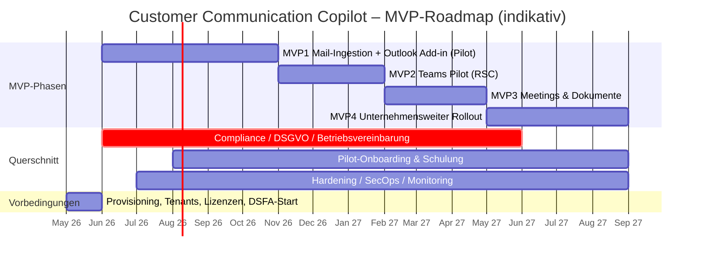

# 13 – MVP-Roadmap & Aufwandsschätzung

> Basis: [`../../instructions.md`](../../instructions.md) – Abschnitte „9. MVP-Vorschlag", „Erweiterte MVP-Planung", Akzeptanzkriterien (Hauptteil 1–10) sowie Erweiterung „Unternehmensweite Erfassung externer Kommunikation" (1–10). Die Roadmap folgt der **Erweiterten MVP-Planung** aus `instructions.md` (serverseitige Erfassung ist Pflicht-Bestandteil von MVP1).

## Konsultierte Plandokumente

| Datei | Beitrag zu dieser Roadmap |
|---|---|
| [00-overview.md](00-overview.md) | Pflicht-Deliverables, Wellenmodell, Leitplanken |
| [01-architecture.md](01-architecture.md) | Container-Schnitt, Topologie, Multi-Tenant – **enthält den Backend-Service ("Communication Copilot Service")**; eine separate Datei `06-backend-service.md` existiert nicht |
| [02-bc-data-model.md](02-bc-data-model.md) | Tabellen, Felder, Aufwand BC-Datenmodell |
| [03-bc-apis.md](03-bc-apis.md) | Custom-API-Schnitt, Endpunkte |
| [04-outlook-addin.md](04-outlook-addin.md) | Add-in Lese-/Compose-Modus, UX |
| [05-teams-app.md](05-teams-app.md) | Bot, ME, Tab, RSC |
| [07-ingestion-pipeline.md](07-ingestion-pipeline.md) | 15-Schritt-Pipeline, Subscription-Manager, Idempotenz |
| [08-ai-orchestration.md](08-ai-orchestration.md) | Capabilities C1–C8, Modell-Routing, Eval |
| [09-data-search.md](09-data-search.md) | Indizes `interactions`, `bc-master`, `bc-documents`, `summaries`, `transcripts` |
| [10-matching.md](10-matching.md) | Regelbasis + LR-Reranker, Kandidaten-Score |
| [11-graph-feasibility.md](11-graph-feasibility.md) | Lizenz-/Pay-per-use-Realität (Mail, Teams, Transkripte) |
| [12-security-compliance.md](12-security-compliance.md) | DSGVO, BV, Application Access Policy, RSC, Audit |
| [16-testing-acceptance.md](16-testing-acceptance.md) | Release-Gates je MVP, Eval-Schwellen |

> Hinweis: Der MVP-Schnitt in [16-testing-acceptance.md](16-testing-acceptance.md) §11 stammt aus einem früheren Planungsstand (Add-in-First). **Diese Roadmap setzt die "Erweiterte MVP-Planung" aus `instructions.md` als verbindlich** – serverseitige Mail-Erfassung ist Bestandteil von MVP1. Die Release-Gates aus §11 werden hier sinngemäß auf den neuen Schnitt abgebildet (§ "Release-Gates" je MVP).

---

## 1. Roadmap-Überblick

Vier MVPs in sequenzieller Reihenfolge, mit drei kontinuierlichen Querschnitts-Workstreams. Phasendauer ist indikativ und hängt vom Team-Setup (siehe §8) und den Vorbedingungen (siehe §9) ab.

Die parallelen Querschnitte starten **vor** MVP1 (DSFA und BV-Entwurf sind Voraussetzung für jeden Pilot-Go-Live) und enden frühestens mit der Produktivnahme von MVP4.

---

## 1.5 Sprint 0 – Setup-Sprint (vor MVP1 Sprint 1)

**Dauer:** 2–3 Wochen. **Ziel:** „Definition of Ready" für MVP1 Sprint 1 (Pilotgruppe mit Consent ≥ 5 Postfächer, Subscriptions/Repos/Lizenzen provisioniert, Eval-Korpus initial).

Detailliertes Backlog (Workstreams WS-A bis WS-I, Tasks, DoD, Mermaid-Abhängigkeitsgraph): siehe **[18-sprint-0-backlog.md](18-sprint-0-backlog.md)** (Entscheidung E-D5).

---

## 2. MVP1 – Serverseitige E-Mail-Erfassung + Outlook Add-in

**Pilot-Umfang:** definierte Pilotgruppe (Empfehlung: **20–50 Postfächer eines Vertriebs- oder Service-Teams**), gescopt über Exchange **Application Access Policy** ([11-graph-feasibility.md §2.4](11-graph-feasibility.md)).

### 2.1 In Scope

| Bereich | Inhalt | Plandokument |
|---|---|---|
| Ingestion Mail | Graph Change Notifications (`/users/{id}/messages`), Subscription-Manager mit Renewal alle ≤ 3 Tage, Delta-Backfill, Encrypted Content optional | [07](07-ingestion-pipeline.md), [11 §2](11-graph-feasibility.md) |
| Application Access Policy | Beschränkung `Mail.Read` auf Pilot-Sicherheitsgruppe, Monitoring der Policy | [11 §2.4](11-graph-feasibility.md), [12](12-security-compliance.md) |
| Matching | Regelbasis (E-Mail/Domain/Belegnr./Projekt) + LR-Reranker, Kandidaten mit Confidence | [10](10-matching.md) |
| BC-Tabellen (Subset) | `Communication Interaction`, `Participant`, `Entity Link`, `AI Summary` (Kurzfassung), `Action Item`, `Source Reference`, `Setup`, `Internal Domain`, `Audit` | [02](02-bc-data-model.md) |
| BC-Pages | Customer Communication Timeline, Interaction Detail, FactBoxes (AI Summary, Open Action Items, Related Documents), Setup-Page, Matching Inbox | [02](02-bc-data-model.md), Hauptteil §1 |
| BC-APIs (Subset) | `POST/PATCH Interaction`, `Match Suggest`, `Context Customer`, `Save Summary`, `Save Reply Draft`, `Setup` | [03](03-bc-apis.md) |
| Outlook Add-in | ItemRead (Side Panel mit Kontext + Vorschlag + Quellen), ItemSend/Compose (Antwortentwurf einfügen, kein Auto-Send) | [04](04-outlook-addin.md) |
| Backend Copilot Service | Endpunkte `/context`, `/suggest-reply`, `/summary`, `/match`, `/interactions`; OBO-Flows; Pre-AI-Permission-Resolver | [01 §3–5](01-architecture.md) |
| AI-Capabilities | C1 Klassifikation, C2 Extraktion, C3 Antwortvorschlag mit Citations, C4 Einzelnachricht-Summary | [08](08-ai-orchestration.md) |
| Audit-Log | `ai.suggestion.created/accepted`, `interaction.persisted`, `permission.denied`, `prompt.injection.detected` (manipulationsgeschützt) | [01 §10](01-architecture.md), [12](12-security-compliance.md) |
| Pre-AI-Permission-Resolver | Berechtigungsprüfung **vor** jeder AI-Zusammenfassung; Source-Filter im Index | [12](12-security-compliance.md) |
| Hybrid-Search-Indizes | `interactions`, `bc-master`, `bc-documents`, `summaries` (jeweils mandantenspezifisch, mit ACL-Feldern) | [09](09-data-search.md) |
| Eval-Suite | Goldlabel-Korpus (300 Mails / 50 Threads), Regression-Runs für C1–C4 | [16 §6](16-testing-acceptance.md) |
| DSFA + Consent-Prozess | **DSFA gestartet + Consent-Prozess implementiert** (Consent-Formular DE/EN, BC-Tabelle `Communication Consent` (50014), Widerruf-Workflow). **BV bewusst aufgeschoben**, siehe Strategie E-D2 / ADR-28 in [12 §10.3](12-security-compliance.md). **BV ist vor MVP4 zwingend.** | [12 §10.3](12-security-compliance.md), [15 A16/A17](15-open-questions-next-steps.md) |

### 2.2 Out of Scope

- Teams-Erfassung jeder Art (auch keine ME/Bot/Tab-Auslieferung).
- Meeting-Transkripte, Recordings.
- SharePoint/OneDrive-Volltextindex (nur Anhang-Metadaten aus Mail).
- Voll-Rollout / tenant-weite Aktivierung.
- Proaktive Briefings, thematisches Clustering.

### 2.3 Akzeptanzkriterien (aus `instructions.md`)

Mit MVP1 erfüllbar (Verweis auf Test-/Eval-Abdeckung in [16](16-testing-acceptance.md)):

| Krit. | Inhalt (verkürzt) |
|---|---|
| H1 | Klassifikation Mail; Fragen/Aufgaben/Risiken erkannt |
| H2 | Antwortvorschlag, **niemals automatisch gesendet** |
| H3 | Quellen sichtbar |
| H4 | Berechtigungen respektiert (Permission Resolver, BC Permission Sets) |
| H5 | AI-Aktionen protokolliert |
| H6 | Zuordnung zu BC-Entitäten (Mail-Pfad) inkl. Mehrfach-Treffer/Confidence |
| H7 | Outlook Add-in Side Panel komplett |
| H9 | Backend mit Graph-, BC-, AI-, Search-Zugriff; Audit, Fehlerbehandlung |
| H10 | Sicherheits-/Compliance-Konzept (Mail-Scope) |
| E1 | Serverseitige Erfassung externer Mails unabhängig vom Benutzer |
| E2 | Erkennung externer Beteiligung gemäß 8-Regeln-Heuristik |
| E3 | Ausschluss interner-only / privater / Newsletter-Mails |
| E5 | Subscription-Lebenszyklus (Renewal, missed, Backfill) |
| E6 | Application Access Policy beschränkt Pilot-Sicherheitsgruppe |
| E7 | (teilweise) – Mail-Anteil; Teams-Anteil erst MVP2 |
| E9 | DSGVO-Workflows: Auskunft, Löschung (Mail-Daten) |

**Noch nicht in MVP1**: H8 (Teams-App), E4 nur für Mail-Pfad, E7 Teams-Teil, E8 (Transkripte), E10 erst mit Multi-Tenant-Onboarding-Flow ab MVP4.

### 2.4 Release-Gates

Mapping auf [16-testing-acceptance.md §11](16-testing-acceptance.md):

- Komponenten-Tests BC, Add-in, Copilot API, Ingestion: 100 % grün.
- E2E §5.1 (Mail → BC) und §5.3 (Compose-Insert ohne Auto-Send): grün im Pilot-Tenant.
- §7.1 Prompt-Injection, §7.2 Permission, §7.4 Tenant-Isolation: grün.
- AI-Eval-Schwellen: **C1 ≥ 0,80**, **C3 Faithfulness ≥ 0,95**, **C2 F1 ≥ 0,80** (Kunde/Beleg).
- Performance: Add-in TTFI **p95 ≤ 3 s**; Ingestion **p95 ≤ 60 s** (Webhook → BC-Schreibung).
- DSGVO-Workflows §7.3: „Auskunft" und „Löschung" grün; **DSFA abgezeichnet**, **BV-Entwurf in Konsultation**.
- Subscription-Renewal-Last (≥ 50 Mailboxen, 7 Tage stabil): grün.

---

## 3. MVP2 – Teams Pilot

**Pilot-Umfang:** **1–2 Pilot-Teams** (z. B. Vertriebsteam aus MVP1) mit den **gleichen Pilot-Mitarbeitern**; Teams-Erfassung primär über **RSC**, um Pay-per-use zu vermeiden.

### 3.1 In Scope

- **Teams App** (Bot + Message Extension + Tab) ausgeliefert an Pilot-Teams via RSC-Manifest ([05](05-teams-app.md)).
- **Ingestion Teams** für Pilot-Teams:
  - Channel Messages via **RSC `ChannelMessage.Read.Group`** (kein Pay-per-use, [11 §3.2](11-graph-feasibility.md)).
  - **Encrypted Content Subscriptions** (Pflicht für Teams-Inhalte) inkl. Zertifikat-Lifecycle in Key Vault.
  - Externe-Beteiligung-Filter (`tenantId` ≠ Home-Tenant, Guests).
- **BC-Erweiterungen**: Felder `Source Chat Id`, `Source Channel Id`, `Source Team Id`, `Source Permalink`, `chatType` ergänzt; Page-Drilldown auf Teams-Permalink.
- **AI-Capabilities**: C5 Thread-Briefing, C7 Aufgabenextraktion aus Chat-Verlauf.
- **Search-Index `transcripts`** angelegt (Schema, ACL-Felder, Mandant-Scoping) – **noch ohne Inhalt** (kommt mit MVP3).
- **Kostenmonitor (Stub)** für späteren Pay-per-use-Pfad (Modell B); in MVP2 nur Telemetrie, keine Aktivierung.

### 3.2 Out of Scope

- Tenant-weite `Chat.Read.All` (Pay-per-use) – bewusst nicht aktiviert; bleibt Option für MVP4.
- 1:1-Chats und Group-Chats außerhalb der Pilot-Teams (Graph-Limitierung: keine RSC für 1:1, [11 §3.1](11-graph-feasibility.md)).
- Meeting-Transkripte, Recordings.
- Voll-Rollout.

### 3.3 Akzeptanzkriterien

- **E4** Idempotenz auch über Teams + Add-in + Backfill hinweg.
- **E7** RSC-Pfad bevorzugt, Pay-per-use kontrolliert (Stub).
- **H8** Teams-App: Bot, ME, Tab; keine Auto-Posts.
- **H6** ergänzend: Teams-Nachrichten gematcht zu BC-Entitäten.
- **E2/E3** auf Teams-Quellen erweitert.

### 3.4 Release-Gates

- Komponenten-Tests Teams App + RSC-Manifest + Adaptive-Card-Schema: grün.
- E2E §5.2 (RSC-Pfad Channel Message → BC) im Pilot-Tenant: grün.
- AI-Eval **C2 F1 ≥ 0,85** (Kunde/Beleg), C5 Coverage ≥ 0,90.
- Encrypted-Content-Decryption und Zertifikatsrotation grün.
- BV in Kraft (für Pilot-Teams).

---

## 4. MVP3 – Meetings & Dokumente

### 4.1 In Scope

- **Meeting-Transkripte** via `OnlineMeetingTranscript.Read.All` ([11 §3.4](11-graph-feasibility.md)) – **lizenzabhängig: Teams Premium oder M365 Copilot beim Organisator**.
- **Recording-Referenzen** via `OnlineMeetingArtifact.Read.All` (nur Verlinkung; keine Volltextverarbeitung von Audio).
- **SharePoint/OneDrive-Indexierung** über Search-Index `bc-documents`/`documents` (Graph Files API + `Sites.Read.All`).
- **Anhang-Pipeline**: Klassifikation und Indexierung von Mail-/Chat-Anhängen (DOCX/PDF/XLSX).
- **AI-Capabilities** ergänzend: Meeting-Briefing, Follow-up-Mail-Vorschlag, Aufgabenextraktion aus Transkript.
- **Search-Index `transcripts`**: Befüllung aktiviert.
- **Graceful Degrade** wenn Transkript fehlt (`open_questions` statt Halluzination).
 **Status: erfüllt** für alle Pilot-Teilnehmenden – siehe Entscheidung **E-D3 / A18** ([15 §1](15-open-questions-next-steps.md)). Risiko **R-02 (fehlende Transkript-Lizenz) ist durch E-D3 entschärft** ([14 R-02, ADR-30](14-risks-decisions.md)); Lizenz-Drift-Monitor (Graph) als Alert.
### 4.2 Out of Scope

- Audio-/Video-Volltextverarbeitung außerhalb Microsofts Transkriptionsservice.
- Eigene Spracherkennung.

### 4.3 Voraussetzungen (lizenzabhängig)

- **Teams Premium** oder **Microsoft 365 Copilot** beim Meeting-Organisator (mindestens für die Pilot-Teilnehmer aus MVP1/MVP2).
- Teams-Meeting-Policy „Transkript zulassen" aktiv.

### 4.4 Akzeptanzkriterien

- **Hauptteil-Akzeptanz Punkt 2** und **Punkt 5** (BC-Daten + Quellen für Dokumente; Quellen sichtbar).
- **Erweiterung-Akzeptanz Punkt 5** (Dokumente / Anhänge).
- **E8** Meeting-Transkripte verarbeitet bzw. graceful degrade.

### 4.5 Release-Gates

- E2E „Transkript-Pfad": grün im Pilot-Tenant.
- E2E „Transkript fehlt → keine Halluzination": grün.
- AI-Eval-Regression-Set: kein Drop > 2 % gegen MVP2-Baseline.

---

## 5. MVP4 – Unternehmensweiter Rollout

### 5.1 In Scope

- **Skalierung** aller Pilotgruppen → **tenant-weit**: Application Access Policy auf Produktiv-Sicherheitsgruppe, sukzessive Aufnahme aller Vertriebs-/Service-/PM-Postfächer.
- ⚠️ **BETRIEBSVEREINBARUNG VOR MVP4 ZWINGEND** (vollständig, nicht mehr nur Pilot-Consent gemäß E-D2 / ADR-28). Ohne unterzeichnete BV gem. § 87 Abs. 1 Nr. 6 BetrVG **kein unternehmensweiter Rollout** in DE/AT. Verhandlung mit BR/SA/MAV ist spätestens während MVP3 abzuschließen. Siehe [12 §10.3](12-security-compliance.md), [14 R-08, ADR-28](14-risks-decisions.mdy-compliance.md)), Change-Management, Support-/Admin-Konzept (L1–L3).
- **Monitoring-Dashboards**: SLO-Burn-Rate, AOAI-Token-Verbrauch, Match-Trefferquote, Akzeptanzrate Antwortvorschläge, Skip-Gründe ([01 §10](01-architecture.md)).
- **Pay-per-use-Migration (optional)**: tenant-weite Teams-Erfassung über `Chat.Read.All` Modell B (1:1- und Group-Chats außerhalb Pilot-Teams) – **nur mit Budget-Schutzschaltern** (Tages-/Monats-Cap, Auto-Disable bei Schwellenüberschreitung, Kostenalarme).
- **Tenant-Onboarding-Workflow** (für Multi-Tenant-Lieferung an weitere BC-Mandanten).
- **AI-Eval-Regression** als Release-Gate dauerhaft etabliert.

### 5.2 Voraussetzungen

- **Betriebsvereinbarung in Kraft** (vollständig, nicht mehr nur Pilot).
- **DSFA abgenommen** und mit DSB final freigegeben.
- Security-Operations-Runbooks (Incident, Subscription-Ausfall, AOAI-Region-Ausfall) abgenommen.
- Lizenz-Prüfung Teams Pay-per-use abgeschlossen, Budget-Cap genehmigt.

### 5.3 Akzeptanzkriterien

- **E10** Mandanten-/Company-Isolation in Index, Storage, APIs (Cross-Tenant-Negativtests grün).
- Hauptteil-Akzeptanz **9** und **10** vollständig (Mandantenfähigkeit, Erweiterbarkeit).
- alle E1–E9 mindestens `green-pilot`, E1–E6 `green-prod`.

### 5.4 Release-Gates

- Last-/Stresstest tenant-weit: 100 Mails/Min nachhaltig, Subscription-Last skaliert.
- Kostenmonitoring + Auto-Disable verifiziert (Kill-Switch-Drill).
- Audit-Log-Manipulationsschutz produktiv.
- Operational-Readiness-Review (ORR) bestanden.

---

## 6. Querschnitts-Workstreams

Laufen **kontinuierlich** über alle MVPs (Start vor MVP1).

| Workstream | Inhalt | Bezug |
|---|---|---|
| **Compliance / DSGVO / BV** | DSFA (Start vor MVP1, Update je MVP), Betriebsvereinbarung (Entwurf → Konsultation → Inkrafttreten vor Voll-Rollout), Auskunfts-/Löschworkflows, Aufbewahrungsrichtlinie, AVV mit Microsoft / OpenAI EU Boundary | [12](12-security-compliance.md) |
| **Security-Operations** | Threat-Modeling pro Komponente, Pen-Tests vor jedem MVP-Go-Live, Prompt-Injection-Korpus pflegen, Key-Vault-Rotation, Subscription-Renewal-Monitoring, Incident-Runbooks | [12](12-security-compliance.md), [16 §7](16-testing-acceptance.md) |
| **Eval / Quality** | Goldlabel-Korpus pflegen, nightly Regression, Drift-Detection bei Modell-/Prompt-Änderungen, Capability-Schwellen je Release verifizieren | [16 §6](16-testing-acceptance.md), [08](08-ai-orchestration.md) |
| **Doku** | Architektur-Records (ADR), Runbooks, Admin-Guide, User-Guide, API-Referenz (OpenAPI), Compliance-Dokumentation | – |
| **Schulung & Onboarding** | Pilot-Onboarding-Sessions (Add-in/Teams), Admin-Schulung, „Was ist erfasst, was nicht" Transparenz-Briefings, Akzeptanzbegleitung | – |

---

## 7. Aufwandsschätzung (T-Shirt-Größen)

**Skala (PW = Personenwoche):** XS = 1–2 PW · S = 3–5 PW · M = 6–10 PW · L = 11–20 PW · XL = 21–40 PW · XXL = > 40 PW.

Schätzungen verstehen sich pro **MVP-Phase** (Inkrement gegenüber Vorphase) und sind **konservativ**. Annahmen siehe §12.

| Komponente | MVP1 | MVP2 | MVP3 | MVP4 | Annahmen |
|---|---|---|---|---|---|
| BC Datenmodell ([02](02-bc-data-model.md)) | L | S | S | XS | Subset in MVP1; Teams-Felder in MVP2; Meeting-/Doku-Felder in MVP3; nur Hardening in MVP4 |
| BC Pages / UX ([02](02-bc-data-model.md)) | L | M | S | XS | Timeline + Detail + FactBoxes + Setup + Matching Inbox in MVP1 |
| BC Custom APIs ([03](03-bc-apis.md)) | L | S | S | XS | API-Subset MVP1; Teams-Felder MVP2; Bulk/Admin-Endpunkte MVP4 |
| Backend Copilot Service ([01](01-architecture.md)) | XL | M | M | M | App Service, OBO, Endpunkte, Permission-Resolver, Tenant-Config |
| Ingestion Service ([07](07-ingestion-pipeline.md)) | XL | L | L | M | Mail-Webhook + Subscription-Mgr + Pipeline (Stage 1–15) MVP1; Teams-RSC + Encrypted Content MVP2; Transkripte MVP3 |
| AI Orchestrator ([08](08-ai-orchestration.md)) | L | M | M | S | C1–C4 in MVP1; C5/C7 MVP2; Meeting-Briefing + Follow-up MVP3 |
| Matching ([10](10-matching.md)) | L | S | S | S | Regelbasis + LR-Reranker MVP1; Teams-Signale MVP2; Doc-/Meeting-Signale MVP3 |
| Outlook Add-in ([04](04-outlook-addin.md)) | L | XS | XS | XS | Lese- + Compose-Modus MVP1; nur Pflege später |
| Teams App – Bot ([05](05-teams-app.md)) | – | M | XS | XS | Bot Framework v4, SSO, Adaptive Cards |
| Teams App – Message Extension | – | M | XS | XS | Action-Command, Card-Flow |
| Teams App – Tab | – | M | S | XS | Kunden-/Projekt-Workspace, SSO |
| Such-/Indexkonzept ([09](09-data-search.md)) | L | S | M | S | Indizes `interactions`, `bc-master`, `bc-documents`, `summaries` MVP1; `transcripts`-Schema MVP2; Doku-Volltext MVP3; Skalierung/Replicas MVP4 |
| Security / Identity ([12](12-security-compliance.md)) | L | M | S | M | App-Reg, OBO, Application Access Policy, RSC-Manifest, Key Vault CMK; Multi-Tenant-Onboarding MVP4 |
| Compliance / DSGVO / BV ([12](12-security-compliance.md)) | L | M | M | M | DSFA, BV-Entwurf, Auskunfts-/Löschworkflows, Aufbewahrung; BV finalisieren MVP4 |
| DevOps / CI-CD | M | S | S | M | IaC (Bicep/Terraform), GitHub Actions, AL-Go, Slot-Deploy, Stage-Pipelines |
| Test- / Eval-Infrastruktur ([16](16-testing-acceptance.md)) | L | M | M | S | Goldlabel-Korpus, Eval-Runner, k6-Last, Pen-Test-Setup |
| Schulung & Onboarding | S | S | S | M | Pilot-Onboarding pro MVP; tenant-weiter Rollout-Plan in MVP4 |

### 7.1 Summen je MVP (Range, Personenwochen)

> Konvertierung: untere Grenze ≈ Summe der jeweils untersten T-Shirt-Werte, obere Grenze ≈ Summe der obersten Werte.

| MVP | Range (PW) | Indikative Dauer (kalendarisch) bei Team-Setup §8 |
|---|---|---|
| **MVP1** – Mail-Ingestion + Outlook | **≈ 130 – 230 PW** | 4–6 Monate |
| **MVP2** – Teams Pilot | **≈ 60 – 110 PW** | 2,5–4 Monate |
| **MVP3** – Meetings & Dokumente | **≈ 55 – 100 PW** | 2,5–4 Monate |
| **MVP4** – Unternehmensweiter Rollout | **≈ 45 – 90 PW** | 3–5 Monate |
| **Gesamt** | **≈ 290 – 530 PW** | – |

**Hinweis zur Spannweite:** Die obere Grenze enthält Puffer für (a) Graph-/RSC-Onboarding-Komplexität, (b) BV-Verhandlung, (c) Eval-Iterationen bei Capability-Schwellen, (d) Multi-Tenant-Onboarding-Tooling. Sie ist **nicht** als pessimistische Risikodeckung zu verstehen; zusätzliche Risikopuffer (typ. 15–25 %) sind vom Kunden separat einzuplanen.

---

## 8. Team-Setup-Empfehlung

| Rolle | MVP1 | MVP2 | MVP3 | MVP4 |
|---|---|---|---|---|
| Architekt (Lead) | 1 | 1 | 1 | 1 |
| Product Owner | 1 | 1 | 1 | 1 |
| BC AL Engineer | 2 | 1–2 | 1 | 1 |
| Backend / .NET Engineer | 2–3 | 2 | 2 | 1–2 |
| AI Engineer (Prompting / Eval / Orchestrator) | 1–2 | 1 | 1–2 | 1 |
| Front-End TS Engineer (Add-in / Tab / Bot-UI) | 1–2 | 2 | 1 | 1 |
| Cloud / SRE | 1 | 1 | 1 | 1–2 |
| Security / Compliance Engineer | 0,5 | 0,5 | 0,5 | 1 |
| UX Designer | 0,5 | 0,5 | 0,5 | 0,25 |
| QA / Test Engineer | 1–2 | 1 | 1 | 1–2 |
| Datenschutzbeauftragter (DSB) | beratend | beratend | beratend | beratend |
| Betriebsrat / Mitarbeitervertretung | beratend | beratend | beratend | beratend |
| **Mindest-Headcount (FTE-äquiv.)** | **9–11** | **8–9** | **7–8** | **8–10** |

Empfehlung: stabiles Kernteam über alle MVPs; AI-Engineer-Auslastung steigt zu MVP3 wieder an (Meeting-Briefing, Follow-up).

---

## 9. Vorbedingungen / Provisioning vor MVP1

| # | Vorbedingung | Verantwortlich |
|---|---|---|
| 1 | Azure Subscriptions `nonprod` (dev/test/uat/pilot) und `prod` getrennt; EU-Region (Sweden Central / West Europe) | Cloud / SRE |
| 2 | M365 Test-Tenant **separat** vom Produktiv-Tenant (Pflicht laut [16 §2](16-testing-acceptance.md)) | M365-Admin |
| 3 | BC SaaS Sandboxen pro Stage (Dev, Test, Pilot) inkl. CRONUS + Demo-Daten | BC-Admin |
| 4 | Lizenzen geprüft: Azure OpenAI (EU Data Boundary), Azure AI Search S2, Service Bus Premium; Outlook/Teams-Lizenzen Pilotgruppe; **Teams Premium oder M365 Copilot** für MVP3-Organisatoren | Lizenz-/Einkauf |
| 5 | Entra App Registrierungen pro Stage (Copilot API, Ingestion, Outlook Add-in, Teams App); Admin Consent geplant | Security |
| 6 | Service Principals + Zertifikate (BC S2S, Graph Encrypted Content) im Key Vault, Auto-Rotation aktiv | Security / Cloud |
| 7 | Application Access Policy für Pilot-Sicherheitsgruppe in Exchange Online | Exchange-Admin |
| 8 | Eval-Daten: Goldlabel-Korpus initial (≥ 200 Mails synthetisch + Labels) | AI Engineer |
| 9 | DSFA-Start mit DSB; Betriebsvereinbarungs-Entwurf eingereicht | DSB / HR / Legal |
| 10 | Pilotgruppe nominiert (20–50 Postfächer), Information & Einwilligung gemäß Art. 13 DSGVO | HR / Pilot-Lead |
| 11 | Monitoring (Application Insights + Log Analytics Workspace) und Audit-Custom-Tables aufgesetzt | Cloud / SRE |
| 12 | CI/CD-Pipelines (GitHub Actions / Azure DevOps), IaC-Repo, AL-Go-Pipeline | DevOps |

---

## 10. Erfolgskriterien je MVP (KPIs)

| MVP | KPI / Schwellenwert |
|---|---|
| **MVP1** | Match-Confidence ≥ 0,8 in **≥ 80 %** der erfassten externen Mails · Akzeptanzrate Antwortvorschlag (Pilot) ≥ **40 %** · Add-in TTFI **p95 ≤ 3 s** · Ingestion E2E **p95 ≤ 60 s**, **p99 ≤ 5 min** · DLQ-Rate < 0,1 % · Audit-Coverage 100 % aller AI-Aktionen · 0 Cross-Tenant-Leaks · keine ungeplanten Auto-Sends |
| **MVP2** | RSC-Anteil an Teams-Erfassung **≥ 95 %** (Rest: bewusst Pay-per-use Stub) · Teams-Match-Confidence ≥ 0,75 in ≥ 75 % · keine ungeplanten Pay-per-use-Kosten · Akzeptanzrate Bot-/ME-Vorschläge ≥ 30 % · keine Auto-Posts |
| **MVP3** | Coverage Meeting-Briefings (wo Transkript verfügbar) **≥ 90 %** · graceful degrade verifiziert (keine Halluzination ohne Transkript) · Doku-Treffer-Relevanz nDCG@5 ≥ 0,7 · Follow-up-Vorschlag-Akzeptanz ≥ 35 % |
| **MVP4** | Verfügbarkeit Copilot API **≥ 99,9 %** monatlich · DLQ-Rate < 0,1 % bei tenant-weiter Last · 0 Cross-Tenant-Leaks unter Last · Pay-per-use-Budget-Cap nie überschritten (Auto-Disable verifiziert) · Adoption ≥ 60 % der berechtigten Benutzer im 3-Monats-Fenster |

---

## 11. Rollback-/Notfall-Strategie pro MVP

Generelles Prinzip: **kein automatisches externes Senden** ⇒ Roll-Backs sind in der Regel datenseitig (BC-Datensätze als „revoked" markieren) und kommunikationsseitig **unkritisch** (kein Versand, kein Reputationsschaden).

| MVP | Rollback-Mechanismen |
|---|---|
| **MVP1** | (a) **Feature Flag** „Add-in aktiv" / „Ingestion aktiv" pro Pilot-User über App Configuration; (b) **Application Access Policy** entfernt sofort den Lesezugriff auf Pilot-Postfächer; (c) Subscription-Manager kann alle Subscriptions per Admin-Cmd löschen (`DELETE /subscriptions/{id}`); (d) BC-Daten werden nicht hart gelöscht, sondern als `Processing Status = revoked` markiert; (e) App-Service-Slot-Swap zurück auf vorherige Version |
| **MVP2** | (a) Teams App **deinstallieren** aus Pilot-Teams (RSC erlischt); (b) Encrypted-Content-Subscriptions widerrufen; (c) BC-Teams-Felder bleiben strukturell, neue Datensätze können `revoked` werden; (d) Bot-Endpunkt deaktivieren (Bot Channel Registration off) |
| **MVP3** | (a) Transkript-/Doku-Pipeline-Feature-Flag; (b) Search-Index `transcripts` lässt sich pro Mandant leeren (`DELETE` per Filter), Schema bleibt erhalten; (c) Recording-Referenzen revozierbar |
| **MVP4** | (a) **Kill-Switch** Pay-per-use Teams (Budget-Cap); (b) staffel-Rollout über Sicherheitsgruppen → Roll-Back über Gruppen-Membership; (c) Multi-Region-DR (Sweden Central → West Europe) für AOAI-Ausfall; (d) **Notfall-Stop** der Ingestion (alle Subscriptions löschen, Functions stoppen) als dokumentiertes Runbook |

DSGVO-Notfall (z. B. Auskunftsersuchen / Löschverlangen): Workflow [12 §7.3](16-testing-acceptance.md) ist **ab MVP1** produktiv und erfasst auch im Rollback-Fall die ggf. bereits eingespielten Daten.

---

## 12. Annahmen und Limitierungen der Schätzung

1. **Stack-Annahme** gemäß [00-overview.md](00-overview.md): BC SaaS, Azure (EU), .NET 8, TypeScript/React, AL.
2. **Single-Mandant-Pilot** in MVP1–MVP3; Multi-Tenant-Onboarding-Tooling erst in MVP4.
3. **Pilotgröße** MVP1: 20–50 Postfächer; bei > 200 Mailboxen erhöht sich Subscription-Last und Tooling (Subscription-Manager) um ca. 1 Größe.
4. **Lizenzabhängige Komponenten** (klar markiert):
   - **Teams Premium** oder **Microsoft 365 Copilot** für **MVP3 Meeting-Transkripte** (sonst keine Transkripte verfügbar – nicht durch Code lösbar).
   - **Microsoft 365 E5** oder **Teams Export API Pay-per-use** für **tenant-weite** Teams-Erfassung in **MVP4** (Modell B); MVP2 nutzt RSC, daher lizenzfrei für Pilot-Teams.
   - **Azure OpenAI** Quota in EU-Region und Region-Pinning erforderlich.
5. **Schätzung enthält keine** Migration aus Altsystemen, keine Mehrsprachen-UI über Deutsch/Englisch hinaus, keine Legacy-Konnektoren (Telefonanlage, Ticketsystem) – solche Erweiterungen sind in [00-overview.md](00-overview.md) als „später" markiert.
6. **BV-/DSFA-Aufwand**: nur die **technische Begleitung** (Datenmodell-Doku, Audit-Beweise, Test-Reports) ist enthalten; juristische BV-Verhandlungsdauer ist **nicht** in PW-Schätzung enthalten und kann den Kalenderplan zusätzlich verlängern.
7. **Pen-Tests / externe Audits** sind separat zu beauftragen und nicht in PW enthalten.
8. **Capability-Schwellen** ([16 §6](16-testing-acceptance.md)) gelten als erreicht, sobald Goldlabel-Korpus-Größe ≥ angegebene Mindestmengen erreicht; iterative Prompt-Tunings sind im Range eingerechnet, aber nicht für > 2 Modellwechsel pro MVP.
9. **Range-Charakter** der T-Shirt-Werte: Wechsel zwischen unterer und oberer Grenze entscheidet sich an Faktoren, die zu Beginn nicht final klar sind – insbesondere RSC-Adoption durch Team-Eigentümer (MVP2), Lizenz-Verfügbarkeit (MVP3), BC-API-Stabilität in SaaS-Updates und Graph-Throttling-Verhalten.
10. **Kein Risikopuffer** in PW-Range enthalten – branchenüblich 15–25 % zusätzlich auf den oberen Wert ansetzen.

---

## Final Report

- **Pfad:** [docs/plan/13-mvp-roadmap.md](13-mvp-roadmap.md)
- **Hauptabschnitte:** Konsultierte Plandokumente · §1 Roadmap-Überblick (Mermaid Gantt) · §2 MVP1 Mail-Ingestion + Outlook Add-in · §3 MVP2 Teams Pilot · §4 MVP3 Meetings & Dokumente · §5 MVP4 Unternehmensweiter Rollout · §6 Querschnitts-Workstreams · §7 Aufwandsschätzung (T-Shirt-Tabelle + Summen) · §8 Team-Setup · §9 Vorbedingungen · §10 Erfolgskriterien · §11 Rollback-/Notfall-Strategie · §12 Annahmen.
- **MVP-Aufwandssummen (PW-Range):**
  - MVP1: **≈ 130–230 PW** (4–6 Monate)
  - MVP2: **≈ 60–110 PW** (2,5–4 Monate)
  - MVP3: **≈ 55–100 PW** (2,5–4 Monate)
  - MVP4: **≈ 45–90 PW** (3–5 Monate)
  - Gesamt: **≈ 290–530 PW** (zzgl. 15–25 % Risikopuffer empfohlen)
- **Top-3 kritische Voraussetzungen vor MVP1-Start:**
  1. **DSFA gestartet und Betriebsvereinbarungs-Entwurf in Konsultation** ([12](12-security-compliance.md)) – ohne diese darf die Pilotgruppe nicht produktiv erfasst werden.
  2. **Exchange Application Access Policy + separater M365-Test-Tenant** ([11 §2.4](11-graph-feasibility.md), [16 §2](16-testing-acceptance.md)) – verhindert ungewolltes „alle-Postfächer"-Scoping und ermöglicht überhaupt erst sichere CI-Tests.
  3. **Azure OpenAI EU-Quota + Region-Pinning + Goldlabel-Korpus initial (≥ 200 Mails)** ([01 §6](01-architecture.md), [16 §3](16-testing-acceptance.md)) – ohne reproduzierbare AI-Eval keine Release-Gates und keine belastbare Capability-Aussage.
