# 18 – Sprint 0 Backlog (MVP1 Setup-Sprint)

> Setup-Sprint vor MVP1 Sprint 1 gemäß Entscheidung **E-D5** ([15-open-questions-next-steps.md A20](15-open-questions-next-steps.md), [13-mvp-roadmap.md §1.5](13-mvp-roadmap.md)). Ziel: **„Definition of Ready" für MVP1 Sprint 1** erreichen, sodass die Pilotgruppe technisch, rechtlich und operativ aufnahmebereit ist.

## 1. Ziel & Definition of Done (Sprint 0)

**Ziel.** In 2–3 Wochen alle nicht-fachlichen Vorbedingungen für die MVP1-Implementierung schaffen: Compliance-Rahmen, Pilotgruppe mit Consent, Lizenzen, Tenants, Subscriptions, Repo-Skelett, AI-Eval-Korpus, Sicherheits-Baseline und Backfill-PoC.

**Definition of Done (Sprint 0 = Definition of Ready für MVP1 Sprint 1):**

- DoD-1: **DSFA gestartet** (Entwurf v0.1, DSB benannt).
- DoD-2: **Consent-Prozess implementiert** (Formular DE/EN, BC-Tabelle `Communication Consent` (50014), Widerruf-Workflow) und ≥ 5 Pilotpostfächer mit gültigem Opt-in-Consent.
- DoD-3: **Mitbestimmungsgremien (BR/SA/MAV) informiert**, Sitzungsprotokoll vorliegend.
- DoD-4: **Pilotgruppe nominiert** (≤ 50 MA, Sponsor benannt, RACI freigegeben).
- DoD-5: **Lizenz-Inventur abgeschlossen** (M365 E5, Teams Premium, M365 Copilot, Azure OpenAI Quota); Lücken adressiert.
- DoD-6: **Azure-Subscriptions** Dev/Test/Prod provisioniert, alle Pflicht-PaaS-Ressourcen IaC-deployed.
- DoD-7: **Mono-Repo angelegt** (Branching, CI/CD-Skelett, Federated Identity, Tagging, Lint).
- DoD-8: **BC-Sandbox** vorbereitet, Service Principal eingebunden, Permission-Set-Skeleton vorhanden.
- DoD-9: **Goldlabel-Korpus** ≥ 200 Beispiele, Eval-Runner-Skeleton lauffähig.
- DoD-10: **Sicherheits-Baseline** (Threat-Model-Workshop durchgeführt, Secret-/Dependency-Scanning aktiv, Logging-Konvention dokumentiert).
- DoD-11: **Backfill-PoC** für eine Test-Mailbox (24 Monate, gedrosselt) erfolgreich; High-Water-Mark-Konzept dokumentiert.
- DoD-12: **Sprint 1 Backlog** geplant, Schätzung approved.

## 2. Sprint-Rahmen

- **Dauer:** 2–3 Wochen (Stretch bei Lizenz- oder BR-Verzögerung).
- **Team-Mindestbesetzung** (Teilzeit zulässig, sofern Output erreicht):

| Rolle | Beteiligung Sprint 0 |
|---|---|
| Product Owner | 100 % |
| Architekt (Lead) | 100 % |
| BC AL Engineer | 50–100 % |
| Backend / .NET Engineer | 50–100 % |
| Cloud / SRE | 100 % |
| Security / DPO (DSB) | 50 % beratend, 100 % bei DSFA/Consent |
| AI Engineer | 50 % (Eval-Korpus, Prompt-Repo) |
| UX Designer | 25 % |
| QA Engineer | 25–50 % |
| HR / Legal | beratend (Consent, BR-Information) |

- **Ceremonies:** tägliches 15-min-Sync, Mid-Sprint-Review (Tag 7–10), Sprint-Review + Retro am Ende, Hand-off an MVP1 Sprint 1.

## 3. Workstreams & Tasks

> Spalten: **ID** | **Task** | **Verantwortlich** | **Output / Artefakt** | **DoD** | **Abhängigkeit**.

### WS-A – Compliance & Consent

| ID | Task | Verantwortlich | Output / Artefakt | DoD | Abhängigkeit |
|---|---|---|---|---|---|
| A1 | Consent-Formular (DE/EN) erstellen | DSB + HR | `consent-form-2026-05-DE-v1.0.pdf`, `…-EN-v1.0.pdf` | Vom DSB freigegeben, juristisch geprüft | – |
| A2 | Consent-Register-Schema in BC umsetzen | BC-Engineer | AL-Skeleton Tabelle 50014 + Enum 50016 + Page | Insert/Modify/Withdraw funktional, Audit-Trigger aktiv | A1 |
| A3 | Datenschutzerklärung Pilot | DSB | `privacy-notice-pilot-v1.0.md` | Auf Intranet veröffentlicht | A1 |
| A4 | Mitarbeiter-Information Pilot (Townhall + FAQ) | HR + Sponsor | Folien, Intranet-Artikel, FAQ v1.0 | Townhall durchgeführt, FAQ live | A1, A3 |
| A5 | Information BR / Sprecherausschuss / MAV | HR + DSB + Sponsor | Informationsschreiben, Sitzungsprotokoll | Protokoll unterzeichnet (DoD-3) | A4 |
| A6 | DSFA-Start (Entwurf v0.1) | DSB | DSFA-Entwurf (Bausteine aus [12 §8.4](12-security-compliance.md)) | DSB-Sign-off auf v0.1 (DoD-1) | – |
| A7 | Verarbeitungsverzeichnis-Eintrag (Art. 30 DSGVO) | DSB | VVT-Eintrag „Communication Copilot Pilot" | im VVT-System eingetragen | A6 |
| A8 | Pilot-Befristungs-Dokument (max. 6 Monate, Re-Consent-Plan) | DSB + PO | `pilot-charta-mit-befristung-v1.0.md` | Sponsor + DSB unterschrieben | A1, A4 |

### WS-B – Pilotgruppe & Stakeholder

| ID | Task | Verantwortlich | Output / Artefakt | DoD | Abhängigkeit |
|---|---|---|---|---|---|
| B1 | Pilotgruppe nominieren (≤ 50, Vertrieb/Service) | Sponsor + Bereichsleitung | Pilot-Liste mit Namen, Rollen, Mailbox-UPNs | Liste freigegeben, ≤ 50 MA | A4 |
| B2 | Sponsor festlegen (C-Level) | Geschäftsführung | Sponsor-Mandat schriftlich | Mandat unterzeichnet | – |
| B3 | RACI-Matrix Sprint 0 + MVP1 | PO | `raci-mvp1.md` | Vom Steering freigegeben | B2 |
| B4 | Kommunikationsplan Pilot | PO + Marketing | `comm-plan-pilot-v1.0.md` (Townhall, Newsletter, Sprechstunde DSB) | Veröffentlicht | B2 |
| B5 | Schulungsplan Pilot-Anwender | UX + PO | Schulungs-Curriculum (60–90 min), Reference Card | Material ready | B1 |
| B6 | Opt-in-Einholung ≥ 5 Pilotpostfächer | DSB + HR | 5+ Datensätze in Tabelle 50014 mit `Granted` | DoD-2 erfüllt | A1, A2, A4, A5, B1 |

### WS-C – Lizenzen & Tenants

| ID | Task | Verantwortlich | Output / Artefakt | DoD | Abhängigkeit |
|---|---|---|---|---|---|
| C1 | Lizenz-Inventur (M365 E5, Teams Premium, M365 Copilot) | M365-Admin + Einkauf | `licence-inventory.xlsx` | Lücken identifiziert | B1 |
| C2 | Azure OpenAI Quota beantragen (Sweden Central, GPT-4.1, GPT-4o-mini, embedding-3-large) | Cloud-Architekt | Quota-Bestätigung | Quota produktiv (DoD-5) | – |
| C3 | Application Access Policy (Exchange) auf Pilotgruppe | Exchange-Admin | PowerShell-Skript + Health-Check-Test | Policy aktiv, Test-Postfach außerhalb der Pilotgruppe wird abgewiesen | B1 |
| C4 | Separater M365-Test-Tenant einrichten | M365-Admin | Test-Tenant mit 5 Test-Postfächern, 2 Test-Teams | Funktional nutzbar | – |
| C5 | BC SaaS Sandbox (Dev/Test/Pilot) provisionieren | BC-Admin | 3 Sandboxen mit CRONUS + Demo-Daten | Login funktional | – |
| C6 | Service Principals registrieren (Backend, Ingestion, BC-S2S, Outlook Add-in) | Security + Cloud | App-Registrierungen mit Zertifikaten in Key Vault | Admin Consent erteilt | C4 |
| C7 | Lizenz-Drift-Monitor (Graph) PoC für Teams Premium / Copilot | Backend | Graph-Skript + Alert-Regel | Alert-Test erfolgreich | C1, C6 |

### WS-D – Azure-Subscription & Infrastruktur

| ID | Task | Verantwortlich | Output / Artefakt | DoD | Abhängigkeit |
|---|---|---|---|---|---|
| D1 | Azure-Subscriptions Dev/Test/Prod (EA, EU) | Cloud-Architekt + Einkauf | 3 Subs mit Cost-Mgmt-Budgets | Subs aktiv | – |
| D2 | Resource-Group-Layout + Naming + Tagging-Policy | Cloud-Architekt | IaC-Repo (Bicep/Terraform), Tagging-Standard | RGs deployed, Policy aktiv | D1 |
| D3 | Key Vault (Premium HSM) pro Stage | Cloud-Architekt | KV-Instanzen, Access-Policies via RBAC | Provisioniert, MI-Zugriff getestet | D2 |
| D4 | Log Analytics + dedizierter **Audit-Workspace** (immutable) | Cloud + Security | 2 Workspaces (Operations, Audit), RBAC-Trennung | Audit-Workspace mit Lock | D2 |
| D5 | Azure AI Search S1 (Pilot) | Cloud-Architekt | Search-Service, MI-RBAC | Service erreichbar, Test-Index angelegt | D2 |
| D6 | Azure OpenAI Deployment Sweden Central | AI Eng + Cloud | Deployments für GPT-4.1, GPT-4o-mini, text-embedding-3-large | Inferenz-Test erfolgreich | C2, D2 |
| D7 | Service Bus Premium (kleinste SKU) | Cloud-Architekt | SB-Namespace mit Topics + Sessions-Queues | Queues erreichbar | D2 |
| D8 | Azure Functions Premium EP1 (Ingestion + Worker) | Cloud-Architekt | Function Apps mit MI + VNet Integration | Hello-World-Function deployed | D2, D7 |
| D9 | App Service Plan + App Service (Copilot API) | Cloud-Architekt | App Service mit Slots | Health-Check 200 OK | D2 |
| D10 | Storage Accounts (Blob + Tables) pro Stage | Cloud-Architekt | Storage mit Private Endpoints + CMK | Verbindung getestet | D3 |
| D11 | Application Insights (pro Stage) | Cloud-Architekt | AppI mit Workspace-Mode | Telemetrie aus D8 sichtbar | D4 |
| D12 | Private Endpoints + VNet Topologie | Cloud-Architekt | Hub-Spoke-VNet, PE für KV/Storage/Search/AOAI/SB | Egress eingeschränkt | D2–D11 |
| D13 | CMK-Vorbereitung (BYOK-Keys in KV, BYOK-Workflow für Search/Storage) | Cloud + Security | Keys angelegt, Rotation-Plan | Keys aktiv (Apply pro Service in MVP1) | D3 |

### WS-E – Repository & DevOps

> Detailliertes Repo-Scaffolding wird durch **Lena-Pipe** erstellt (Repo-Scaffolding-Dokument [`19-repo-scaffolding.md`](19-repo-scaffolding.md), in Sprint 0 von Lena-Pipe geliefert – **nicht von Taylor-Docs anlegen**).

| ID | Task | Verantwortlich | Output / Artefakt | DoD | Abhängigkeit |
|---|---|---|---|---|---|
| E1 | Mono-Repo-Struktur freezen (Komponenten-Ordner, Workspaces) | Architekt + Lena-Pipe | Repo `comm-copilot` initial | `git push` Main grün | – |
| E2 | Branching-Policy + PR-Template + CODEOWNERS | DevOps-Lead | `BRANCHING.md`, `PULL_REQUEST_TEMPLATE.md`, `CODEOWNERS` | Aktiv im Repo | E1 |
| E3 | CI/CD-Skelett (GitHub Actions / Azure DevOps) | DevOps-Lead | Pipelines `build.yml`, `deploy-dev.yml`, AL-Go-Pipeline | Build green auf Main | E1 |
| E4 | Secrets via Federated Identity (OIDC) | DevOps + Cloud | Workload-Identity-Federation aktiv | Pipeline deployt ohne Client Secret | C6, D1 |
| E5 | Tagging-Policy (Cost-Tags, Tenant-Tag) | Cloud-Architekt | Azure Policy Assignment | Compliance-Report grün | D2 |
| E6 | Linting / Code-Quality (CodeQL, AL Code Cop, ESLint, dotnet-format) | DevOps + Eng-Leads | Workflow-Runs auf PR | Auf Main erzwungen | E3 |
| E7 | Repo-Vorlagen pro Komponente (Backend, Ingestion, Outlook, Teams, BC AL) | Lena-Pipe | Subverzeichnisse mit Skeleton + README | `dotnet build` / `npm run build` / `al package` ok | E1 |

### WS-F – BC-Setup

| ID | Task | Verantwortlich | Output / Artefakt | DoD | Abhängigkeit |
|---|---|---|---|---|---|
| F1 | BC-Sandbox vorbereiten (Pilot-Company + Demo-Daten) | BC-Admin | Sandbox `pilot-cc` aktiv | Login funktional | C5 |
| F2 | App-ID-Range-Antrag bei Microsoft (AppSource) **oder** interner Range 50000–50099 dokumentieren | BC-Lead + PO | Range-Beschluss + ggf. PartnerCenter-Antrag | Beschluss schriftlich | – |
| F3 | Service Principal in BC einbinden (S2S, Entra-App + Cert) | BC-Lead + Security | Permission `IOI_COMM_HUB_API` zugewiesen | S2S-Token-Test grün | C6 |
| F4 | Permission-Set-Skeleton (`READ`, `EDIT`, `API`, `ADMIN`, `AUDIT`) | BC-Engineer | AL-Files mit leeren Permission Sets | App installiert | F1, F2 |
| F5 | AL-Skeleton für Tabellen 50000 + 50014 + Setup | BC-Engineer | AL-Source erste Iteration | App installierbar in Sandbox | F4 |

### WS-G – AI-Eval-Vorbereitung

| ID | Task | Verantwortlich | Output / Artefakt | DoD | Abhängigkeit |
|---|---|---|---|---|---|
| G1 | Goldlabel-Korpus kuratieren (≥ 200 Beispiele) aus Pilotpostfächern **nach Consent** | AI Eng + QA + Pilot-Anwender | Repo `comm-copilot-eval` mit `gold/`-Ordner | ≥ 200 gelabelte Mails (DoD-9) | B6, A1 |
| G2 | Eval-Runner-Skeleton (.NET) + Promptfoo-Integration | AI Eng | `eval-runner` mit Faithfulness/Citation/Halluc.-Metriken | `eval-runner run --suite c1` exit-code 0 | E1 |
| G3 | Prompt-Repo strukturieren (System-Prompts, Templates, Versioning) | AI Eng | `prompts/` mit `c1/`, `c2/`, `c3/`, `c4/` + SemVer-Tags | Templates lintet, Schema-validiert | E1 |
| G4 | Adversarial-Prompt-Set initial (Prompt-Injection, Halluzinations-Triggers) | AI Eng + Security | `gold/adversarial/` ≥ 30 Beispiele | Suite läuft | G2 |

### WS-H – Sicherheits-Baseline

| ID | Task | Verantwortlich | Output / Artefakt | DoD | Abhängigkeit |
|---|---|---|---|---|---|
| H1 | Threat-Model-Workshop (STRIDE) auf Architektur | Security + Architekt | TM-Dokument mit Befunden | Workshop durchgeführt, Findings gefüllt | – |
| H2 | Pen-Test-Provider-Auswahl (für MVP1-Gate) | Security + Einkauf | Shortlist + Angebot | Provider gebucht (Slot vor MVP1-GA) | – |
| H3 | Secret-Scanning aktivieren (GitHub Advanced Security / gitleaks) | DevOps + Security | Scan auf Main + PR | Aktiv, 0 Open-Findings | E3 |
| H4 | Dependency-Scanning (Dependabot/Renovate) | DevOps | Konfiguration im Repo | PRs werden generiert | E3 |
| H5 | Logging-Konvention dokumentieren (Felder, PII-Verbot, correlationId) | Architekt + Security | `LOGGING.md` | Im Repo + verlinkt aus [12 §13](12-security-compliance.md) | E1 |
| H6 | Hash-Kette Audit-Log (PoC) | Security + Backend | PoC-Skript Hash-Chain Verifikation | Verifikation erfolgreich | D4 |

### WS-I – Historien-Vollständigkeit

| ID | Task | Verantwortlich | Output / Artefakt | DoD | Abhängigkeit |
|---|---|---|---|---|---|
| I1 | Backfill-PoC für eine Test-Mailbox (24 Monate, gedrosselt) | Backend + Cloud | Lauffähiges Skript + Resultat-Report (Anzahl, Dauer, Kosten) | Backfill abgeschlossen ≥ 95 % der Mails (DoD-11) | C3, C4, C6, D6, D7, D8 |
| I2 | Lücken-Monitor-Spezifikation (Stage 16) | Architekt + Backend | Spezifikations-PR auf [07 §4 Stage 16](07-ingestion-pipeline.md) | Spezifikation reviewed | – |
| I3 | High-Water-Mark-Konzept (Persistenz, Restart-Verhalten) | Backend | Design-Dokument | Reviewed | I1 |
| I4 | Wiederaufnahme-Job-Skeleton (Timer Trigger + High-Water-Mark) | Backend | Function-Skeleton | Build green | I3, D8 |

## 4. Risiken in Sprint 0 und ihre Mitigation

| ID | Risiko | Mitigation |
|---|---|---|
| RS-01 | Lizenz-Drift / Lieferzeit Teams Premium / Copilot überschreitet Sprint-Fenster (E-D3) | Vorab Bestand prüfen (C1); Bestellung in Woche 1; Sprint 0 darf bei Verzug bis 4 Wochen verlängert werden. |
| RS-02 | BR/SA/MAV-Information verzögert sich (A5) | Termin frühestmöglich vereinbaren; bei Nicht-Erreichbarkeit auf protokollierten Versand der Information ausweichen, Pilotstart erst nach Sitzung. |
| RS-03 | Consent-Quote bleibt unter 5 Postfächern (DoD-2) | Sponsor adressiert Pilot-Bereich persönlich; Schulung „Was ist erfasst, was nicht" frühzeitig. |
| RS-04 | Azure OpenAI Quota in Sweden Central nicht freigegeben | Frühe Beantragung (C2); Fallback: West Europe + DSFA-Update. |
| RS-05 | Application Access Policy verhält sich tenant-weit unerwartet | Test mit Postfach **außerhalb** der Pilotgruppe; Negative-Test in CI etablieren (Vorbereitung MVP1). |
| RS-06 | Backfill-PoC stößt an Graph-Throttling | Drosselung gemäß [07 §11](07-ingestion-pipeline.md) ab Start; PoC läuft mit 1 Test-Mailbox, nicht produktiv. |
| RS-07 | DSFA-Bausteine unvollständig | DSB nutzt Bausteine aus [12 §8](12-security-compliance.md); externer Berater optional. |
| RS-08 | Repo-Scaffolding (Lena-Pipe) verzögert | Sprint-0-Tasks WS-E definieren Mindeststruktur; Detail-Scaffolding kann als Inkrement in Sprint 1 nachgezogen werden. |

## 5. Sprint-0-Ergebnis-Checkliste (Definition of Ready für MVP1 Sprint 1)

Alle Punkte müssen ✅ sein, bevor MVP1 Sprint 1 startet:

- [ ] Alle Vorbedingungen aus [13-mvp-roadmap.md §9](13-mvp-roadmap.md) erfüllt (Punkte 1–12).
- [ ] Pilotgruppe mit gültigem Consent ≥ 5 Postfächer (Tab. 50014).
- [ ] BR/SA/MAV-Information durchgeführt + protokolliert.
- [ ] DSFA v0.1 vom DSB unterzeichnet.
- [ ] Lizenz-Inventur abgeschlossen, Teams Premium / M365 Copilot für alle Pilot-Teilnehmenden bestätigt; Lizenz-Drift-Monitor-PoC läuft.
- [ ] Azure-Subscriptions provisioniert, alle Pflicht-PaaS-Ressourcen IaC-deployed (Sweden Central + West Europe als DR-Optionsregion).
- [ ] Application Access Policy auf Pilotgruppe aktiv und durch Health-Check verifiziert.
- [ ] Mono-Repo angelegt, CI/CD-Pipelines green, Federated Identity aktiv, Linting + Secret-/Dependency-Scanning auf Main erzwungen.
- [ ] BC-Sandbox + Service Principal + Permission-Set-Skeleton + AL-Skelett für Tab. 50000 / 50014 deployed.
- [ ] Goldlabel-Korpus ≥ 200 Beispiele, Eval-Runner ausführbar, Adversarial-Suite ≥ 30 Beispiele.
- [ ] Threat-Model-Workshop durchgeführt, Logging-Konvention dokumentiert, Hash-Chain-PoC validiert.
- [ ] Backfill-PoC (1 Mailbox, 24 Monate) erfolgreich abgeschlossen, High-Water-Mark-Konzept dokumentiert.
- [ ] Sprint-1-Backlog refined, geschätzt und Sponsor-freigegeben.

## 6. Empfohlene Reihenfolge / Abhängigkeitsgraph

```mermaid
flowchart TD
    A6[A6 DSFA-Start]
    A1[A1 Consent-Formular] --> A3[A3 Datenschutzerklärung]
    A1 --> A2[A2 Consent-Register BC]
    A1 --> A4[A4 MA-Information]
    A4 --> A5[A5 BR/SA/MAV-Info]
    A1 --> A8[A8 Pilot-Befristung]

    B2[B2 Sponsor] --> B3[B3 RACI]
    B2 --> B4[B4 Komm.-Plan]
    A4 --> B1[B1 Pilotgruppe]
    B1 --> B5[B5 Schulungsplan]
    A2 --> B6[B6 Opt-in ≥ 5]
    A5 --> B6

    B1 --> C1[C1 Lizenz-Inventur]
    C1 --> C7[C7 Lizenz-Drift-Monitor]
    B1 --> C3[C3 App Access Policy]
    C4[C4 Test-Tenant] --> C6[C6 Service Principals]
    C2[C2 AOAI Quota] --> D6

    D1[D1 Azure Subs] --> D2[D2 RG/Tagging]
    D2 --> D3[D3 Key Vault]
    D2 --> D4[D4 Log Analytics + Audit-WS]
    D2 --> D5[D5 AI Search]
    D3 --> D6[D6 AOAI Deployment]
    D2 --> D7[D7 Service Bus]
    D7 --> D8[D8 Functions]
    D2 --> D9[D9 App Service]
    D3 --> D10[D10 Storage]
    D4 --> D11[D11 App Insights]
    D2 --> D12[D12 Private Endpoints]
    D3 --> D13[D13 CMK]

    D1 --> E1[E1 Mono-Repo]
    E1 --> E2[E2 Branching]
    E1 --> E3[E3 CI/CD]
    E3 --> E4[E4 Federated Identity]
    E3 --> E6[E6 Linting]
    E1 --> E7[E7 Repo-Vorlagen]

    C5[C5 BC Sandbox] --> F1[F1 BC-Sandbox vorbereitet]
    F1 --> F4[F4 Permission-Sets]
    F2[F2 ID-Range] --> F4
    C6 --> F3[F3 SP in BC]
    F4 --> F5[F5 AL-Skeleton 50000/50014]

    B6 --> G1[G1 Goldlabel-Korpus]
    E1 --> G2[G2 Eval-Runner]
    E1 --> G3[G3 Prompt-Repo]
    G2 --> G4[G4 Adversarial-Set]

    H1[H1 Threat-Model]
    E3 --> H3[H3 Secret-Scan]
    E3 --> H4[H4 Dep-Scan]
    E1 --> H5[H5 Logging-Konv.]
    D4 --> H6[H6 Hash-Chain PoC]

    C3 --> I1[I1 Backfill-PoC]
    C6 --> I1
    D6 --> I1
    D8 --> I1
    I1 --> I3[I3 High-Water-Mark]
    I3 --> I4[I4 Wiederaufnahme-Job]
    I2[I2 Lücken-Monitor-Spec]
```

## 7. Verweise

- Repo-Scaffolding-Detaildokument: **[19-repo-scaffolding.md](19-repo-scaffolding.md)** – wird durch **Lena-Pipe** erstellt; Taylor-Docs legt es **nicht** selbst an.
- MVP1-Vorbedingungen: [13-mvp-roadmap.md §9](13-mvp-roadmap.md).
- Compliance-Strategie Pilot ohne BV: [12-security-compliance.md §10.3](12-security-compliance.md).
- Annahmen E-D1…E-D5: [15-open-questions-next-steps.md §1 (A16–A20)](15-open-questions-next-steps.md).
- Risikoregister + ADR-27..30: [14-risks-decisions.md](14-risks-decisions.md).
- Pipeline-Stages 0 + 16: [07-ingestion-pipeline.md §4](07-ingestion-pipeline.md).
- BC-Tabelle Communication Consent (50014): [02-bc-data-model.md §3.15](02-bc-data-model.md).
